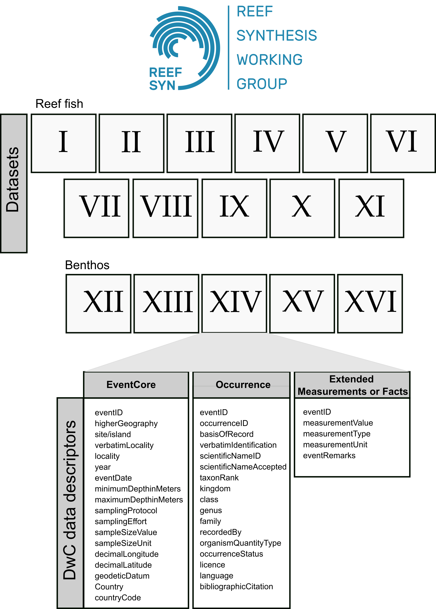

<!-- README.md is generated from README.Rmd. Please edit that file -->

<!-- badges: start -->
<!-- badges: end -->

```{r setup, include=FALSE}
knitr::opts_chunk$set(echo = TRUE)
```

Target journal: Earth System Science Data


Here we present the raw figures of the datapaper. We adopted the Darwin Core Standard to organize the 16 datasets. The root R script "RUN_TO_ORGANIZE_DATA_INTO_DwC.R" can be used to generate these organized datasets from raw datasets. By running this script you will create the folder 'DwC_output' which will host the processed datasets (most of them in a particular folder; exceptions are datasets II and XII (fish and benthos from the ABrolhos Bank), and XI and XVI (fish and benthos from Rio Grande do Norte state), which were produced by the same researchers).

Folders in this project:

- **Data**: raw datasets. Each folder of dataset has its own R script to organize datasets into DwC standard;

- **DwC_output**: the processed data, after run the organization scripts for each dataset;

- **Policy**: policies of autorship and data sharing (only Portuguese);

- **R**: folder with R script to be applied to the processed data. Scratch of a Shiny App;


## Figures
```{r dev = c("png", "tiff", "pdf"), echo = F, fig.height=6.5,fig.width=6.5,fig.margin=F,fig.align="center", message=F,warning=F,out.width="80%",out.height="80%",dpi=600}


## R code to load data sets and plot points
## call packages

source("R/packages.R")
source("R/functions.R")

# open researcher data
researcher_data <- read.xlsx(here::here("Data","researcher_data","PLANILHA_CONSOLIDADA.xlsx"), sheet = 1, colNames = TRUE, detectDates=F)

# formatting data
researcher_data$objetivos <- as.character (researcher_data$objetivos)
researcher_data$titulo_portugues <- as.character (researcher_data$titulo_portugues)
researcher_data$titulo_ingles <- as.character (researcher_data$titulo_ingles)

## extrair as colunas que desejo analaisar
institution <- strsplit(researcher_data$instituicao,",")
institution <- unlist(strsplit(unlist(institution), "/"))
institution <- gsub (" ","",institution)

# df for word-cloud
institution <- data.frame (inst=unique(institution) [order (unique(institution))],
                           freq=table(institution) [order (names(table(institution)))])

# map institutions
# mapa mundi
world <- ne_countries(scale = "medium", returnclass = "sf")
world$colour_Country <- ifelse (world$name_sort %in% researcher_data$country, "orange","gray90")

# cortar o mapa para ver a america do Sul e parte da central
wm <- ggplot() + 
  geom_sf (data=world, size = 0.1, 
           fill= world$colour_Country,
           colour="gray40") +
  #coord_sf (xlim = c(-50, -25),  ylim = c(-30, 4), expand = FALSE) +
  theme_bw() + #xlab ("Longitude")  + ylab ("Latitude") +
  theme(panel.border = element_blank(), 
        panel.grid.major = element_blank(), 
        panel.grid.minor = element_blank(),
        panel.background = element_rect(fill = "#f4f9f9",#darkslategray1
                                        colour = "#f4f9f9"),
        axis.text.x = element_text(size=8),
        axis.ticks.x=element_line(size=1),
        axis.text.y = element_text(size=8),
        axis.ticks.y=element_line(size=1),
        axis.title.x = element_text(size=10),
        axis.title.y = element_text(size=10),
        #title = element_blank(),
        plot.margin = unit(c(0,-0.8,0,0.3), "cm")) +
  labs (title = "A) Institutions of ReefSYN team members")

# map
map_SC <- wm + geom_point(data  = researcher_data %>%
                                    select (instituicao, lat,long) %>%
                                    group_by(instituicao) %>%
                            summarise (lat = mean(lat,na.rm=T),
                                       long=mean(long,na.rm=T)),aes (x=long,y=lat), 
                size=3) + 
  geom_label_repel(data = researcher_data%>%
                                    select (instituicao, lat,long) %>%
                                    group_by(instituicao) %>%
                            summarise (lat = mean(lat,na.rm=T),
                                       long=mean(long,na.rm=T)), aes(x=long, 
                                  y=lat,
                                  label = instituicao),
                  size = 3,
                  fill = "white",
                  alpha=0.8,
                  min.segment.length = 0,
                  box.padding = 0.3,
                  max.overlaps=100)+
  xlab("") + ylab("") + 
  theme(legend.position = "none") 


### english title
titulo_ingles <- as.character (researcher_data$titulo_ingles [which(researcher_data$titulo_ingles != "Indefinido")])
##  df for wcloud
freq_texto_wc <-  function_freq_texto_wc (titulo_ingles)

par(mar = c(4, 4, .1, .1))

## institutions

#wordcloud::wordcloud(words = institution$inst, freq = institution$freq.Freq,
#          min.freq = 1,scale=c(4, .2),
#          max.words=50, 
#          random.order=FALSE, rot.per=0.15, 
#          colors = RColorBrewer::brewer.pal(8, "Dark2"))
#

#dir.create("output")
#pdf (here ("output"),file= "fig1A.pdf")
map_SC
#dev.off()


# wordcloud
wordcloud::wordcloud(words = freq_texto_wc$word, 
          freq = freq_texto_wc$freq.Freq,
          min.freq = 2,scale=c(4, .2),
          max.words=max(freq_texto_wc$freq.Freq)+3, 
          random.order=FALSE, rot.per=0.15, 
          colors = RColorBrewer::brewer.pal(8, "Dark2"),
          main = "Title")


```
Fig. 1: Institutions and research topics explored by ReefSYN team members and collaborators. Abbreviations: AIMS: Australian Institute Of Marine Science; CDU: Charles Darwin University; CEBIMar: Centro de Biologia Marinha of the University of São Paulo; ICMBio: Chico Mendes Institute for Biodiversity Conservation; IO-USP: Oceanographic Institute of the University of São Paulo; PSL: Paris Sciences et Lettres University; UENF: Universidade Federal do Norte Fluminense; UFES: Universidade Federal do Espírito Santo; UFF: Universidade Federal Fluminense; UFOP: Universidade Federal do Oeste do Pará; UFRN: Universidade Federal do Rio Grande do Norte; UFSC: Universidade Federal de Santa Catarina; UFSM: Universidade Federal de Santa Maria; UnB: Universidade de Brasília.


```{r dev = c("png", "tiff", "pdf"), echo = F, fig.height=8, fig.width=8, message=F, warning=F, fig.align= "center", out.width="100%", out.height="100%", dpi=600}

# dataset names
# fish
fish_dataset_names <- data.frame (Name = c("Fish communities from the Brazilian province",
                                           "Abrolhos Bank monitoring/time series",
                                           "Arraial do Cabo (Rio de Janeiro) monitoring/time series",
                                           "Oceanic islands’ monitoring/time series",
                                           "Fish assemblages from Trindade and Martin Vaz",
                                           "Santa Catarina monitoring/time series",
                                           "Fish assemblages from Guarapari, Espírito Santo",
                                           "Fish assemblages from Southern Espírito Santo",
                                           "Trophic interactions along the Western Atlantic",
                                           "Alcatrazes monitoring/time series",
                                           "Rio Grande do Norte monitoring/time series"))

# benthos
benthos_dataset_names <- data.frame (Name = c("Benthic communities’ monitoring in Abrolhos Bank",
                                              "Benthic communities’ monitoring in Abrolhos Bank",
                                           "Extended benthic communities from the Brazilian province",
                                           "Benthic communities from the Brazilian province",
                                           "Benthic communities’ monitoring/time series from oceanic islands",
                                           "Benthic communities from Rio Grande do Norte"))


# load eventCore datasets
# fish
ds1<- read.csv (here::here("DwC_output","RMorais_spatialData", "event_core.csv"))
ds2<- read.csv (here::here("DwC_output","RFrancini_timeSeries_abrolhos","event_core_fish.csv"))
ds3<- read.csv (here::here("DwC_output","RJ_time_series", "event_core.csv"))
ds4<- read.csv (here::here("DwC_output","PELD_iloc_fish", "event_core.csv"))
colnames(ds4)[which(colnames(ds4) == "island")] <- "site"
ds5 <- read.csv (here::here("DwC_output","Pinheiro_TrindadeMVaz", "event_core.csv"))
ds6<- read.csv (here::here("DwC_output","SC_time_series", "event_core.csv"))
ds7 <- read.csv (here::here("DwC_output","Pinheiro_GuarapariES", "event_core.csv"))
ds8 <- read.csv (here::here("DwC_output","Pinheiro_ES", "event_core.csv"))
ds9<- read.csv (here::here("DwC_output","GLongo_spatialData", "event_core.csv"))
ds10<- read.csv (here::here("DwC_output","Alcatrazes_time_series", "event_core.csv"))
ds11<- read.csv (here::here("DwC_output","GLongo_NRoss_spatialData", "event_core_fish.csv"))

# benthos
ds12<- read.csv (here::here("DwC_output","RFrancini_timeSeries_abrolhos","event_core_benthos.csv"))
ds13<- read.csv (here::here("DwC_output","RFrancini_spatialData", "event_core.csv"))
ds14<- read.csv (here::here("DwC_output", "AAued_spatialData", "event_core.csv"))
ds15<- read.csv (here::here("DwC_output","PELD_iloc_benthos", "event_core.csv"))
colnames(ds15)[which(colnames(ds15) == "island")] <- "site"
ds16<- read.csv (here::here("DwC_output", "GLongo_NRoss_spatialData", "event_core_benthos.csv"))

# list of sites with sampling of benthic communities
list_benthos <- list(data.frame (ds12, Dataset= "XII"),
                     data.frame (ds13, Dataset = "XIII"),
                     data.frame (ds14, Dataset ="XIV"),
                     data.frame (ds15, Dataset="XV"),
                     data.frame (ds16, Dataset = "XVI"))


# agggregate and get coordinates for each site
coords <- lapply (list_benthos, function (i) 
  
  
  dplyr::group_by(i, Dataset, higherGeography, site, locality) %>% 
  
                    summarise(decimalLatitude = mean(decimalLatitude,na.rm=T),
                            decimalLongitude = mean(decimalLongitude,na.rm=T)) %>% 
    
                  select (higherGeography, site, locality,
                          decimalLatitude, decimalLongitude)
)

# melt
coords <- do.call(rbind, coords)
coords$Dataset <- factor (coords$Dataset,
                          levels =  c("XII", "XIII", "XIV", "XV", "XVI"))
coords_unique_sites <- coords %>% 
  group_by(locality) %>%
  summarise(decimalLatitude = mean( decimalLatitude,na.rm=T),
                            decimalLongitude = mean( decimalLongitude,na.rm=T)) 

# map
# mapa mundi
world <- ne_countries(scale = "medium", returnclass = "sf")

# cortar o mapa para ver a america do Sul e parte da central
wm <- ggplot() + 
  geom_sf (data=world, size = 0.1, 
           fill= "gray90",colour="gray90") +
  coord_sf (xlim = c(-50, -25),  ylim = c(-30, 4), expand = FALSE) +
  theme_bw() + xlab ("Longitude")  + ylab ("Latitude") +
  theme(panel.border = element_blank(), 
        panel.grid.major = element_blank(), 
        panel.grid.minor = element_blank(),
        panel.background = element_rect(fill = "#81c6e8ff",
                                        colour = "#81c6e8ff"),
        
        axis.text.x = element_text(size=6),
        axis.ticks.x=element_line(size=1),
        axis.text.y = element_text(size=6),
        axis.ticks.y=element_line(size=1),
        axis.title.x = element_text(size=8),
        axis.title.y = element_text(size=8),
        title = element_text(size=9)) 

# map
wm_data <- wm +  geom_jitter(data = coords, 
                             aes(x = decimalLongitude, 
                                 y = decimalLatitude,
                                 col = Dataset,
                                 fill=Dataset), 
                             size =4, position= "jitter",
                            stat = "identity",
        shape = 19, alpha=0.3,
        stroke=1) +
  theme (plot.background = element_rect("white"),
        #panel.background = element_blank(),
        axis.title.x = element_text(color = "#292929", face = "bold"),
        axis.title.y = element_blank(),
        axis.text = element_text(color = "#292929", face = "bold"),
         legend.text = element_text(size =6),
        legend.title = element_text(size =7),
        legend.key.height= unit(0.3, 'cm'),
        legend.key.width= unit(0.1, 'cm'),
        panel.grid = element_blank())+
  scale_colour_viridis_d(option="magma", end=0.8)+
  ggtitle (paste ("Number of localities with benthic sampling", "n=", nrow(coords_unique_sites), sep=" "))  +
  guides(colour = guide_legend(override.aes = list(alpha=1)))


# ================
# fish

list_fish <- list(data.frame (ds1, Dataset = "I"),
                  data.frame (ds2, Dataset = "II"),
                  data.frame (ds3, Dataset = "III"),
                  data.frame (ds4, Dataset = "IV"),
                  data.frame (ds5, Dataset = "V"),
                  data.frame (ds6, Dataset = "VI"),
                  data.frame (ds7, Dataset = "VII"),
                  data.frame (ds8, Dataset = "VIII"),
                  data.frame (ds9, Dataset = "IX"),
                  data.frame (ds10, Dataset = "X"),
                  data.frame (ds11, Dataset = "XI")
                  
                  
                  )


# agggregate and get coordinates for each site
coords_fish <- lapply (list_fish, function (i) 
  
  
  group_by(i, Dataset, higherGeography, site, locality) %>% 
  
                    summarise(decimalLatitude = mean( decimalLatitude,na.rm=T),
                            decimalLongitude = mean( decimalLongitude,na.rm=T)) %>% 
    
                  select (higherGeography,site, locality,
                          decimalLatitude,decimalLongitude)
)

# melt
coords_fish <- do.call(rbind,coords_fish)

# organize order
coords_fish$Dataset <- factor (coords_fish$Dataset,
                          levels =  c("I", "II", "III", "IV", "V", "VI", "VII", "VIII", "IX", "X", "XI"))


# input coordinates for missing ones in datasets IX-XI
missing_coords <- coords_fish [is.na(coords_fish$decimalLatitude),]

# find and bind
bind_coords <- lapply (seq (1,nrow(missing_coords)), function (i){
  
  # select coords based on other sites and locations
  coords_to_input <- coords_fish[which(coords_fish$site %in% missing_coords[i,]$site ),]
  
  
  missing_coords[i,"decimalLatitude"] <- mean(coords_to_input$decimalLatitude,na.rm=T)
  missing_coords[i,"decimalLongitude"] <- mean(coords_to_input$decimalLongitude,na.rm=T)
  
  
  
  missing_coords <- missing_coords [i,]
  missing_coords
  
}
)
bind_coords<-do.call(rbind,bind_coords)

# filter out missing
coords_fish <- coords_fish [is.na(coords_fish$decimalLatitude) !=T,]
# and bind the new ones
coords_fish <- rbind(coords_fish,
                     bind_coords)

# unique sites and localities
coords_fish_unique_sites <- coords_fish %>% 
  group_by(locality) %>%
  summarise(decimalLatitude = mean( decimalLatitude,na.rm=T),
            decimalLongitude = mean( decimalLongitude,na.rm=T)) 

# map
wm_data_fish <- wm + geom_point(data = data.frame(coords_fish %>%
                                                    
                                                    filter (is.na(decimalLatitude) != T)
                                                  
                                                    ), aes(x = decimalLongitude, 
                                                         y = decimalLatitude,
                                                         col = Dataset,
                                                         fill=Dataset), 
                            size =4, position= "jitter",
        shape = 19, alpha=0.3) + 
  scale_colour_viridis_d(direction=-1)+
  theme (plot.background = element_rect("white"),
        #panel.background = element_blank(),
        axis.title = element_text(color = "#292929", face = "bold"),
        axis.text = element_text(color = "#292929", face = "bold"),
        legend.text = element_text(size =6),
        legend.title = element_text(size =7),
        legend.key.height= unit(0.3, 'cm'),
        legend.key.width= unit(0.1, 'cm'),
        panel.grid = element_blank())+
  ggtitle (paste ("Number of localities with fish sampling", "n=", nrow(coords_fish_unique_sites), sep=" ")) +
  guides(colour = guide_legend(override.aes = list(alpha=1))) 

# panel of maps
gridExtra::grid.arrange(
             wm_data_fish,
             wm_data,
             ncol=2)


# unique locality names
localities <- length(unique(c(coords_fish_unique_sites$locality,coords_unique_sites$locality)))
sites <- length(unique(c(coords_fish$site, coords$site)))
samples_benthos <- length(unique(unlist (sapply (list_benthos, "[[", "eventID"))))
samples_fish <- length(unique(unlist (sapply (list_fish, "[[", "eventID"))))
total_samples <- samples_benthos + samples_fish
years_benthos <- unique(unlist (sapply (list_benthos, "[[", "year")))
years_benthos <- years_benthos[order(years_benthos)]
years_fish <- unique(unlist (sapply (list_fish, "[[", "year")))
years_fish <- years_fish[order(years_fish)]
years_fish <- years_fish[is.na(years_fish)!=T]
range_years <- range (c(years_fish,years_benthos),na.rm=T)

# filming time in BR
# extracted from here: 
# https://onlinelibrary.wiley.com/doi/10.1111/geb.12806#support-information-section
#filming_time <- sum(23, 85, 77, 112, 72, 90, 101, 128)
#(filming_time*(10/60))


```
Fig. 2: Spatial distribution of fish (left) and benthos (right) sampling locations per dataset. Datasets: `r c(fish_dataset_names$Name, benthos_dataset_names$Name)`. Coordinates of datasets V and VII were gathered from datasets XIV and IV based on the matching between site and locality names. Dataset VIII has no geographic coordinates.

Table 1: Description of reef fish datasets/ Number of sampling events of fish sampling in each dataset. Coordinates of datasets V and VII were gathered from datasets XIV and IV based on the matching between site and locality names. Dataset VIII has no geographic coordinates.

```{r, echo = F, results='asis',warning=F, message=F}

# fish
table_description_data_fish <- lapply (list_fish, function (i)
  
    data.frame ("Sampling protocol" = (table(i$samplingProtocol)),
                "Dataset" = unique(i$Dataset),
                "Scale" = "Transect/plot",
                "Sampling area (m2)" = mean (i$sampleSizeValue),
                "Nsites" = length(unique(i$site)),
                "Latitude" = paste (round (min (i$decimalLatitude,na.rm=T),2),
                                    round (max (i$decimalLatitude,na.rm=T),2),
                                    sep=", "),
                "Longitude" = paste (round (min (i$decimalLongitude,na.rm=T),2),
                                    round (max (i$decimalLongitude,na.rm=T),2),
                                    sep=", "),
                "Years" = paste (round (min (i$year,na.rm=T),2),
                                    round (max (i$year,na.rm=T),2),
                                    sep="-"))
)

# melt
table_description_data_fish<-do.call(rbind,table_description_data_fish)

# build the table
table_description_data_fish %>% 
  mutate(Sampling.protocol.Var1 = recode(Sampling.protocol.Var1, 
                                         "video plot - 2 x 1m" = "Video plot - 2 x 1m"
                                   )) %>% 
  dplyr::rename("Sampling Protocol" = "Sampling.protocol.Var1",
                "Samples (n)" = "Sampling.protocol.Freq",
                "Sampling area (m2)" = "Sampling.area..m2.",
                 "Number of sites" = "Nsites") %>% 
  
  dplyr::bind_cols(fish_dataset_names) %>%
  
  dplyr::relocate("Dataset", "Name") %>%
  
  kable(align="c")


```


Table 2. Description of benthic datasets/ Number of sampling events of benthic sampling in each dataset. Sampling area provided for each photoquadrat.

```{r, echo = F, results='asis',warning=F, message=F}

## Benthos
# the number of sampling events per dataset

table_description_data_benthos <- lapply (list_benthos, function (i)
  
    data.frame ("Sampling protocol" = table(i$samplingProtocol),
                "Dataset" = unique(i$Dataset),
                "Scale" = "Plot/point",
                "Sampling area (m2)" = round (mean (i$sampleSizeValue),2),
                "Nsites" = length(unique(i$site)),
                "Latitude" = paste (round (min (i$decimalLatitude),2),
                                    round (max (i$decimalLatitude),2),
                                    sep=", "),
                "Longitude" = paste (round (min (i$decimalLongitude),2),
                                    round (max (i$decimalLongitude),2),
                                    sep=", "),
                "Years" = paste (round (min (i$year,na.rm=T),2),
                                    round (max (i$year,na.rm=T),2),
                                    sep="-"))
)

# melt
table_description_data_benthos <- do.call(rbind,table_description_data_benthos)
#sum(table_description_data_benthos$eventIDs)

table_description_data_benthos %>%
  #dplyr::mutate(Sampling.protocol.Var1 = recode(Sampling.protocol.Var1, 
  #                                              "point-intercept  lines" = "Point-intercept lines - 10m",
  #                                              "photoquadrats" = "Photoquadrats - 1 x 1m",
  #                                              "fixed photo-quadrats" = "Photoquadrats - 1 x 1m",
  #                                              "Photoquadrats 50 X 50cm" = "Photoquadrats - 0.5 x 0.5m"))  %>%
  #
  dplyr::rename("Sampling Protocol" = "Sampling.protocol.Var1",
                "Samples (n)" = "Sampling.protocol.Freq",
                "Sampling area (m2)" = "Sampling.area..m2.",
                 "Number of sites" = "Nsites") %>%
  
  dplyr::bind_cols(benthos_dataset_names) %>%
  
  dplyr::relocate("Dataset", "Name") %>%
  
  kable(align="c")


```


<!-- badges: start -->
<!-- badges: end -->


```{r dev = c("png", "tiff", "pdf"), echo = F, fig.height=5,fig.width=8,message=F, warning=F,fig.align= "center",dpi=600,out.width="100%",out.height="100%"}


# benthos
# number of eventIDs (rows per year)
eventIDs_year <- lapply (list_benthos, function (i) i %>% 
                           group_by (year,Dataset) %>% 
                           tally()  # the number of eventIDs
                         
                         )
# count the ids
eventIDs_year_benthos<-do.call(rbind,eventIDs_year) %>%
                           
                          group_by(year) %>%
                           
                          summarise (sum_cum = sum (n)) %>% # sum the number of ids per year
                          mutate(n_cum = cumsum(sum_cum)) # find the cumulative sum

# the beggining of each Dataset
begin_data <- do.call(rbind,eventIDs_year) %>%
                           
                          group_by(Dataset) %>%
                          
                          summarise (min_year = min (year,na.rm=T)) 


# fish
# number of eventIDs (rows per year)
eventIDs_yearB <- lapply (list_fish, function (i) i %>% 
                           group_by (year,Dataset) %>% 
                           tally()  # the number of eventIDs
                         
                         )
# count the ids
eventIDs_year_fish<-do.call(rbind,eventIDs_yearB) %>%
                           
                          group_by(year) %>%
                           
                          summarise (sum_cum = sum (n)) %>% # sum the number of ids per year
                          mutate(n_cum = cumsum(sum_cum)) # find the cumulative sum

# the beggining of each Dataset
begin_data_fish <- do.call(rbind,eventIDs_yearB) %>%
                           
                          group_by(Dataset) %>%
                          
                          summarise (min_year = min (year,na.rm=T)) 


# bind the years in the fish Dataset missing in the benthic Datasets
to_bind_benthos <- data.frame (year = c(2001, 2002,2020,2021,2022,2023),
                               sum_cum=c(0,0,max(eventIDs_year_benthos$sum_cum),
                                          max(eventIDs_year_benthos$sum_cum),
                                          max(eventIDs_year_benthos$sum_cum),
                                         max(eventIDs_year_benthos$sum_cum)),
                               
                               n_cum=c(0,0,max(eventIDs_year_benthos$n_cum),
                                       max(eventIDs_year_benthos$n_cum),
                                       max(eventIDs_year_benthos$n_cum),
                                       max(eventIDs_year_benthos$n_cum)))

# bind
eventIDs_year_benthos <- bind_rows (eventIDs_year_benthos,
                                    to_bind_benthos) %>% 
  
              arrange (year)


# plot 
# benthos
trend_benthos <- ggplot (data = eventIDs_year_benthos, aes (x=year,y=n_cum)) + 
  geom_area(alpha=0.5, fill = "#FD8235", col = "gray30",size=1) + 
  theme(plot.background = element_rect("white"),
        panel.background = element_blank(),
        axis.title = element_text(color = "#292929", face = "bold",size=12),
        axis.text = element_text(color = "#292929", face = "bold",size=12),
        panel.grid = element_blank()) + 
  xlab ("") + ylab ("") 

trend_benthos_annotate <- trend_benthos + geom_text(data = begin_data, aes (x= min_year, y = 2000,
                                                  label = Dataset,
                                                  angle = 0),
                                                  size = 5) + 
  geom_segment(data = begin_data, 
               aes(x = min_year, y = 0, xend = min_year, yend = 1500)) + 
  geom_segment(aes(x = 2011, y = -100, xend = 2014, yend = -100),size=3,col="gray30")+
  geom_segment(aes(x = 2013, y = 100, xend = 2023, yend = 100),size=3,col="gray60")+
  geom_segment(aes(x = 2013, y = 300, xend = 2023, yend = 300),size=3,col="#FFA559")+
  geom_segment(aes(x = 2020, y = 450, xend = 2023, yend = 450),size=3,col="#5A8F7B")

#+
  
  
 # ggplot2::annotate("text", x = 2011.5, y = 200, label = "SISBIOTAMar")+
#  ggplot2::annotate("text", x = 2015, y = 180, label = "PELD-ILOC")+
 # ggplot2::annotate("text", x = 2015, y = 500, label = "ProspecMar")+
#  ggplot2::annotate("text", x = 2021.5, y = 850, label = "ReefSYN")
  
  

# fish
trend_fish <- ggplot (data = eventIDs_year_fish, aes (x=year,y=n_cum)) + 
  geom_area(alpha=0.5, fill = "#6CC4A1", col = "gray30",size=1) + 
  theme(plot.background = element_rect("white"),
        panel.background = element_blank(),
        axis.title.y = element_text(color = "#292929", face = "bold",size=12),
        axis.text.y = element_text(color = "#292929", face = "bold",size=12),
        axis.ticks.x = element_blank(),
        axis.text.x = element_blank(),# element_text(color = "#292929", face = "bold"),
        panel.grid = element_blank()) + 
  xlab ("") + ylab ("") 

trend_fish_annotate <- trend_fish + geom_text_repel(data = begin_data_fish, aes (x= min_year, y = 12000,
                                                  label = Dataset,
                                                  angle = 0),
                                                  size = 5,
                                                  box.padding=0) + 
  geom_segment(data = begin_data_fish, 
               aes(x = min_year, y = 0, xend = min_year, yend = 10000)) +
  geom_segment(aes(x = 2011, y = -400, xend = 2014, yend = -400),size=3,col="gray30")+
  geom_segment(aes(x = 2013, y = 500, xend = 2023, yend = 500),size=3,col="gray60")+
  geom_segment(aes(x = 2013, y = 1500, xend = 2023, yend = 1500),size=3,col="#FFA559")+
  geom_segment(aes(x = 2020, y = 2300, xend = 2023, yend = 2300),size=3,col="#5A8F7B")+
  
  ggplot2::annotate("text", x = 2011, y = 800, label = "SISBIOTAMar")+
  ggplot2::annotate("text", x = 2015, y = 880, label = "PELD-ILOC")+
  ggplot2::annotate("text", x = 2015, y = 2500, label = "ProspecMar")+
  ggplot2::annotate("text", x = 2021.5, y = 3500, label = "ReefSYN")
#+
 # scale_y_reverse()


gridExtra::grid.arrange (
              trend_fish_annotate,
              trend_benthos_annotate,
              nrow=2,
              left = "Cumulative number of sampling events (eventIDs)") 


```
Fig. 3: The number of sampling events accumulated over time for fish (top) and benthos (bottom). One sampling event consists, for example, on one transect deployed into a location. The vertical segments indicate the year in which data included in each dataset started to be collected. The horizontal bars depict the main funding sources as follows: dark gray bar: Sisbiota, CNPq; light gray bar: PELD, CNPq; orange bar: Prospec Mar, CNPq; green bar: ReefSYN, SinBiose CNPq. Datasets: `r c(fish_dataset_names$Name, benthos_dataset_names$Name)`


```{r dev = c("png", "tiff", "pdf"), echo = F, fig.height=5,fig.width=8,message=F, dpi=600, warning=F, fig.align= "center",out.width="100%",out.height="100%"}

# load eventCore datasets
# fish
ds1_occ<- read.csv (here::here("DwC_output","RMorais_spatialData", "DF_occ.csv"))
ds1_occ$year<- ds1 [match (ds1_occ$eventID, ds1$eventID), "year"]
ds2_occ<- read.csv (here::here("DwC_output","RFrancini_timeSeries_abrolhos","DF_occ_fish.csv"))
ds2_occ$year<- ds2 [match (ds2_occ$eventID, ds2$eventID), "year"]
ds3_occ<- read.csv (here::here("DwC_output","RJ_time_series", "DF_occ.csv"))
ds3_occ$year<- ds3 [match (ds3_occ$eventID, ds3$eventID), "year"]
ds4_occ<- read.csv (here::here("DwC_output","PELD_iloc_fish", "DF_occ.csv"))
colnames(ds4_occ)[which(colnames(ds4_occ) == "island")] <- "site"
ds4_occ$year<- ds4 [match (ds4_occ$eventID, ds4$eventID), "year"]
ds5_occ <- read.csv (here::here("DwC_output","Pinheiro_TrindadeMVaz", "DF_occ.csv"))
ds5_occ$year<- ds5 [match (ds5_occ$eventID, ds5$eventID), "year"]
ds6_occ<- read.csv (here::here("DwC_output","SC_time_series", "DF_occ.csv"))
ds6_occ$year<- ds6 [match (ds6_occ$eventID, ds6$eventID), "year"]
ds7_occ <- read.csv (here::here("DwC_output","Pinheiro_GuarapariES", "DF_occ.csv"))
ds7_occ$year<- ds7 [match (ds7_occ$eventID, ds7$eventID), "year"]
ds8_occ <- read.csv (here::here("DwC_output","Pinheiro_ES", "DF_occ.csv"))
ds8_occ$year<- ds8 [match (ds8_occ$eventID, ds8$eventID), "year"]
ds9_occ<- read.csv (here::here("DwC_output","GLongo_spatialData", "DF_occ.csv"))
ds9_occ$year<- ds9 [match (ds9_occ$eventID, ds9$eventID), "year"]
ds10_occ<- read.csv (here::here("DwC_output","Alcatrazes_time_series", "DF_occ.csv"))
ds10_occ$year<- ds10 [match (ds10_occ$eventID, ds10$eventID), "year"]
ds11_occ<- read.csv (here::here("DwC_output","GLongo_NRoss_spatialData", "DF_occ_fish.csv"))
ds11_occ$year<- ds11 [match (ds11_occ$eventID, ds11$eventID), "year"]

# benthos
ds12_occ<- read.csv (here::here("DwC_output","RFrancini_timeSeries_abrolhos","DF_occ_benthos.csv"))
ds12_occ$year<- ds12 [match (ds12_occ$eventID, ds12$eventID), "year"]
ds13_occ<- read.csv (here::here("DwC_output","RFrancini_spatialData", "DF_occ.csv"))
ds13_occ$year<- ds13 [match (ds13_occ$eventID, ds13$eventID), "year"]
ds14_occ<- read.csv (here::here("DwC_output", "AAued_spatialData", "DF_occ.csv"))
ds14_occ$year<- ds14 [match (ds14_occ$eventID, ds14$eventID), "year"]
ds15_occ<- read.csv (here::here("DwC_output","PELD_iloc_benthos", "DF_occ.csv"))
colnames(ds15_occ)[which(colnames(ds15_occ) == "island")] <- "site"
ds15_occ$year<- ds15 [match (ds15_occ$eventID, ds15$eventID), "year"]
ds16_occ<- read.csv (here::here("DwC_output", "GLongo_NRoss_spatialData", "DF_occ_benthos.csv"))
ds16_occ$year<- ds16 [match (ds16_occ$eventID, ds16$eventID), "year"]

# list of sites with sampling of benthic communities
list_occ_benthos <- list(data.frame (ds12_occ, Dataset= "XII"),
                     data.frame (ds13_occ, Dataset = "XIII"),
                     data.frame (ds14_occ, Dataset ="XIV"),
                     data.frame (ds15_occ, Dataset="XV"),
                     data.frame (ds16_occ, Dataset = "XVI")
)


# ================
# fish

list_occ_fish <- list(data.frame (ds1_occ, Dataset = "I"),    
                  data.frame (ds2_occ, Dataset = "II"),
                  data.frame (ds3_occ, Dataset = "III"),
                  data.frame (ds4_occ, Dataset = "IV"),
                  data.frame (ds5_occ, Dataset = "V"),
                  data.frame (ds6_occ, Dataset = "VI"),
                  data.frame (ds7_occ, Dataset = "VII"),
                  data.frame (ds8_occ, Dataset = "VIII"),
                  data.frame (ds9_occ, Dataset = "IX"),
                  data.frame (ds10_occ, Dataset = "X"),
                  data.frame (ds11_occ, Dataset = "XI")
                  
                  )

 
## project richness

# benthos
# number of spp year (rows per year)

spp_year <- do.call(rbind,
                    
                    lapply (list_occ_benthos, function (i)  
                      
                    
                        i %>% select (year, scientificNameAccepted, Dataset) # interesting columns
  
                              
                       )) %>% 
  
                dcast (formula = year ~ scientificNameAccepted, # table
                                  drop=T) %>%
  
            filter (is.na(year) != T) %>%
                        
                  
                  set_rownames(.$year)  # set rownames
  
                    
                

# composition matrix
spp_year <-  ifelse (spp_year >=1,1,0)
#spp_year <- spp_year [,-which(colnames(spp_year) == "NA")]# rm NA cols


# aggregate
agg_data_year1 <- sum (spp_year[1,-1]>0)
acc_time <- lapply (seq (2,nrow(spp_year)), function (i){
  
        agg_data <- aggregate (
               data.frame (spp_year[1:i,]), 
                   by = list (spp_year[1:i,"year"]),
                   FUN = sum)[,-c(1,2)]
        sum_sp <- sum (agg_data>0)
        sum_sp
})
acc_time<- c(agg_data_year1, unlist(acc_time))
acc_time <- data.frame(SR = acc_time, 
           year = as.numeric(rownames(spp_year)))
acc_time<-rbind (data.frame  (SR=0, 
                              year=c(2001,2002)),
                 acc_time,
                 data.frame  (SR=max(acc_time$SR), 
                              year=c(2020,2021,2022,2023)))

# fish 

spp_year_fish <- do.call(rbind ,
                    
                    lapply (list_occ_fish, function (i)  
                      
                    
                        i %>% select (year, scientificNameAccepted, Dataset) # interesting columns
  
                              
                       )) %>% 
  
                dcast (formula = year ~ scientificNameAccepted, # table
                                  drop=T)
                    
                

# composition matrix
spp_year_fish <-  ifelse (spp_year_fish >=1,1,0)
spp_year_fish <- spp_year_fish [,-which(colnames(spp_year_fish) == "NA")]# rm NA cols

# aggregate
agg_data_year1_fish <- sum (spp_year_fish[1,-1]>0)
acc_time_fish <- lapply (seq (2,nrow(spp_year_fish)), function (i){
  
        agg_data <- aggregate (
               data.frame (spp_year_fish[1:i,]), 
                   by = list (spp_year_fish[1:i,"year"]),
                   FUN = sum)[,-c(1,2)]
        sum_sp <- sum (agg_data>0)
        sum_sp
})
acc_time_fish <- unlist(acc_time_fish)#c(agg_data_year1_fish, unlist(acc_time_fish))
acc_time_fish <- data.frame(SR = acc_time_fish, 
           year = seq (2001, 2023))
#acc_time_fish$year <- as.Date(as.character(acc_time_fish$year), format = "%Y")


# plot 
# benthos
trend_benthos_SR <- ggplot (data = acc_time, 
                            aes (x= (year),y=SR)) + 
  geom_area(alpha=0.5, fill = "#FD8235", col = "gray30",size=1) + 
  theme(plot.background = element_rect("white"),
        panel.background = element_blank(),
        axis.title = element_text(color = "#292929", face = "bold",size=12),
        axis.text = element_text(color = "#292929", face = "bold",size=12),
        panel.grid = element_blank()) + 
  xlab ("") + ylab ("") +
  
  # projects 
  geom_text_repel(data = begin_data, aes (x= min_year, y = 80,
                                                  label = Dataset,
                                                  angle = 0),
                                                  size = 5,
                                                  box.padding=0) + 
  geom_segment(data = begin_data, 
               aes(x = min_year, y = 0, xend = min_year, yend = 60)) + 
  
  # grants
  geom_segment(aes(x = 2011, y = -3, xend = 2014, yend = -3),size=3,col="gray30")+
  geom_segment(aes(x = 2013, y = 4, xend = 2023, yend = 4),size=3,col="gray60")+
  geom_segment(aes(x = 2013, y = 9, xend = 2023, yend = 9),size=3,col="#FFA559")+
  geom_segment(aes(x = 2020, y = 15, xend = 2023, yend = 15),size=3,col="#5A8F7B")

#+
  
  
  #ggplot2::annotate("text", x = 2011.5, y = 5, label = "SISBIOTAMar")+
  #ggplot2::annotate("text", x = 2015, y = 8, label = "PELD-ILOC")+
  #ggplot2::annotate("text", x = 2015, y = 16, label = "ProspecMar")+
  #ggplot2::annotate("text", x = 2021.5, y = 22, label = "ReefSYN")
  
# fish
trend_fish_SR <- ggplot (data = acc_time_fish, aes (x=year, y=SR)) + 
  geom_area(alpha=0.5, fill = "#6CC4A1", col = "gray30",size=1) + 
  theme(plot.background = element_rect("white"),
        panel.background = element_blank(),
        axis.title.y = element_text(color = "#292929", face = "bold",size=12),
        axis.text.y = element_text(color = "#292929", face = "bold",size=12),
        axis.ticks.x = element_blank(),
        axis.text.x = element_blank(),# element_text(color = "#292929", face = "bold"),
        panel.grid = element_blank()) + 
  xlab ("") + ylab ("") +
  
  #scale_y_reverse() + # talvez seja melhor manter a escala normal
  # projects
  geom_text_repel(data = begin_data_fish, aes (x= min_year, y = 250,
                                                  label = Dataset,
                                                  angle = 0),
                                                  size = 5,
                                                  box.padding=0) + 
  geom_segment(data = begin_data_fish, 
               aes(x = min_year, y = 0, xend = min_year, yend = 220)) + 
  ylim(c(-6,450))+
  
  # grants
  geom_segment(aes(x = 2011, y = -5.5, xend = 2014, yend = -5.5),size=3,col="gray30")+
  geom_segment(aes(x = 2013, y = 12, xend = 2023, yend = 12),size=3,col="gray60")+
  geom_segment(aes(x = 2013, y = 29, xend = 2023, yend = 29),size=3,col="#FFA559")+
  geom_segment(aes(x = 2020, y = 47, xend = 2023, yend = 47),size=3,col="#5A8F7B")+
  
  
  ggplot2::annotate("text", x = 2011.2, y = 16.7, label = "SISBIOTAMar")+
  ggplot2::annotate("text", x = 2015, y = 15.2, label = "PELD-ILOC")+
  ggplot2::annotate("text", x = 2015, y = 60, label = "ProspecMar")+
  ggplot2::annotate("text", x = 2021.6, y = 74, label = "ReefSYN")


# arrange plots
gridExtra::grid.arrange(trend_fish_SR,
             trend_benthos_SR,
             nrow=2,
              left = "Cumulative number of scientificNameAccepted")


# recorded by
fish_rec <- unique(unlist(strsplit (unique (tolower (unlist(sapply (list_occ_fish, "[[", "recordedBy")))),"/|:|\\|")))
benthos_rec <- unique(unlist(strsplit (unique (tolower (unlist(sapply (list_occ_benthos, "[[", "recordedBy")))),"/|:|\\|")))
# N people
N_people<-length(unique(c(benthos_rec, fish_rec)))

# count the totals of taxa
# spp benthos

benthic_taxa <-lapply (list_occ_benthos, function (i)


  (unique(i$scientificNameAccepted[which(i$taxonRank == "Species")])) # at the species level

)
Ntaxa <- length (unique(unlist(benthic_taxa)))
Ngenera <- sum(is.na(unique(unlist(sapply (list_occ_benthos, "[[", "genus"))))!=T)
Nfam<-sum(is.na(unique(unlist(sapply (list_occ_benthos, "[[", "family"))))!=T)
Ncla<-sum(is.na(unique(unlist(sapply (list_occ_benthos, "[[", "class"))))!=T)
Nkin<-sum(is.na(unique(unlist(sapply (list_occ_benthos, "[[", "kingdom"))))!=T)
king_to_show<-unique(unlist(sapply (list_occ_benthos, "[[", "kingdom")))
king_to_show<- king_to_show[is.na(king_to_show)!=T]

# spp fish
fish_taxa <-lapply (list_occ_fish, function (i)


  (unique(i$scientificNameAccepted[which(i$taxonRank == "Species")])) # at the species level

)
Nspp <- length (unique(unlist(fish_taxa)))
Species_fish <- unique(unlist(sapply (list_occ_fish, "[[", "scientificNameAccepted")))
Species_fish<- Species_fish[is.na(Species_fish) != T]
Ngenera_fish <- length(unique(sapply (strsplit(Species_fish, " "), "[[",1)))
Nfamfish<-sum(is.na(unique(unlist(sapply (list_occ_fish, "[[", "family"))))!=T)
Nclafish<-sum(is.na(unique(unlist(sapply (list_occ_fish, "[[", "class"))))!=T)
fish_class <- unique(unlist(sapply (list_occ_fish, "[[", "class")))
fish_class <- fish_class[is.na(fish_class) !=T]
fish_kin <- unique(unlist(sapply (list_occ_fish, "[[", "kingdom")))
fish_kin <- fish_kin[is.na(fish_kin)!= T]

# fish to show
ranks <- unique(unlist(sapply (list_occ_fish, "[[", "taxonRank")))
ranks <- ranks[is.na(ranks) != T]

# list of taxa
list_taxa_show <-   lapply (list_occ_fish, function (i)
    lapply ( ranks, function (k)  { # for each rank # for each dataset
  
    
    taxa_to_show <- unique(i[which(i$taxonRank %in% k),"scientificNameAccepted"])# get the name

    taxa_to_show <- taxa_to_show[order(taxa_to_show)] # order

    taxa_to_show <- knitr::combine_words(taxa_to_show, and = "") # separate with commas
    
    taxa_to_show
  }))

# length(unique(unlist (sapply (list_taxa_show, "[[", 1))))
# length(unique(unlist (sapply (list_taxa_show, "[[", 2))))

# benthos to show

ranks_benthos <- unique(unlist(sapply (list_occ_benthos, "[[", "taxonRank")))

# list of taxa
list_taxa_show_benthos <-   lapply (list_occ_benthos, function (i)  # for each dataset
  
  lapply ( ranks_benthos, function (k)  { # for each rank  
   

    
    taxa_to_show <- unique(i[which(i$taxonRank %in% k),"scientificNameAccepted"])# get the name

    taxa_to_show <- taxa_to_show[order(taxa_to_show)] # order

    taxa_to_show <- knitr::combine_words(taxa_to_show, and = "") # separate with commas
    taxa_to_show
  }))

# length(unique(unlist (sapply (list_taxa_show_benthos, "[[", 2))))
# length(unique(unlist (sapply (list_taxa_show_benthos, "[[", 6))))


```
Fig. 4: Trends in the number of scientific names accumulated over time for fish (top) and benthos (bottom). The vertical segments depict the year in which data included in each Dataset started to be collected. The horizontal bars depict the formal funding as follows: dark gray bar: Sisbiota, CNPq; light gray bar: PELD, CNPq; orange bar: Prospec Mar, CNPq; green bar: ReefSYN, SinBiose CNPq. Datasets: `r c(fish_dataset_names$Name, benthos_dataset_names$Name)`


```{r include=T,echo=F, warning=F, fig.align='center', out.width="75%",out.height="75%"}
# All defaults



```
Fig. 5: Structure of the datasets gathered by the ReefSYN working group, showing the Darwin Core Standard terms included in most datasets. Dataset codes are presented in Tables 1 and 2. These terms are part of a standardized glossary maintained by the Darwin Core Task Group (2009).


```{r dev = c("png", "tiff", "pdf"), echo = F, fig.height=6, fig.width=10, message=F, warning=F, fig.align= "center", out.width="100%", out.height="100%", dpi=600}

# All defaults


# plot

dat_barplot_fish <- lapply (list_occ_fish, function (i)
  
  i %>% select (Dataset,
                scientificNameAccepted,
                genus,
                family,
                order,
                class,
                phylum,
                kingdom
                ) %>%
    
    distinct()
    
  )


# melt
dat_barplot_fish <- do.call(rbind,dat_barplot_fish)


# Get full taxonomical classification
barplot_fish <- dat_barplot_fish %>% 
   group_by(Dataset) %>% 
  summarise(Species = n_distinct(scientificNameAccepted),
            Phylum = n_distinct(phylum),
            Class = n_distinct(class),
            Order = n_distinct(order),
            Family = n_distinct(family),
            Genus = n_distinct(genus)) %>%
  pivot_longer(cols = Species:Genus, names_to = "taxa_rank", values_to = "richness") %>% 
  mutate(taxa_rank = factor(taxa_rank, levels = c("Phylum", "Class", "Order", "Family", "Genus", "Species")))  %>% 
  ggplot(aes(y = richness, x = Dataset, fill = taxa_rank)) +
  geom_bar(stat = "identity") +
  theme_classic() +
  theme(legend.position = "",
        axis.title.y = element_text(size = 14),
        axis.text.y = element_text(size = 12),
        axis.text.x = element_text(size = 12)) +
  labs(y = "Taxa richness (n)", x = "", title = "(a) Fish taxa") +
  scale_fill_brewer(palette="Spectral")
  


# benthos

dat_barplot_benthos <- lapply (list_occ_benthos, function (i)
  
  i %>% select (Dataset,
                scientificNameAccepted,
                genus,
                family,
                order,
                class,
                phylum,
                kingdom
                ) %>%
    
    distinct()
    
  )

# melt
dat_barplot_benthos <- do.call(rbind,dat_barplot_benthos)


# Get full taxonomical classification
barplot_benthos <- dat_barplot_benthos %>% 
   group_by(Dataset) %>% 
  summarise(Species = n_distinct(scientificNameAccepted),
            Phylum = n_distinct(phylum),
            Class = n_distinct(class),
            Order = n_distinct(order),
            Family = n_distinct(family),
            Genus = n_distinct(genus)) %>%
  pivot_longer(cols = Species:Genus, names_to = "taxa_rank", values_to = "richness") %>% 
  mutate(taxa_rank = factor(taxa_rank, levels = c("Phylum", "Class", "Order", "Family", "Genus", "Species")))  %>% 
  ggplot(aes(y = richness, x = Dataset, fill = taxa_rank)) +
  geom_bar(stat = "identity") +
  theme_classic() +
  theme(legend.position = "",
        axis.title.y = element_text(size = 14),
        axis.text.y = element_text(size = 12),
        axis.text.x = element_text(size = 12)) +
  labs(y = "", x = "", title = "(a) Benthic taxa") +
  scale_fill_brewer(palette="Spectral")
  
# get the legend
legend_to_plot <- get_legend (barplot_benthos + theme(legend.position="right",
                        legend.title = element_blank()))

# arrange panel
(barplot_fish | barplot_benthos) + legend_to_plot + plot_layout(ncol = 3, widths=c(2,2,1))


```
Fig. 6: Taxa richness according to taxonomic classification in each dataset. Column labels denote different reef fish and benthos datasets. Datasets: `r c(fish_dataset_names$Name, benthos_dataset_names$Name)`

# Data availability
These data are published under CC BY-NC license. “Policy of data sharing and use” can be found in the ReefSYN Organization in Github (available at  [here::here](https://github.com/Sinbiose-Reefs/reefsyn_site/blob/master/DataPolicy_SINBIOSE.pdf)). Data embargo goes up to January 2024, one year after the end of ReefSYN funding by the SinBiose.

# Acknowledgements
Students and researchers that collected the data. ReefSYN was supported by the Center for Synthesis in Biodiversity and Ecosystem Services (SinBiose, CNPq). Thiago Silveira and Marina Sissini (PELD-ILOC team).

# Financial support

This project is funded by the Center for Synthesis in Biodiversity and Ecosystem Services SinBiose (https://www.gov.br/cnpq/pt-br/acesso-a-informacao/acoes-e-programas/programas/sinbiose-1) (CNPq #442417/2019-5, granted to MGB). The center is part of the National Council for Scientific and Technological Development (Conselho Nacional de Desenvolvimento Científico e Tecnológico, CNPq). Researchers from the “Brazilian Marine Biodiversity Research Network – SISBIOTA-Mar” (CNPq #563276/2010-0 and FAPESC #6308/2011-8 to SRF) and ‘‘Programa de Monitoramento de Longa Duração das Comunidades Recifais de Ilhas Oceânicas – PELD ILOC’’ (CNPq 441241/2016-6, to CELF), initiatives that collected and shared their data sets used in this research. ALL received post-doctoral fellowships from CNPq (#153024/2022-4, #164240/2021-7, #151228/2021-3, #152410/2020-1). J.P.Q. received post-doctoral fellowship from FAPESP (2018/21380-0 and 2021/). TCM received post-doctoral fellowships from FAPERJ (E-26/202.372/2021) and CNPq (#102450/2022-6). GOL is grateful to a research productivity scholarship provided by the Brazilian National Council for Scientific and Technological Development (CNPq; 310517/2019-2) and Serrapilheira Institute (Grant No. Serra-1708-15364) for continued research support.


## This paper was produced using the following software and associated packages:

```{r pressure, echo=F,warning=F,message=F}

source("R/packages.R")
sessionInfo()


```


