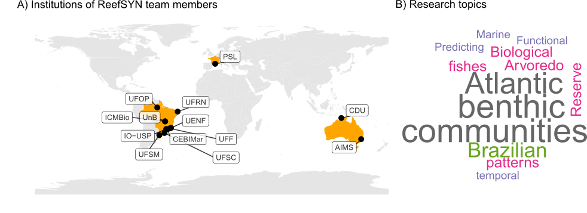

<!-- README.md is generated from README.Rmd. Please edit that file -->

<!-- badges: start -->
<!-- badges: end -->

```{r setup, include=FALSE}
knitr::opts_chunk$set(echo = TRUE)
```

Target journal: Earth System Science Data

Here we present the raw figures of the datapaper. We adopted the Darwin Core Standard to organize the 16 datasets. The root R script "RUN_TO_ORGANIZE_DATA_INTO_DwC.R" can be used to generate these organized datasets from raw datasets. By running this script you will create the folder 'DwC_output' which will host the processed datasets (most of them in a particular folder; exceptions are datasets II and XII (fish and benthos from the ABrolhos Bank), and XI and XVI (fish and benthos from Rio Grande do Norte state), which were produced by the same researchers). Main data updates are listed in the end of this file. 

Folders in this project:

- **Data**: raw datasets. Each dataset folder has its own R script to organize data (DwC standard);

- **DwC_output**: the processed data, after running each organization script;

- **Policy**: policies of authorship and data sharing (only Portuguese);

- **R**: folder with R scripts. Scratch of a Shiny App;


## Figure: Team members' Institutes and Research Topics
```{r dev = c("png", "tiff", "pdf"), echo = F, fig.height=6.5,fig.width=6.5,fig.margin=F,fig.align="center", message=F,warning=F,out.width="80%",out.height="80%",dpi=600}


## R code to load data sets and plot points
## call packages

source("R/packages.R")
source("R/functions.R")
```

```{r include=T,echo=F, warning=F, fig.align='center', out.width="100%",out.height="100%"}
# All defaults




```
Institutes (A) and research topics (B) explored by ReefSYN. Abbreviations: AIMS: Australian Institute of Marine Science; CDU: Charles Darwin University; CEBIMar: Centre for Marine Biology of the University of São Paulo; ICMBio: Chico Mendes Institute for Biodiversity Conservation; IO-USP: Oceanographic Institute of the University of São Paulo; PSL: Paris Sciences et Lettres University; UENF: North Fluminense State University; UFES: Federal University of Espírito Santo; UFF: Fluminense Federal University; UFOPA: Federal University of Western Pará; UFRN: Federal University of Rio Grande do Norte; UFSC: Federal University of Santa Catarina; UFSM: Federal University of Santa Maria; UnB: University of Brasília.


## ReefSYN Data Structure
```{r include=T,echo=F, warning=F, fig.align='center', out.width="75%",out.height="75%"}
# All defaults

knitr::include_graphics("dataStructure.png")

```
Structure of the datasets gathered by the ReefSYN working group, showing the Darwin Core Standard terms included in most datasets. These terms are part of a standardized glossary maintained by the Darwin Core Task Group (2009).


# Data availability
These data are published under CC BY-NC license. “Policy of data sharing and use” can be found in the ReefSYN Organization in Github (available at  [here::here](https://github.com/Sinbiose-Reefs/reefsyn_site/blob/master/DataPolicy_SINBIOSE.pdf)). Data embargo goes up to January 2025.

# Acknowledgements
Students and researchers that collected the data. ReefSYN was supported by the Center for Synthesis in Biodiversity and Ecosystem Services (SinBiose, CNPq). Thiago Silveira and Marina Sissini (PELD-ILOC team).

# Financial support

This project is funded by the Center for Synthesis in Biodiversity and Ecosystem Services SinBiose (https://www.gov.br/cnpq/pt-br/acesso-a-informacao/acoes-e-programas/programas/sinbiose-1) (CNPq #442417/2019-5, granted to MGB). The center is part of the National Council for Scientific and Technological Development (Conselho Nacional de Desenvolvimento Científico e Tecnológico, CNPq). Researchers from the “Brazilian Marine Biodiversity Research Network – SISBIOTA-Mar” (CNPq #563276/2010-0 and FAPESC #6308/2011-8 to SRF) and ‘‘Programa de Monitoramento de Longa Duração das Comunidades Recifais de Ilhas Oceânicas – PELD ILOC’’ (CNPq 441241/2016-6, to CELF), initiatives that collected and shared their data sets used in this research. ALL received post-doctoral fellowships from CNPq (#153024/2022-4, #164240/2021-7, #151228/2021-3, #152410/2020-1). J.P.Q. received post-doctoral fellowship from FAPESP (2018/21380-0 and 2021/). TCM received post-doctoral fellowships from FAPERJ (E-26/202.372/2021) and CNPq (#102450/2022-6). GOL is grateful to a research productivity scholarship provided by the Brazilian National Council for Scientific and Technological Development (CNPq; 310517/2019-2) and Serrapilheira Institute (Grant No. Serra-1708-15364) for continued research support.

## This paper was produced using the following software and associated packages:

```{r pressure, echo=F,warning=F,message=F}

source("R/packages.R")
sessionInfo()


```


