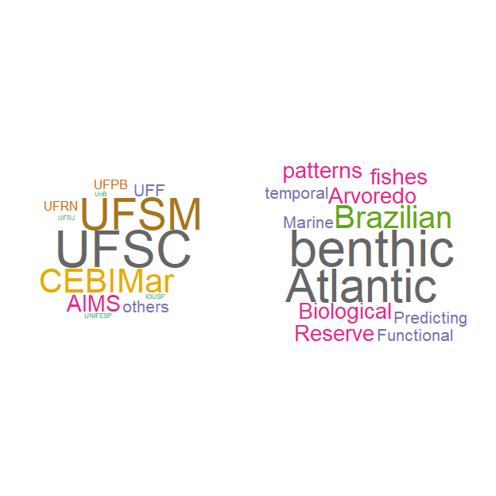
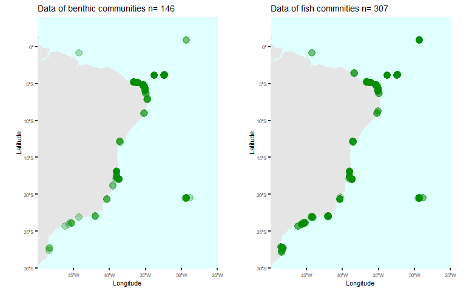
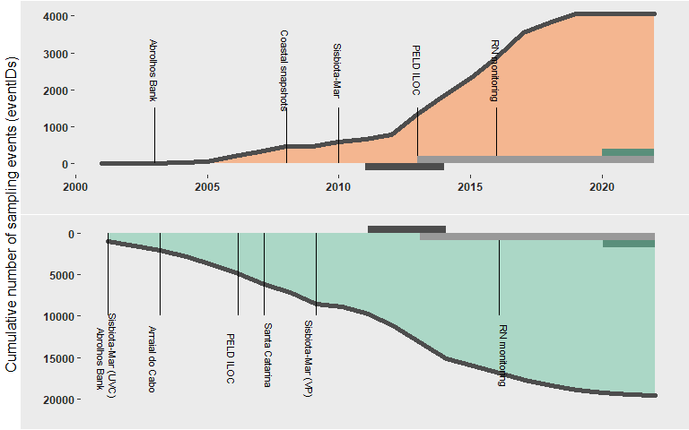
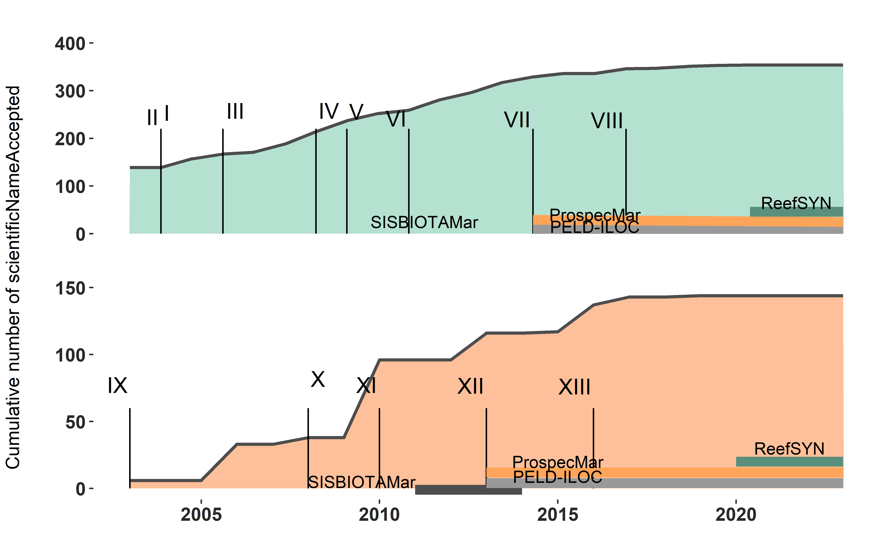

Datapaper Draft: Standardized datasets of Brazilian reef biodiversity in
space and time
================
Reef Synthesis Working Group; Luza, AL, Cordeiro, CAMM, …, Aued, AW,
Ferreira, CEL, Mendes, T., Roos, N, Longo, GO, Francini-Filho, RB,
Floeter, SR, Bender, MG
2022/08/16

<!-- README.md is generated from README.Rmd. Please edit that file -->
<!-- badges: start -->
<!-- badges: end -->

# Paper section 1: Ecological Synthesis, and who are we?

The leveraging of ecological synthesis has two main reasons: ecology is
both entering in the age of big data (Wüest et al. 2020) and applying
the principles of open science (UNESCO 2021). We are now experiencing a
transition from isolated research, with data stored in the drawer, to a
global research network with data stored in public repositories
available to be used for leveraging further research (Reichman et
al. 2011). Brazil just started to track this trend. The ‘Sinbiose’, the
Brazilian Institute of Synthesis in Biodiversity and Ecosystem Services
(Sinbiose, see <http://www.sinbiose.cnpq.br/web/sinbiose/home>),
comprises a pioneer initiative within Latin America in terms of
ecological synthesis and application of open-science principles (UNESCO
2020). There are seven working groups funded by the Sinbiose institute,
being the ReefSYN–**ReefSYN Working Group**  
–the only group working with marine ecosystems (particularly coral and
rocky reefs of the Brazilian marine biogeographical province (Spalding
et al. 2007)).

The ReefSYN is a team of 22 researchers (20 early-career and senior
researchers, supported by two post-doctoral researchers) from several
countries and institutions (Fig. 1). Up to this date, most members of
this team performed research in isolation, each one covering a specific
dimension of reef biodiversity (Fig. 1). By getting funding and support
from the Sinbiose we have now the chance to make data synthesis and
bring together different research expertise/fields/perspectives to
engange into a common objective: *Provide a synthesis about patterns and
drivers of reef diversity and provision of ecological services in
Brazil*. More information about our group can be found at
<https://reefsyn.weebly.com/home-us.html>.

Fig. 1: Institutions and research topics explored by the ReefSYN team
members.

# Paper section 2: Spatial and temporal distribution of data gathered by the ReefSYN Working Group

Over time (since 2001 actually), this team of researchers gathered data
of fish and benthic organisms (e.g., algae, corals) in different
localities scattered throughout the Brazilian coast and oceanic islands.
By standardizing these data to a common, globally accepted standard–the
Darwin Core Standard–it would be possible to integrate data and make
data synthesis to answer more ambitious questions about the functioning
of Brazilian reef ecosystems, as well quantify, given the distribution
of data in space and time, the influence of humans on reef biodiversity
and ecosystem services. Below, we make a spatial mapping of our data,
and show how the accumulation of sample and taxonomic information in
time and space proceeded.

Natural to ecological synthesis is the use of big data (both in terms of
data amount and heterogeneity) (Wüest et al. 2020). To achieve our
objective, we are analyzing data from almost 400 unique localities
distributed throughout the Brazilian coast and oceanic islands. Our data
embrace a notable latitudinal range, from 0.91 to -27.6 latitude
degrees, and cover a significant portion of the Atlantic Ocean. In these
localities, we gathered and standardized both already published and yet
unpublished data of fish and benthic communities to create this large
database under the curatorship of the ReefSYN Working Group. In brief,
all these data came from geographically replicated, large-scale research
programs conducted over the last decades in Brazil (SISBOTA-MAR,
PELD-ILOC, Abrolhos Bank monitoring) and from novel initiatives such as
the monitoring of reef fish and benthos of Rio Grande do Norte. Below we
present the map with the spatial distribution of localities aggregated
across datasets, for fish and benthic organisms (see legend, Fig. 2).

Fig. 2: Spatial distribution of sampling sites of benthos (right) and
fish (left) per dataset.

# Paper section 3: Temporal trends on data acquisition

The dataset presented here reunite information from several independent
and geographically replicated efforts to characterize the marine
biodiversity of the Brazilian province in space and time (Fig. 3). In
terms of the cumulative number of eventIDs (i.e. information associated
with an Event of sampling (something that occurs at a place and time),
Darwin Core Task Group (2009)) across the datasets over time, We can see
that i) there were an abrupt increase in the number of eventIDs after
2013, mainly for benthos (probably leveraged by the Sisbiota-Mar project
(CNPq)), and ii) that the data included in several initiatives (e.g.,
Sisbiota-Mar, PELD ILOC) gather data from past expeditions (i.e., prior
to the grant).

The number of sampling events per dataset, for benthos and fish, are
shown in Tables 1 and 2.

Table 1: number of sampling events of benthos sampling, per dataset.

| samplingProtocol        | eventIDs.Var1           | eventIDs.Freq | Dataset           |
|:------------------------|:------------------------|--------------:|:------------------|
| Photoquadrats           | photoquadrats           |           345 | Sisbiota-Mar      |
| Photoquadrats           | photoquadrats           |           285 | RN monitoring     |
| Photoquadrats 50 X 50cm | Photoquadrats 50 X 50cm |          2748 | PELD ILOC         |
| Photoquadrats           | photoquadrats           |            24 | Coastal snapshots |
| Point-intercept lines   | fixed photo-quadrats    |           595 | Abrolhos Bank     |
| Fixed photo-quadrats    | point-intercept lines   |            54 | Abrolhos Bank     |

Table 2: number of sampling events of fish sampling, per dataset.

| samplingProtocol                   | eventIDs.Var1                      | eventIDs.Freq | Dataset            |
|:-----------------------------------|:-----------------------------------|--------------:|:-------------------|
| Underwater visual survey - 20 x 2m | underwater visual survey - 20 x 2m |           820 | RN monitoring      |
| Video plot                         | video plot                         |           378 | Sisbiota-Mar (VP)  |
| Underwater Visual Survey - 20 x 2m | Underwater Visual Survey - 20 x 2m |          3480 | PELD ILOC          |
| Stationary visual census - 4 x 2m  | stationary visual census - 4 x 2m  |          6422 | Abrolhos Bank      |
| Underwater visual survey - 20 x 2m | underwater visual survey - 20 x 2m |          2146 | Arraial do Cabo    |
| Underwater visual survey - 20 x 2m | underwater visual survey - 20 x 2m |          4570 | Sisbiota-Mar (UVC) |
| Underwater visual survey - 20 x 2m | underwater visual survey - 20 x 2m |          1897 | Santa Catarina     |

The number of sampling events grew over time, with a notable increase
after 2012-2013. Discuss ….

Fig. 3: The number of sampling events accumulated over time for benthos
(top) and fish (bottom). One sampling event consist, for example, on one
transect deployed into a locality. The vertical segments depict the year
in which data included in each Dataset started to be collected. The
horizontal bars depict the formal funding as follows: dark gray bar:
Sisbiota, CNPq; light gray bar: PELD, CNPq; green bar: ReefSYN, Sinbiose
CNPq.

# Paper section 4: Temporal trends on the number of species

It is also natural that the cumulative sampling effort over time produce
more scientific knowledge regarding the number of identified
species/taxa. Here, we counted the cumulative number of scientific
names/taxon names (after a checking with the WORMS database, using the R
package “worrms”). As can be seen in Fig. 4, there was a nearly constant
increase in the number of fish scientific names over time. In contrast,
for benthos, there were several years of constancy amid years of abrupt
increase in the number of identified taxa (Fig. 4).

Fig. 4: Trends in the number of scientific names accumulated over time
for benthos (top) and fish (bottom). The vertical segments depict the
year in which data included in each Dataset started to be collected. The
horizontal bars depict the formal funding as follows: dark gray bar:
Sisbiota, CNPq; light gray bar: PELD, CNPq; green bar: ReefSYN, Sinbiose
CNPq.

# Paper section 5: Brief description of each data set

## Spatial data (snapshots)

### Fish communities from the Brazilian province (Sisbiota-Mar (UVC), Figs. 2 and 3)

This dataset, used by Morais et al. (2017), includes fish counts and
size estimates in 4,570 transects distributed over 137 localities in 20
different sites spanning from 0 to 27°S latitude degrees (including
oceanic islands). The methods used to sample fish was underwater visual
census (UVC). Sampling descriptors include Observer ID, site depth, and
date. The geographical information (coordinates) is at the site (not
transect) level.

### Benthic communities from the Brazilian province (Sisbiota-Mar, Figs. 2 and 3)

This dataset, used by Aued et al. (2018) –data also published at
[DRYAD](https://doi.org/10.5061/dryad.f5s90), includes site-level cover
of \~100 benthic taxa from 3,855 photoquadrats deployed in 40 localities
in 15 different sites spanning 0 to 27°S latitude degrees. Benthic
organisms were identified at several taxonomic levels (morphotype,
species, order). Sampling descriptors include photoquadrat ID, site
depth, date or year and, for some samples, observer ID. The geographical
information is at the site level.

### Benthic communities from the Brazilian province (Coastal snapshots, Figs. 2 and 3)

This dataset was compiled by Erika Santana, Anaíde Aued, and Ronaldo
Francini-Filho, and consists in data of benthic organisms sampled in
photoquadrats deployed in several sites disposed along the coast and
oceanic islands. This dataset is complimentary to the dataset of Aued et
al. (2018). Benthic organisms were identified at several taxonomic
levels (morphotype, species, order). The dataset originally had
environmental descriptors such as site depth, month and year (not in DwC
standards).

### Trophic interactions along the Western Atlantic (Sisbiota-Mar(VP), Figs. 2 and 3)

This dataset, used by Longo et al. (2019), includes records of feeding
behavior of fish over benthos, as well interactions among fish. These
data were obtained with 1,133 unique videoplots deployed in 70
localities from 17 different sites spanning since 34°N to 27°S. Sampling
descriptors include recording time, date, depth, and observed ID.

## Time Series

### Benthic communities from oceanic islands (PELD-ILOC, Figs. 2 and 3)

Dataset of benthic communities recorded in the four oceanic islands of
Brazil: Fernando de Noronha Archipelago, Rocas’ Atoll, Trindade Island
and Martiz Vaz Archipelago, and Saint Peter and Saint Paul’s
Archipelago. Data were collected since 2013 up to 2019, and were curated
by Dr. César Cordeiro and Thiago Silveira (PELD-ILOC team). These data
were generated by the team of [PELD ILOC
project](http://peldiloc.sites.ufsc.br/).

### Fish communities from oceanic islands (PELD-ILOC, Figs. 2 and 3)

Dataset of fish recorded in the four oceanic islands of Brazil: Fernando
de Noronha Archipelago, Rocas’ Atoll, Trindade Island and Martiz Vaz
Archipelago, and Saint Peter and Saint Paul’s Archipelago. Data were
collected since 2013 up to 2019, and were curated by Dr. César Cordeiro
and Thiago Silveira (PELD-ILOC team). The method used to sample fish was
the underwater visual census (UVC). These data were generated by the
team of [PELD ILOC project](http://peldiloc.sites.ufsc.br/).

### Fish and benthic communities from Rio Grande do Norte (RN monitoring, Figs. 2 and 3)

Data collected by Guilherme Longo and Natália Roos in Rio Grande do
Norte. Data of fishes and benthos were collected in the same spatial
unit: within a transect of 20m2 used to register fishes, they deployed
10 photoquadrats to register benthic organisms. These data were used in
a publication by Natalia Roos [Roos et
al. 2019](https://www.int-res.com/prepress/m13005.html). Data have been
collected since 2016.

### Fish communities from Santa Catarina (Santa Catarina, Figs. 2 and 3)

Data from Sergio Floeter. Data collected from xxxx to xxx.

### Fish communities from Arraial do Cabo, Rio de Janeiro (Arraial do Cabo, Figs. 2 and 3)

Data from Carlos EL Ferreira and Thiago C. Mendes. Data collected from
xxx to xxxx.

### Fish communities from Abrolhos Bank (Abrolhos Bank, Figs. 2 and 3)

Data from Ronaldo Francini-Filho. Data collected from 2001 to xxxx.

## Auxiliary datasets (not in this publication)

### A trait dataset for Atlantic and Eastern Pacific fishes

Already published dataset compiled by Quimbayo et
al. (2021)[Link](https://doi.org/10.1002/ecy.3298). These data include
traits of 2,153 fish species. Traits describe activity, size, diet,
distribution, and fishing price.

### Benthic traits from the Brazilian province

Unpublished data collected by Anaide Aued and collaborators (based on
Costello et al. 2013). These data include functional traits of more than
100 taxa of benthic organisms. Traits describe mobility, size, growth
form, trophic level, and accretion capacity.

### Coral traits of the Brazilian province

Unpublished data collected J Bleuel, GO Longo, and other collaborators.
These data include functional traits of 24 coral species. Traits
describe reproduction mode and period, growth rate and form, and
tolerance to depth, light, and temperature.

### Reef fish aesthetic value

Unpublished data from Waechter et al. Dataset that collected data about
people perception about the aesthethic value of Brazilian reef fish and
seascape.

## Spatial polygons

### Marine habitats

Polygons of distribution of marine habitats published by Magris et
al. (2021)[Link](https://doi.org/10.5061/dryad.xsj3tx9d1)

### Brazilian Protected Areas

Spatial polygons of all Brazilian Protected Areas (in land and sea).
These spatial data were shared by Rafael Magris (ICMBio).

## How can you access these data?

These data are published under CC BY-NC licence. “Policy of data sharing
and use” can be found in the ReefSYN Organization in Github (available
[here](https://github.com/Sinbiose-Reefs/reefsyn_site/blob/master/DataPolicy_SINBIOSE.pdf)).
Data embargo goes up to **January 2024**, one year after the end of
ReefSYN funding.

### Funding

This project is funded by the Brazilian Biodiversity Synthesis Center -
[SINBIOSE](http://www.sinbiose.cnpq.br/web/sinbiose) (CNPq
\#442417/2019-5, funding to MGB). The center is part of the National
Council for Scientific and Technological Development (*Conselho Nacional
de Desenvolvimento Científico e Tecnológico*, CNPq).Researchers from the
“Brazilian Marine Biodiversity Research Network – SISBIOTA-Mar” (CNPq
\#563276/2010-0 and FAPESC \#6308/2011-8 to SRF) and ‘‘Programa de
Monitoramento de Longa Duração das Comunidades Recifais de Ilhas
Oceânicas – PELD ILOC’’ (CNPq 441241/2016-6, to CELF), initiatives that
collected and shared their data sets used in this research. ALL
acknowledge the funding of CNPq (#164240/2021-7, \#151228/2021-3,
\#152410/2020-1). GOL is grateful to a research productivity scholarship
provided by the Brazilian National Council for Scientific and
Technological Development (CNPq; 310517/2019-2) and Serrapilheira
Institute (Grant No. Serra-1708-15364) for continued research support.

### References

Darwin Core Task Group. 2009. Darwin Core. Biodiversity Information
Standards (TDWG) <http://www.tdwg.org/standards/450> Mark D. Spalding,
Helen E. Fox, Gerald R. Allen, Nick Davidson, Zach A. Ferdaña, Max
Finlayson, Benjamin S. Halpern, Miguel A. Jorge, Al Lombana, Sara A.
Lourie, Kirsten D. Martin, Edmund McManus, Jennifer Molnar, Cheri A.
Recchia, James Robertson, Marine Ecoregions of the World: A
Bioregionalization of Coastal and Shelf Areas, BioScience, Volume 57,
Issue 7, July 2007, Pages 573–583, <https://doi.org/10.1641/B570707>
Reichman OJ, Jones MB, Schildhauer MP. Challenges and opportunities of
open data in ecology. Science. 2011 Feb 11;331(6018):703-5. doi:
10.1126/science.1197962. PMID: 21311007. UNESCO, 2021. UNESCO
Recommendation on Open Science. Available at:
<https://unesdoc.unesco.org/ark:/48223/pf0000379949>. 34 pages Wüest,
RO, Zimmermann, NE, Zurell, D, et al. Macroecology in the age of Big
Data – Where to go from here? J Biogeogr. 2020; 47: 1– 12.
<https://doi.org/10.1111/jbi.13633>
