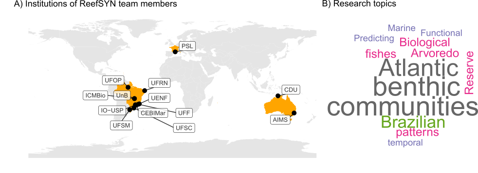
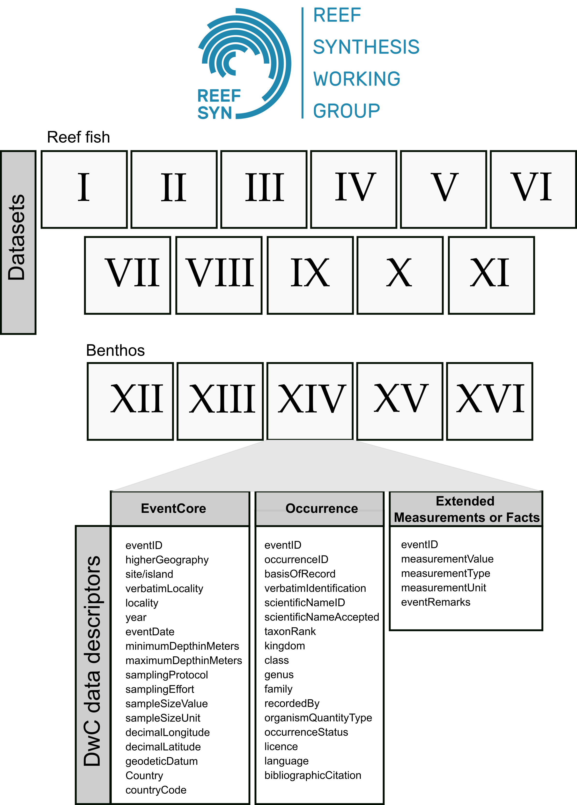

Standardized datasets of Brazilian reef diversity in space and time
================
Reef Synthesis Working Group
2025/10/28

<!-- README.md is generated from README.Rmd. Please edit that file -->
<!-- badges: start -->
<!-- badges: end -->

Here we present main details about our datapaper. We adopted the Darwin
Core Standard to organize the 16 datasets. The root R script
“RUN_TO_ORGANIZE_DATA_INTO_DwC.R” can be used to generate these
organized datasets from raw data. By running this script you will create
the folder ‘DwC_output’, which will then host the processed datasets.
The last updates are listed in the end of this file.

Folders in this project:

- **Data**: raw datasets. Each dataset folder has its own R script to
  organize data (DwC standard);

- **DwC_output**: the processed data, after running each organization
  script - folders will be numbered sequentially from I to XVI;

- **Policy**: policies of authorship and data sharing (only Portuguese);

- **R**: folder with R scripts. Draft of a Shiny App;

## Figure: Team members’ Institutes and Research Topics

Institutes (A) and research topics (B) explored by ReefSYN.
Abbreviations: AIMS: Australian Institute of Marine Science; CDU:
Charles Darwin University; CEBIMar: Centre for Marine Biology of the
University of São Paulo; ICMBio: Chico Mendes Institute for Biodiversity
Conservation; IO-USP: Oceanographic Institute of the University of São
Paulo; PSL: Paris Sciences et Lettres University; UENF: North Fluminense
State University; UFES: Federal University of Espírito Santo; UFF:
Fluminense Federal University; UFOPA: Federal University of Western
Pará; UFRN: Federal University of Rio Grande do Norte; UFSC: Federal
University of Santa Catarina; UFSM: Federal University of Santa Maria;
UnB: University of Brasília.

## ReefSYN Data Structure

Structure of the datasets gathered by the ReefSYN working group, showing
the Darwin Core Standard terms included in most datasets. These terms
are part of a standardized glossary maintained by the Darwin Core Task
Group (2009).

# Data availability

These data are published under CC BY-NC license. “Policy of data sharing
and use” can be found in the ReefSYN Organization in Github (available
at
[here::here](https://github.com/Sinbiose-Reefs/reefsyn_site/blob/master/DataPolicy_SINBIOSE.pdf)).
Data embargo goes up to January 2025.

# Acknowledgements

Students and researchers that collected the data. ReefSYN was supported
by the Center for Synthesis in Biodiversity and Ecosystem Services
(SinBiose, CNPq). The authors would like to thank the contributions of
Thiago Silveira and Marina Sissini (PELD-ILOC team).

# Financial support

This research was conducted by the team and collaborators of the Reef
Synthesis Working Group (ReefSYN) funded by the Brazilian National
Council for Scientific and Technological Development (CNPq) through the
Synthesis Center on Biodiversity and Ecosystem Services (SinBiose, CNPq,
\#442417/2019-5 to MGB) and PPBio INTEGRA-Mar (MCTI, CNPq, 441226/2023-0
to MGB and GOL) Researchers from the ‘Brazilian Marine Biodiversity
Research Network—SISBIOTA-Mar’ (CNPq \#563276/2010-0 and FAPESC
\#6308/2011-8 to SRF), ‘Programa de Monitoramento de Longa Duração das
Comunidades Recifais de Ilhas Oceânicas—PELD ILOC’ (CNPq
\#441327/2020-6, to CELF) and Universidade Federal do Espírito Santo
(Fundação de Amparo à Pesquisa do Espírito Santo, FAPES grant
\#38854660/2007) collected and shared datasets used in this research.
The project of dataset VIII was funded by Fundação Grupo O Boticário,
Fundação SOS Mata Atlântica and ICMBio. ALL received post-doctoral
fellowships from CNPq (#153024/2022-4, \#164240/2021-7, \#151228/2021-3,
\#152410/2020-1) and CAPES (PDPG-POSDOC, \#88887.800011/2022-00). JPQ
received post-doctoral fellowships from FAPESP (2018/21380-0 and
2021/09279-4). GOL is grateful to his research productivity scholarship
provided by CNPq (#310517/2019-2 and 308072/2022-7), and to
Serrapilheira Institute (Grant No. Serra-1708-15364) for continued
research support. CELF, RBFF and SRF are grateful for their research
productivity scholarships provided by CNPq (#304004/2018-9 to CELF,
\#309651/2021-2 to RBFF, and \#307340/2019-8 to SRF). HT Pinheiro
acknowledges a CAPES scholarship for his master degree between 2008 and
2010. The group thanks Ana Paula Prates (Brazilian Ministry of the
Environment) for kindly sharing the map of priority areas, and Leticia
Costa-Lotufo and the ProspecMar-Ilhas team (CNPq, \#62/2013) for
supporting PELD researchers during data acquisition on oceanic islands.

## Last updates:

### 2026/04/15

1)  Taxonomic corrections (due to J. Feitosa review in ESSD journal):

<!-- -->

1)  *Goblioclinus* to *Gobioclinus*

### 2025/10/28

1 - Correcting year in dataset IX;  
2 - Correction of site name in dataset V (“cabritas” to
“praia_das_cabritas”);  

ToDo list:

1)  Sum of benthic cover within eventIDs sum 1 (ie. plot scale). For
    some datasets might not be possible (XIII, for which plot ID was not
    available). Look the scripts in R/Corrections and try to solve the
    issues. PS: perhaps not a problem if one wants to work at site
    level, but need some care if one is interested in plot-level cover
    data;
2)  Is it possible to define a scale (hierarchy of locations,
    localities, etc) that integrates all data sets? From now, each data
    set has an unique hierarchy which might not match with other data
    sets. Perhaps the best way to create ‘sites’ is through the use of
    the whole hierarchy by creating combinations of unique coordinates,
    locations, localities, regions.

### 2025/06/24

1 - Folders with DwC data named appropriately (from I to XVI);  
2 - The redundancy of records among data sets was eliminated. For
instance, many records from PELD, ES, SC, …, were aggregated to the
Dataset I – SISBIOTA data set– in the past, generating the data
redundancy (identified by Juliana Fonseca-UFF). Thus, we kept the
records from their original sources;  
3 - The taxonomic updates were:  
a) *Ophioblennius atlanticus* (Only eastern Atlantic): Brazil has
*Ophioblennius trinitatis* in the coast and islands. The only exception
is Santa Catarina, which has a new species (SR Floeter pers. comm.).
Thus, the data set of Santa Catarina has just “Ophioblennius”. Details
can be found here:
<https://lbmm.ufsc.br/pdfs/Lastrucci_et_al_(2018)_Ophioblennius_JFB.pdf>;  
b) *Stegastes fuscus trindadensis* in Trindade, instead of *Stegastes
fuscus*.  

## The data was processed using the following versions of software and associated packages:

    ## R version 4.5.2 (2025-10-31 ucrt)
    ## Platform: x86_64-w64-mingw32/x64
    ## Running under: Windows 11 x64 (build 26200)
    ## 
    ## Matrix products: default
    ##   LAPACK version 3.12.1
    ## 
    ## locale:
    ## [1] LC_COLLATE=Portuguese_Brazil.utf8  LC_CTYPE=Portuguese_Brazil.utf8   
    ## [3] LC_MONETARY=Portuguese_Brazil.utf8 LC_NUMERIC=C                      
    ## [5] LC_TIME=Portuguese_Brazil.utf8    
    ## 
    ## time zone: Europe/Paris
    ## tzcode source: internal
    ## 
    ## attached base packages:
    ## [1] parallel  stats     graphics  grDevices utils     datasets  methods  
    ## [8] base     
    ## 
    ## other attached packages:
    ##  [1] patchwork_1.3.2         magrittr_2.0.4          reshape2_1.4.5         
    ##  [4] mapdata_2.3.1           maps_3.4.3              plotly_4.12.0          
    ##  [7] xts_0.14.2              zoo_1.8-15              dygraphs_1.1.1.6       
    ## [10] vegan_2.7-2             permute_0.9-8           leaflet_2.2.3          
    ## [13] flexdashboard_0.6.3     rerddap_1.2.3           png_0.1-9              
    ## [16] knitr_1.51              wordcloud_2.6           RColorBrewer_1.1-3     
    ## [19] terra_1.8-86            SnowballC_0.7.1         tm_0.7-18              
    ## [22] NLP_0.3-2               sf_1.0-23               scatterpie_0.2.6       
    ## [25] ggrepel_0.9.6           gridExtra_2.3           rnaturalearthdata_1.0.0
    ## [28] rnaturalearth_1.1.0     lubridate_1.9.4         forcats_1.0.1          
    ## [31] stringr_1.6.0           dplyr_1.1.4             purrr_1.2.0            
    ## [34] readr_2.1.6             tidyr_1.3.2             tibble_3.3.0           
    ## [37] ggplot2_4.0.1           tidyverse_2.0.0         openxlsx_4.2.8.1       
    ## [40] here_1.0.2             
    ## 
    ## loaded via a namespace (and not attached):
    ##  [1] DBI_1.2.3          rlang_1.1.6        otel_0.2.0         e1071_1.7-17      
    ##  [5] compiler_4.5.2     mgcv_1.9-3         vctrs_0.6.5        httpcode_0.3.0    
    ##  [9] pkgconfig_2.0.3    fastmap_1.2.0      rmarkdown_2.30     tzdb_0.5.0        
    ## [13] xfun_0.55          cachem_1.1.0       jsonlite_2.0.0     tweenr_2.0.3      
    ## [17] cluster_2.1.8.2    R6_2.6.1           bslib_0.9.0        stringi_1.8.7     
    ## [21] hoardr_0.5.5       jquerylib_0.1.4    Rcpp_1.1.0         Matrix_1.7-4      
    ## [25] splines_4.5.2      timechange_0.3.0   tidyselect_1.2.1   rstudioapi_0.17.1 
    ## [29] yaml_2.3.12        codetools_0.2-20   curl_7.0.0         plyr_1.8.9        
    ## [33] lattice_0.22-7     withr_3.0.2        S7_0.2.1           evaluate_1.0.5    
    ## [37] units_1.0-0        proxy_0.4-29       polyclip_1.10-7    zip_2.3.3         
    ## [41] xml2_1.5.1         pillar_1.11.1      KernSmooth_2.23-26 ggfun_0.2.0       
    ## [45] ncdf4_1.24         generics_0.1.4     rprojroot_2.1.1    hms_1.1.4         
    ## [49] scales_1.4.0       class_7.3-23       glue_1.8.0         slam_0.1-55       
    ## [53] lazyeval_0.2.2     tools_4.5.2        data.table_1.18.0  fs_1.6.6          
    ## [57] grid_4.5.2         crosstalk_1.2.2    nlme_3.1-168       ggforce_0.5.0     
    ## [61] cli_3.6.5          rappdirs_0.3.3     viridisLite_0.4.2  gtable_0.3.6      
    ## [65] yulab.utils_0.2.3  sass_0.4.10        digest_0.6.39      classInt_0.4-11   
    ## [69] crul_1.6.0         htmlwidgets_1.6.4  farver_2.1.2       htmltools_0.5.9   
    ## [73] lifecycle_1.0.4    httr_1.4.7         MASS_7.3-65
