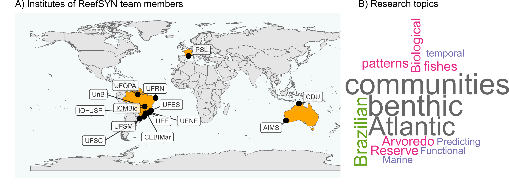
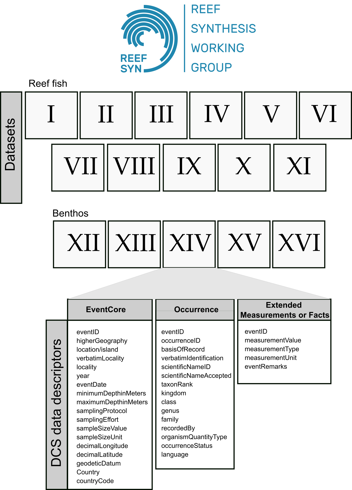

Standardized datasets of Brazilian reef diversity in space and time
================
Reef Synthesis Working Group
2023/12/14

<!-- README.md is generated from README.Rmd. Please edit that file -->
<!-- badges: start -->
<!-- badges: end -->

Target journal: Earth System Science Data

Here we present the raw figures of the datapaper. We adopted the Darwin
Core Standard to organize the 16 datasets. The root R script
“RUN_TO_ORGANIZE_DATA_INTO_DwC.R” can be used to generate these
organized datasets from raw datasets. By running this script you will
create the folder ‘DwC_output’ which will host the processed datasets
(most of them in a particular folder; exceptions are datasets II and XII
(fish and benthos from the ABrolhos Bank), and XI and XVI (fish and
benthos from Rio Grande do Norte state), which were produced by the same
researchers).

Folders in this project:

- **Data**: raw datasets. Each dataset folder has its own R script to
  organize data (DwC standard);

- **DwC_output**: the processed data, after running each organization
  script;

- **Policy**: policies of authorship and data sharing (only Portuguese);

- **R**: folder with R scripts. Scratch of a Shiny App;

## Figure: Team members’ Institutes and Research Topics

Institutes and research topics explored by ReefSYN team members and
collaborators. Abbreviations: AIMS: Australian Institute Of Marine
Science; CDU: Charles Darwin University; CEBIMar: Centro de Biologia
Marinha of the University of São Paulo; ICMBio: Chico Mendes Institute
for Biodiversity Conservation; IO-USP: Oceanographic Institute of the
University of São Paulo; PSL: Paris Sciences et Lettres University;
UENF: Universidade Federal do Norte Fluminense; UFES: Universidade
Federal do Espírito Santo; UFF: Universidade Federal Fluminense; UFOP:
Universidade Federal do Oeste do Pará; UFRN: Universidade Federal do Rio
Grande do Norte; UFSC: Universidade Federal de Santa Catarina; UFSM:
Universidade Federal de Santa Maria; UnB: Universidade de Brasília.

## ReefSYN Data Structure

Structure of the datasets gathered by the ReefSYN working group, showing
the Darwin Core Standard terms included in most datasets. These terms
are part of a standardized glossary maintained by the Darwin Core Task
Group (2009).

# Data availability

These data are published under CC BY-NC license. “Policy of data sharing
and use” can be found in the ReefSYN Organization in Github (available
at
[here::here](https://github.com/Sinbiose-Reefs/reefsyn_site/blob/master/DataPolicy_SINBIOSE.pdf)).
Data embargo goes up to January 2025.

# Acknowledgements

Students and researchers that collected the data. ReefSYN was supported
by the Center for Synthesis in Biodiversity and Ecosystem Services
(SinBiose, CNPq). Thiago Silveira and Marina Sissini (PELD-ILOC team).

# Financial support

This project is funded by the Center for Synthesis in Biodiversity and
Ecosystem Services SinBiose
(<https://www.gov.br/cnpq/pt-br/acesso-a-informacao/acoes-e-programas/programas/sinbiose-1>)
(CNPq \#442417/2019-5, granted to MGB). The center is part of the
National Council for Scientific and Technological Development (Conselho
Nacional de Desenvolvimento Científico e Tecnológico, CNPq). Researchers
from the “Brazilian Marine Biodiversity Research Network – SISBIOTA-Mar”
(CNPq \#563276/2010-0 and FAPESC \#6308/2011-8 to SRF) and ‘‘Programa de
Monitoramento de Longa Duração das Comunidades Recifais de Ilhas
Oceânicas – PELD ILOC’’ (CNPq 441241/2016-6, to CELF), initiatives that
collected and shared their data sets used in this research. ALL received
post-doctoral fellowships from CNPq (#153024/2022-4, \#164240/2021-7,
\#151228/2021-3, \#152410/2020-1). J.P.Q. received post-doctoral
fellowship from FAPESP (2018/21380-0 and 2021/). TCM received
post-doctoral fellowships from FAPERJ (E-26/202.372/2021) and CNPq
(#102450/2022-6). GOL is grateful to a research productivity scholarship
provided by the Brazilian National Council for Scientific and
Technological Development (CNPq; 310517/2019-2) and Serrapilheira
Institute (Grant No. Serra-1708-15364) for continued research support.

## This paper was produced using the following software and associated packages:

    ## R version 4.3.2 (2023-10-31 ucrt)
    ## Platform: x86_64-w64-mingw32/x64 (64-bit)
    ## Running under: Windows 10 x64 (build 19045)
    ## 
    ## Matrix products: default
    ## 
    ## 
    ## locale:
    ## [1] LC_COLLATE=Portuguese_Brazil.utf8  LC_CTYPE=Portuguese_Brazil.utf8   
    ## [3] LC_MONETARY=Portuguese_Brazil.utf8 LC_NUMERIC=C                      
    ## [5] LC_TIME=Portuguese_Brazil.utf8    
    ## 
    ## time zone: America/Sao_Paulo
    ## tzcode source: internal
    ## 
    ## attached base packages:
    ## [1] parallel  stats     graphics  grDevices utils     datasets  methods  
    ## [8] base     
    ## 
    ## other attached packages:
    ##  [1] patchwork_1.1.3         magrittr_2.0.3          reshape2_1.4.4         
    ##  [4] mapdata_2.3.1           maps_3.4.1.1            plotly_4.10.3          
    ##  [7] xts_0.13.1              zoo_1.8-12              dygraphs_1.1.1.6       
    ## [10] vegan_2.6-4             lattice_0.22-5          permute_0.9-7          
    ## [13] leaflet_2.2.1           flexdashboard_0.6.2     rerddap_1.0.4          
    ## [16] png_0.1-8               knitr_1.45              wordcloud_2.6          
    ## [19] RColorBrewer_1.1-3      SnowballC_0.7.1         tm_0.7-11              
    ## [22] NLP_0.2-1               rgeos_0.6-2             sp_2.1-1               
    ## [25] sf_1.0-14               scatterpie_0.2.1        ggrepel_0.9.4          
    ## [28] gridExtra_2.3           rnaturalearthdata_0.1.0 rnaturalearth_0.3.4    
    ## [31] lubridate_1.9.3         forcats_1.0.0           stringr_1.5.1          
    ## [34] dplyr_1.1.4             purrr_1.0.2             readr_2.1.4            
    ## [37] tidyr_1.3.0             tibble_3.2.1            ggplot2_3.4.4          
    ## [40] tidyverse_2.0.0         openxlsx_4.2.5.2        here_1.0.1             
    ## 
    ## loaded via a namespace (and not attached):
    ##  [1] DBI_1.1.3          rlang_1.1.2        e1071_1.7-13       compiler_4.3.2    
    ##  [5] mgcv_1.9-0         vctrs_0.6.4        httpcode_0.3.0     pkgconfig_2.0.3   
    ##  [9] fastmap_1.1.1      utf8_1.2.4         rmarkdown_2.25     tzdb_0.4.0        
    ## [13] xfun_0.41          cachem_1.0.8       jsonlite_1.8.7     highr_0.10        
    ## [17] tweenr_2.0.2       cluster_2.1.4      R6_2.5.1           bslib_0.6.0       
    ## [21] stringi_1.8.1      hoardr_0.5.3       jquerylib_0.1.4    Rcpp_1.0.10       
    ## [25] Matrix_1.6-3       splines_4.3.2      timechange_0.2.0   tidyselect_1.2.0  
    ## [29] rstudioapi_0.15.0  yaml_2.3.7         curl_5.1.0         plyr_1.8.9        
    ## [33] withr_2.5.2        evaluate_0.23      units_0.8-4        proxy_0.4-27      
    ## [37] polyclip_1.10-6    zip_2.3.0          xml2_1.3.5         pillar_1.9.0      
    ## [41] KernSmooth_2.23-22 ggfun_0.1.3        ncdf4_1.21         generics_0.1.3    
    ## [45] rprojroot_2.0.4    hms_1.1.3          munsell_0.5.0      scales_1.2.1      
    ## [49] class_7.3-22       glue_1.6.2         slam_0.1-50        lazyeval_0.2.2    
    ## [53] tools_4.3.2        data.table_1.14.8  grid_4.3.2         crosstalk_1.2.1   
    ## [57] colorspace_2.1-0   nlme_3.1-163       ggforce_0.4.1      cli_3.6.1         
    ## [61] rappdirs_0.3.3     fansi_1.0.5        viridisLite_0.4.2  gtable_0.3.4      
    ## [65] sass_0.4.7         digest_0.6.33      classInt_0.4-10    crul_1.4.0        
    ## [69] htmlwidgets_1.6.3  farver_2.1.1       htmltools_0.5.7    lifecycle_1.0.4   
    ## [73] httr_1.4.7         MASS_7.3-60
