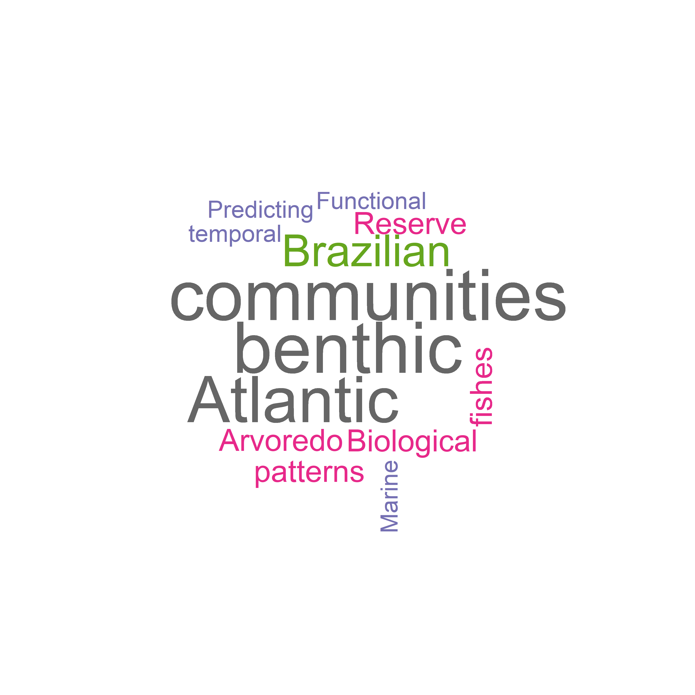

Standardized datasets of Brazilian reef diversity in space and time
================
Reef Synthesis Working Group; Luza, AL, Cordeiro, CAMM, …, Aued, AW,
Ferreira, CEL, Floeter, SR, Francini-Filho, RB, Longo, GO, Mendes, T,
Roos, N, Segal, B, Bender, MG
2023/04/26

<!-- README.md is generated from README.Rmd. Please edit that file -->
<!-- badges: start -->
<!-- badges: end -->

# 1 Introduction

The recent rise of ecological synthesis has two main reasons: ecology is
both entering in the age of big data (Michener & Jones 2012), and is
increasingly applying the principles of open science (UNESCO 2021,
Reichman et al. 2011). We are now experiencing a transition from
isolated research, with data stored locally, to a global research
network with data stored in public repositories and promptly available
to foster further research (Reichman et al. 2011). Brazil has just
started to follow this trend. For example, The ‘SinBiose’, the Center
for Synthesis in Biodiversity and Ecosystem Services (see
<http://www.sinbiose.cnpq.br/web/sinbiose/home>), is the first
ecological synthesis center in Brazil and Latin America and brings
innovative ideas about data synthesis and application of open-science
principles (Luza et al., in prep.). Currently, seven working groups are
funded by SinBiose, from which ReefSYN –**Reef Synthesis Working
Group**– is the only one developing research on marine ecosystems,
particularly on biogenic and rocky reefs of the Brazilian marine
biogeographical province (Briggs 1974). The ReefSYN gathers 22
researchers (20 early-career and senior researchers, assisted by two
post-doctoral researchers) from several countries and institutions (Fig.
1). Funding from SinBiose (CNPq) has given the ReefSYN group the
opportunity to gather scientists of different areas of expertise,
assemble data and develop ecological synthesis with a common objective:
*to investigate the patterns and drivers of reef biodiversity and the
provision of reef ecosystem services in Brazil* (see
<https://reefsyn.weebly.com/home-us.html>). Curating available datasets
to a common, globally accepted standard –the Darwin Core Standard– would
enable synthesis to answer ambitious questions on drivers of diversity
and functioning of Brazilian reef ecosystems, and quantifying/ assessing
anthropogenic impacts on reef biodiversity and ecosystem services.
Adequate data standardization and storage enable data to be findable,
accessible, interoperable and reusable (the ‘FAIR’ principles, Wilkinson
et al. 2016) such that data can be integrated with pre-existing datasets
by researchers and/or machine-learning algorithms. Following these
principles we hereby present and characterize the 12 datasets gathered
by ReefSYN (seven of fish and five of benthos), showing summaries of
spatial distribution, sampling effort and methods, gain of data over
time, and taxonomic coverage of data.

Fig. 1: Institutions (A) and research topics (B) explored by the ReefSYN
team members.

# 2 Methodology

## 2.1 Geographical and temporal coverage

From 2001 up to 2020, we gathered data on fish and benthic organisms
(e.g., algae, corals) in more 344 localities distributed throughout the
Brazilian coast and oceanic islands (Fig. 2, Tables 1 and 2). All these
data came from geographically replicated, large-scale and long-term
ecological monitoring research programs conducted over the last decades
in Brazil (SISBOTA-MAR, PELD-ILOC, Abrolhos Bank monitoring), and from
novel initiatives such as the monitoring of reef fish and benthos of Rio
Grande do Norte (e.g., Ross et al. 2019). The Brazilian marine
biogeographical province (Briggs, 1974; Floeter et al., 2008; Pinheiro
et al., 2018), located in Southwestern Atlantic, host reefs with mostly
turbid and nutrient-rich waters due to the sediment discharge from
several rivers that flow into the coast (Aued et al., 2018; Loiola et
al., 2019; Mies et al., 2020).Coral and rocky reefs are disposed along
more than 27 latitude degrees in the narrow continental shelf (0.91N to
27.6S latitude degrees; Fig. 3). These reefs are exposed to varied
temperature, productivity and salinity settings, producing a
north/northeast and south/southeast regionalization of the coastal
biodiversity (Cord et al., 2022; Pinheiro et al., 2018). Far from the
coast there are four oceanic islands, which host coralligenous and rocky
reefs, with high endemism levels, and a varied similarity in species
composition to that of coastal reefs (Cord et al., 2022; Pinheiro et
al., 2018). Recent analysis of spatially extensive benthic datasets
revealed clear-water reef communities occurring in the oceanic islands
and in oligotrophic waters from the Northeast region, whereas
turbid-water reef communities occurring throughout the coast (Santana et
al. 2023). The sampling effort available in the current datasets was not
evenly distributed in time. Indeed, since 2001, the number of samples
accumulated over time, as well as the number of sampled taxa (Fig. 2).
There was a notable increase in sampling effort after 2012-2013, which
is associated with the Sisbiota-Mar network, the increase in team
members, aggregation of datasets, and the total amount of financial
support derived from network cooperative efforts/partners. The
ProspeqMar project, for example, which has bioprospection and holobiotic
investigation objectives, has been an important contribution to network
maintenance from 2013 onwards. Notably, the cumulative number of
eventIDs (i.e. information associated with a sampling event–
i.e. something that occurs at a place and time– Darwin Core Task Group
(2009)) over time across the datasets show that i) there was an abrupt
increase in the number of eventIDs after 2013, mainly for benthos
(leveraged by the Sisbiota-Mar project (CNPq)), ii) large projects such
as Sisbiota-Mar and PELD ILOC have already made an effort to gather data
from previous initiatives (Krajewski & Floeter 2011), iii) there was a
nearly constant increase in the number of fish taxa over time. For
benthos, in contrast, there were years of constancy amid years of abrupt
increase in the number of identified taxa (Figs. 3 and 4), a delay
probably caused by the laboratory and computational work required to
identify these organisms.

Fig. 2: Spatial distribution of fish (left) and benthos (right) sampling
sites per dataset.

## 2.2 Data description

The datasets described here represent different efforts to gather data
on reef fish and benthos along the Brazilian biogeographical province.
We hereby present 13 datasets, being eight of reef fish and five of
benthos. Three out of seven fish datasets and two out of five benthic
datasets are time series (Tables 1 and 2). The remaining datasets are
spatial snapshots (only one visit to a site) whose data were collected
over many years. There were a total of 24020 samples distributed
throughout the Brazilian biogeographic province (n=19969 for fish, and
n=4051) from 2001 to 2023. These samples were distributed in a total of
55 sites and 316 localities.

Table 1: Description of reef fish datasets.

| Dataset |         Sampling Protocol          | Samples (n) |     Scale     | Sampling area (m2) | Number of sites |    Latitude    |   Longitude    |   Years   |
|:-------:|:----------------------------------:|:-----------:|:-------------:|:------------------:|:---------------:|:--------------:|:--------------:|:---------:|
|    I    | Underwater visual survey - 20 x 2m |    4570     | Transect/plot |         40         |       20        |  -27.85, 0.92  | -48.52, -28.86 | 2001-2015 |
|   VI    |        Video plot - 2 x 1m         |     390     | Transect/plot |         2          |       12        |  -27.6, -0.87  | -48.39, -34.04 | 2009-2014 |
|   IV    | Underwater Visual Survey - 20 x 2m |    3480     | Transect/plot |         40         |        4        |  -20.53, 0.97  | -33.82, -28.86 | 2006-2019 |
|  VIII   | Underwater visual survey - 20 x 2m |     859     | Transect/plot |         40         |        7        |  -6.38, -4.72  | -36.7, -34.93  | 2016-2023 |
|    V    | Underwater visual survey - 20 x 2m |    1897     | Transect/plot |         40         |        9        | -27.84, -27.12 | -48.53, -48.33 | 2007-2021 |
|   III   | Underwater visual survey - 20 x 2m |    2146     | Transect/plot |         40         |        1        | -23.01, -22.96 | -42.04, -41.98 | 2003-2021 |
|   II    | Stationary visual survey - 4 x 2m  |    6422     | Transect/plot |         8          |        5        |  -18, -16.89   | -39.15, -38.65 | 2001-2014 |
|   VII   | Underwater visual survey - 20 x 2m |     330     | Transect/plot |         40         |        1        | -24.11, -24.1  | -45.71, -45.69 | 2013-2022 |

Table 2: number of sampling events of benthos sampling, per dataset.

| Dataset |       Sampling Protocol       | Samples (n) |   Scale    | Sampling area (m2) | Number of sites |    Latitude    |   Longitude    |   Years   |
|:-------:|:-----------------------------:|:-----------:|:----------:|:------------------:|:---------------:|:--------------:|:--------------:|:---------:|
|   XI    | Photoquadrats - 0.25 x 0.25 m |     345     | Plot/point |        0.06        |       15        |  -27.6, -0.87  | -48.39, -29.31 | 2010-2014 |
|    X    | Photoquadrats - 0.66 x 0.75 m |     24      | Plot/point |        0.50        |        7        |  -24.29, 0.92  | -46.18, -28.86 | 2008-2018 |
|   XII   |    Photoquadrats 50 X 50cm    |    2748     | Plot/point |        0.25        |        4        |  -20.52, 0.92  | -33.82, -29.32 | 2013-2019 |
|  XIII   | Photoquadrats - 0.25 x 0.25 m |     285     | Plot/point |        0.06        |        7        |  -6.38, -4.75  | -36.69, -34.93 | 2016-2017 |
|   IX    |  Photoquadrats - 0.5 x 0.5 m  |     54      | Plot/point |        0.66        |        7        | -17.98, -16.89 | -39.15, -38.66 | 2003-2014 |
|   IX    |   Photoquadrats - 1 X 0.7 m   |     595     | Plot/point |        0.66        |        7        | -17.98, -16.89 | -39.15, -38.66 | 2003-2014 |

<!-- badges: start -->
<!-- badges: end -->

Fig. 3: The number of sampling events accumulated over time for fish
(top) and benthos (bottom). One sampling event consists, for example, on
one transect deployed into a locality. The vertical segments indicate
the year in which data included in each dataset started to be collected.
The horizontal bars depict the main funding sources as follows: dark
gray bar: Sisbiota, CNPq; light gray bar: PELD, CNPq; green bar:
ReefSYN, SinBiose CNPq.Databases: I: Fish communities from the Brazilian
province; II: Abrolhos Bank monitoring/time series; III: Arraial do Cabo
(Rio de Janeiro) monitoring/time series; IV: Oceanic islands’
monitoring/time series; V: Santa Catarina monitoring/time series; VI:
Trophic interactions along the Western Atlantic; VII: Alcatrazes
monitoring/time series; VIII: Rio Grande do Norte monitoring/time
series; IX: Benthic communities’ monitoring in Abrolhos Bank; X:
Extended benthic communities from the Brazilian province; XI: Benthic
communities from the Brazilian province; XII: Benthic communities’
monitoring/time series from oceanic islands; XIII: Benthic communities
from Rio Grande do Norte.

Fig. 4: Trends in the number of scientific names accumulated over time
for fish (top) and benthos (bottom). The vertical segments depict the
year in which data included in each Dataset started to be collected. The
horizontal bars depict the formal funding as follows: dark gray bar:
Sisbiota, CNPq; light gray bar: PELD, CNPq; green bar: ReefSYN, SinBiose
CNPq. Databases: I: Fish communities from the Brazilian province; II:
Abrolhos Bank monitoring/time series; III: Arraial do Cabo (Rio de
Janeiro) monitoring/time series; IV: Oceanic islands’ monitoring/time
series; V: Santa Catarina monitoring/time series; VI: Trophic
interactions along the Western Atlantic; VII: Alcatrazes monitoring/time
series; VIII: Rio Grande do Norte monitoring/time series; IX: Benthic
communities’ monitoring in Abrolhos Bank; X: Extended benthic
communities from the Brazilian province; XI: Benthic communities from
the Brazilian province; XII: Benthic communities’ monitoring/time series
from oceanic islands; XIII: Benthic communities from Rio Grande do
Norte.

# 2.3 Data sources and sampling protocol

## 2.3.1 Reef fish datasets

### 2.3.1.1 Dataset I: Fish communities from the Brazilian province

This dataset, used by Morais et al. (2017), includes fish counts and
size estimates in 4,570 transects distributed over 137 localities in 20
different sites spanning from 0° to 27°S latitude degrees (including
oceanic islands). Sampling descriptors include *Observer ID*, *site
depth*, and *date*. The geographical information (coordinates) is
indicated here at the site level (i.e., represents a set of replicates
of transects in a given time and place). The method used to sample fish
was underwater visual census (UVC) with 20 × 2m in dimension, and
samples were obtained in the austral summer from 2007 to 2011. Strip
transects performed by free or scuba diving, during which the diver
unwound a tape while identifying, counting and estimating the total
length (LT, cm) of non-cryptic fishes \>10 cm. And, while retracting the
tape, following the same procedure for benthic-associated non-cryptic
fishes \<10 cm and cryptic species (see Morais et al. 2017 for more
details). The dataset also includes data from Krajewski & Floeter
(2011).

### 2.3.1.2 Dataset II: Abrolhos Bank monitoring/time series

Fish assemblage data from the Abrolhos Bank was collected by Ronaldo
Francini-Filho from 2001 to 2014. The dataset here includes samples of
five sites and 28 localities nested within sites but not evenly
distributed in space.. The variables in this dataset are related to the
description of fish identification and abundance, measured at stationary
visual censuses (4 x 2m, 5 min). Depth of sampling varied among sites
and ranged between 2 and 15m. Benthic communities assessments were
completed at the same sites, localities and depths of fish stationary
censuses, using either point-intersect technique (four 10m-transects in
each depth and locality) or photo quadrats (10 quadrats, 0.7m2).

### 2.3.1.3 Dataset III: Arraial do Cabo (Rio de Janeiro) monitoring/time series

The data were collected by the [LECAR team](https://www.lecar.uff.br/)
from 2003 to 2021, but were annually collected only from 2014 to 2021 at
four of the 21 sites monitored. All other sites were sampled
opportunistically. Dataset includes fish species, size and abundance
recorded at 40m2 (20x2m) belt-transects in rocky reefs in Arraial do
Cabo, Rio de Janeiro. Transects were laid at different depths at,
approximately, 5m intervals according to local maximum depths, ranging
from 1 to 25m deep. Samples include data from two distinct oceanographic
domains present locally, one under strong influence of seasonal
upwelling, and another with indirect influence of the upwelling.

### 2.3.1.4 Dataset IV: Oceanic islands’ monitoring/time series

Dataset of fish recorded in the four oceanic islands of Brazil: Fernando
de Noronha Archipelago, Rocas’ Atoll, Trindade Island and Martiz Vaz
Archipelago, and Saint Peter and Saint Paul’s Archipelago. Data were
collected from 2013 to 2019, organized by Juan Quimbayo, Thiago Silveira
and Cesar Cordeiro (PELD-ILOC team) and is curated by Cesar Cordeiro.
The method used to sample fish was the underwater visual census (UVC).
These data were generated by the team of applying the same UVS protocol
(20 x 2m strip transect) described above and used by Morais et
al. (2017). Transects were laid at different depths at 5m intervals
according to local maximum depths, ranging from 3 to 25m deep.

### 2.3.1.5 Dataset V: Santa Catarina monitoring/time series

The data was collected yearly by the [LBMM team](https://lbmm.ufsc.br/),
from 2007 to 2021. Dataset includes fish species, size and abundance
recorded at 40m2 (20x2m) belt-transects in nine sites along the Santa
Catarina state coastal area. Transects were laid at different depths at,
approximately, 5m intervals according to local maximum depths, ranging
from 1 to 25m deep (Quimbayo et al. 2022).

### 2.3.1.6 Dataset VI: Trophic interactions along the Western Atlantic

This dataset, used by Longo et al. (2019), includes records of feeding
behavior of fish over the benthic community, as well interactions among
fish. These data were obtained with 1,133 unique videoplots deployed in
70 localities from 17 different sites spanning 61 degrees of latitude,
from 34°N to 27°S. Sampling descriptors include *recording time*,
*date*, *depth*, and *observed ID*. At each site, static videos were
replicated at 2 × 1 m areas positioned haphazardly on the reefs, with
5–10 m between replicates. Feeding pressure was estimated as the product
of the number of bites taken and the body mass (in kilograms) of the
fish, accounting for body size variation. Individual biomass was
obtained through length–weight relationships from the literature (Froese
& Pauly, 2016).

### 2.3.1.7 Dataset VII: Alcatrazes monitoring/time series

This dataset has been collected through the collective effort among
Instituto Chico Mendes, Centro de Biologia Marinha, Universidade de São
Paulo (CEBIMar/USP), LECAR and LBMM teams. The Alcatrazes Archipelago
(AA) is located 36 km offshore the Northern Coast of São Paulo State,
Brazil (24°06’03” S, 45°41’25” W; Fig. 1). This archipelago is composed
of one main island and 13 rocky outcrops of different size, making up 73
ha of land. The Alcatrazes monitoring program started 2013 until present
and has aimed to monitor reef fish assemblages using belt transects
(underwater visual surveys of 40 m2 (20 - 2m transects). A total of 113
species were recorded (109 identified at the level of species and four
at the level of genus) along 325 plots (belt transects). In each
transect, the divers identified, counted, and estimated the total length
(TL) of all fish species observed within a belt transect.

### 2.3.1.8 Dataset VIII: Rio Grande do Norte monitoring/time series

Data collected by Guilherme Longo and Natália Roos in Rio Grande do
Norte, based on fishes and benthos collected in the same spatial unit. A
transect of 20x2m was used to record fishes, they also deployed 10 photo
quadrats to register benthic organisms. Data have been collected yearly
since 2016, at depths ranging from 1 to 28 m according to local depth.
These data were used in a publication by Natalia Roos [Roos et
al. 2019](https://www.int-res.com/prepress/m13005.html).

## 2.3.2 Benthic datasets

### 2.3.2.1 Dataset IX: Benthic communities’ monitoring in Abrolhos Bank

A mosaic of 15 high-resolution digital images totaling 0.7 m2
constituted each sample. Quadrats were permanently delimited by fixed
metal pins and set at random distances along a 20–50 m axis on the tops
of reef pinnacles. Relative coral cover was estimated through the
identification of organisms below 300 randomly distributed points per
quadrat (i.e., 20 points per photograph) using the Coral Point Count
with Excel Extensions software (Kohler and Gill, 2006). The counts of
benthic organisms were converted to percentages.

### 2.3.2.2 Dataset X: Extended benthic communities from the Brazilian province

This dataset was compiled by Erika Santana, Anaíde Aued, and Ronaldo
Francini-Filho, and consists of data on benthic organisms sampled in
photo quadrats deployed in several sites disposed along the coast and
oceanic islands. This dataset is complementary to the dataset of Aued et
al. (2018). Following the imaging register, image processing was done
using the Coral Point Count with Excel extensions software (CPCe v. 4.1)
(Kohler and Gill, 2006). Benthic organisms were identified at different
taxonomic levels (morphotype, species, order). Morphotypes were adapted
from Steneck and Dethier (1994) in which algae are grouped according to
morpho-anatomical characteristics. However, morphotype, bare substrate,
sediment, lost information (shade, quadrat, tape) and turf were not
included in the data because they do not represent taxonomic entities in
which DwC standards are based. The dataset originally had environmental
descriptors such as *site depth*, *month* and *year*, which were
adequate here using DwC standards. This dataset was combined with the
dataset of Aued et al. (2018) in the analysis of Santana et al. (2023).
For dataset including benthic cover categories not included here, please
contact data providers.

### 2.3.2.3 Dataset XI: Benthic communities from the Brazilian province

includes site-level cover information of \~100 benthic taxa from 3,855
photo quadrats deployed in 40 localities from 15 different sites,
spanning 0° to 27°S latitude degrees. The sampling sites indicated here
are the same from Morais et al. (2017). Benthic organisms were
identified at the lowest possible taxonomic level (i.e., morphotype,
species, order) according to constraints related to image
identification. Image processing was done using the Coral Point Count
with Excel extensions software (CPCe v. 4.1) (Kohler and Gill, 2006),
with the exception of data from Trindade island which was analysed using
the photoQuad software (Trygonis & Sini, 2012). Bare substrate,
sediment, lost information (shade, quadrat, tape) and turf were not
included in the data because they do not represent taxonomic entities in
which DwC standards are based. Sampling descriptors include *photo
quadrat ID*, *site depth*, *date* or *year* and, for some samples,
*observer ID.* The geographical information is indicated at the site
level. Six to twenty 2x1m horizontal surfaces of reef area on each depth
strata were haphazardly selected for taking photo quadrats (25 x 25 cm)
and characterized the benthic community. Each 2x1m area was set, at
least, two meters apart from each other and considered as independent
sample units.

### 2.3.2.4 Dataset XII: Benthic communities’ monitoring/time series from oceanic islands

Dataset of benthic communities recorded in the four oceanic islands of
Brazil: Fernando de Noronha Archipelago, Rocas’ Atoll, Trindade Island
and Martin Vaz Archipelago, and Saint Peter and Saint Paul’s
Archipelago. These data were collected from 2013 to 2022, organized by
Thiago Silveira and Cesar Cordeiro (PELD-ILOC team) and curated by Cesar
Cordeiro. These data were generated by the team of [PELD ILOC
project](http://peldiloc.sites.ufsc.br/), and are still being sampled
annually. As the images from 2020 to 2022 are still under analysis,
these data were not included here. The method for registering the
benthic community included three to six fixed transects (20 m) parallel
to the coastline placed at 2 m intervals. Ten to 11 (50 × 50 cm) photo
quadrats were taken at each transect in each year and locality from 2013
to 2019. Following the imaging register, image processing was done using
the Coral Point Count with Excel extensions software (CPCe v. 4.1)
(Kohler and Gill, 2006). This stage consisted on the identification of
major taxonomic, morpho-anatomical benthic groups and the estimation of
their relative cover in samples. Bare substrate, sediment, lost
information (shade, quadrat, tape), morpho-anatomical benthic groups and
turf were not included in the data because they do not represent
taxonomical entities in which DwC standards are based. Software analysis
were performed by overlaying 50 random points on each image and
identifying the organisms immediately below each point details (details
in Zamoner et al. 2021).

### 2.3.2.4 Dataset XIII: Benthic communities from Rio Grande do Norte

See 2.3.1.4

# 2.4 Data management and standardization

We strive to standardize data and follow the FAIR principles of data
science – i.e. data should be “findable”, “accessible”, “interoperable”,
and “reusable” (Wilkinson et al., 2016). Data holders supplied their
datasets to the database managers in digital format (e.g., spreadsheets,
csv files). The datasets were predominantly managed in the R Programming
Environment (R Core Team 2022).

# 2.5 Data structure

All datasets are available as a Darwin Core Archive (DwC-A), and all
fields were named compliant with Darwin Core (DwC) standards (TDWG,
2015), which includes an event core (event sampling data), occurrence
(taxonomic data), and extended measurement or fact (environmental
variables and taxa counts or cover) (Fig. 5).

Fig. 5: ReefSYN data structure following the Darwin Core Standard.
Dataset codes in Tables 1 and 2.

# 2.6 Quality assurance/quality control procedures

- The name of all taxa were checked against the WoRMS database, using
  the R package “worrms” (World Register of Marine Species (WoRMS,
  2022)). Thus, valid scientific names were called
  “scientificNameAccepted” following the DwC standard.
- Samples were always collected by researchers or trained students.
- Sampling methods are broadly used and accepted worldwide.
- Data were checked by two data managers (A.L. Luza, C. Cordeiro) and
  questions were sent to data owners whenever necessary. The data owners
  are listed in the Author contributions’ section. Overall, main
  inconsistencies found in the datasets (and solved by contacting the
  data owners) were related with 1) region names; 2) locality names; 3)
  site names; 4) different IDs of unique sampling events; 5) format of
  sampling day, month and year; 6) Missing sampling day, month, year; 7)
  lack of geographical information; 8) misspelling of species names; 9)
  sampling unit identity (e.g., one video plot, photoquadrat).
- Data owners shared Microsoft Excel spreadsheets (“.csv”, “.xlsx”),
  often containing data in a wide format. Most data were transformed
  into a long format, organized, standardized (following the DwC
  standard) and processed using the R Programming Environment (R Core
  Team, 2022). Some modifications that could not be easily done in R,
  regarding the splitting of sample IDs, were done in Microsoft Excel.
  It consisted in dealing with eventIDs separated by different
  separators (“ \_ “,” . ” , …) and we used Excel to have more control
  on what information to get. R routines (scripts) are available at
  GitHub, together with the raw data.
- Softwares used to identify benthos were cited in the description of
  each dataset so the data user is aware of them.

# 2.7 Taxonomic coverage

General taxonomic coverage description

The seven fish datasets comprise the description of the occurrence of
318 taxa from 176 genera, 69 families and 2 classes, being them
TeleosteiandElasmobranchii. The five benthic datasets comprise the
description of the occurrence of 82 taxa, 176 genera, 68 families, 15,
and 4 kingdoms, being them Plantae, Animalia, Bacteria, Chromista.
Because the photographic identification does not always allow the
species level identification, the number of genera and families are
comparatively high relative to species richness. In general, the
datasets with a large spatial coverage (datasets I and X from
SISBIOTA-Mar project) showed higher taxa richness in comparison with
local monitoring (datasets IV and XI) (Fig. 6).

Fig. 6: Taxa richness according to taxonomic classification in each
dataset. Column labels denote different reef fish and benthos datasets
(see Fig. 5).

# 2.8 Taxonomic coverage per dataset

## 2.8.1 Fish

*Taxonomic ranks*

Kingdom: Animalia, NA

Phylum: Chordata, NA

Class: Elasmobranchii, Teleostei, NA

Orders: Acanthuriformes, Acropomatiformes, Albuliformes, Anguilliformes,
Aulopiformes, Batrachoidiformes, Beloniformes, Blenniiformes,
Callionymiformes, Carangaria incertae sedis, Carangiformes,
Carcharhiniformes, Centrarchiformes, Clupeiformes, Dactylopteriformes,
Eupercaria incertae sedis, Gobiesociformes, Gobiiformes,
Holocentriformes, Kurtiformes, Lophiiformes, Mugiliformes, Mulliformes,
Myliobatiformes, Orectolobiformes, Ovalentaria incertae sedis,
Perciformes, Pleuronectiformes, Rhinopristiformes, Scombriformes,
Syngnathiformes, Tetraodontiformes, Torpediniformes, NA

Families: Acanthuridae, Albulidae, Antennariidae, Apogonidae,
Aulostomidae, Balistidae, Batrachoididae, Belonidae, Blenniidae,
Bothidae, Callionymidae, Carangidae, Carcharhinidae, Centropomidae,
Chaenopsidae, Chaetodontidae, Cirrhitidae, Dactylopteridae, Dasyatidae,
Diodontidae, Dorosomatidae, Echeneidae, Engraulidae, Ephippidae,
Fistulariidae, Gerreidae, Ginglymostomatidae, Gobiesocidae, Gobiidae,
Grammatidae, Gymnuridae, Haemulidae, Hemiramphidae, Holocentridae,
Kyphosidae, Labridae, Labrisomidae, Lutjanidae, Malacanthidae,
Microdesmidae, Monacanthidae, Mugilidae, Mullidae, Muraenidae,
Myliobatidae, Narcinidae, Ogcocephalidae, Ophichthidae, Opistognathidae,
Ostraciidae, Pempheridae, Pinguipedidae, Pomacanthidae, Pomacentridae,
Pomatomidae, Priacanthidae, Rachycentridae, Rhinobatidae, Scaridae,
Sciaenidae, Scombridae, Scorpaenidae, Serranidae, Sparidae,
Sphyraenidae, Syngnathidae, Synodontidae, Tetraodontidae,
Tripterygiidae, NA

Genus: Ablennes, Abudefduf, Acanthistius, Acanthostracion, Acanthurus,
Aetobatus, Ahlia, Albula, Alectis, Alphestes, Aluterus, Amblycirrhitus,
Amphichthys, Anchoviella, Anisotremus, Antennarius, Apogon, Archosargus,
Arcos, Astrapogon, Aulostomus, Azurina, Balistes, Bathygobius, Belone,
Bodianus, Bothus, Calamus, Callionymus, Cantherhines, Canthidermis,
Canthigaster, Caranx, Carcharhinus, Centropomus, Centropyge,
Cephalopholis, Chaetodipterus, Chaetodon, Channomuraena, Chilomycterus,
Chloroscombrus, Choranthias, Chromis, Clepticus, Coryphopterus,
Cosmocampus, Cryptotomus, Ctenogobius, Dactylopterus, Dasyatis,
Decapterus, Dermatolepis, Diapterus, Diodon, Diplectrum, Diplodus,
Doratonotus, Dules, Echeneis, Echidna, Elacatinus, Elagatis,
Emblemariopsis, Enchelycore, Engraulis, Enneanectes, Entomacrodus,
Epinephelus, Equetus, Eucinostomus, Eugerres, Euthynnus, Fistularia,
Gerres, Ginglymostoma, Gnatholepis, Gobioclinus, Gobiosoma,
Goblioclinus, Gramma, Gymnothorax, Gymnura, Haemulon, Halichoeres,
Harengula, Helcogramma, Hemiramphus, Heteropriacanthus, Hippocampus,
Holacanthus, Holocentrus, Hypanus, Hypleurochilus, Hyporthodus,
Hypsoblennius, Kyphosus, Labrisomus, Lactophrys, Lutjanus, Malacanthus,
Malacoctenus, Melichthys, Micrognathus, Microgobius, Microspathodon,
Mugil, Mulloidichthys, Mullus, Muraena, Mycteroperca, Myliobatis,
Myrichthys, Myripristis, Narcine, Negaprion, Nicholsina, Ocyurus,
Odontoscion, Ogcocephalus, Ophichthus, Ophioblennius, Opistognathus,
Orthopristis, Pagrus, Parablennius, Paraclinus, Paranthias, Pareques,
Pempheris, Phaeoptyx, Pinguipes, Platybelone, Plectrypops, Pomacanthus,
Pomatomus, Porichthys, Priacanthus, Priolepis, Prognathodes,
Pronotogrammus, Pseudobatos, Pseudocaranx, Pseudupeneus, Ptereleotris,
Rachycentron, Rhinobatos, Rhomboplites, Rypticus, Sardinella,
Sargocentron, Scartella, Scarus, Scomberomorus, Scorpaena, Scorpaenodes,
Selar, Selene, Seriola, Serranus, Sparisoma, Sphoeroides, Sphyraena,
Starksia, Stegastes, Stephanolepis, Strongylura, Synodus, Thalassoma,
Trachinotus, Upeneus, Uraspis, Xyrichtys, Zapteryx, NA

Species: Ablennes hians, Abudefduf saxatilis, Acanthistius brasilianus,
Acanthostracion polygonia, Acanthostracion polygonium, Acanthostracion
quadricornis, Acanthurus bahianus, Acanthurus chirurgus, Acanthurus
coeruleus, Acanthurus monroviae, Aetobatus narinari, Ahlia egmontis,
Albula vulpes, Alectis ciliaris, Alphestes afer, Aluterus monoceros,
Aluterus scriptus, Amblycirrhitus earnshawi, Amblycirrhitus pinos,
Amphichthys cryptocentrus, Anchoviella lepidentostole, Anisotremus
moricandi, Anisotremus surinamensis, Anisotremus virginicus, Antennarius
multiocellatus, Apogon americanus, Apogon axillaris, Apogon
pseudomaculatus, Archosargus probatocephalus, Archosargus rhomboidalis,
Arcos rhodospilus, Astrapogon puncticulatus, Aulostomus maculatus,
Aulostomus strigosus, Azurina multilineata, Balistes capriscus, Balistes
vetula, Bathygobius soporator, Belone belone, Bodianus insularis,
Bodianus pulchellus, Bodianus rufus, Bothus lunatus, Bothus ocellatus,
Calamus calamus, Calamus penna, Callionymus bairdi, Cantherhines
macrocerus, Cantherhines pullus, Canthidermis maculata, Canthidermis
sufflamen, Canthigaster figueiredoi, Canthigaster sanctaehelenae, Caranx
bartholomaei, Caranx crysos, Caranx hippos, Caranx latus, Caranx
lugubris, Caranx ruber, Carcharhinus perezi, Carcharhinus perezii,
Centropomus parallelus, Centropomus undecimalis, Centropyge
aurantonotus, Cephalopholis fulva, Chaetodipterus faber, Chaetodon
ocellatus, Chaetodon sanctaehelenae, Chaetodon sedentarius, Chaetodon
striatus, Channomuraena vittata, Chilomycterus reticulatus,
Chilomycterus spinosus, Chloroscombrus chrysurus, Choranthias
salmopunctatus, Chromis flavicauda, Chromis jubauna, Chromis limbata,
Chromis limbaughi, Chromis scotti, Clepticus brasiliensis, Coryphopterus
dicrus, Coryphopterus glaucofraenum, Coryphopterus thrix, Cosmocampus
albirostris, Cryptotomus roseus, Ctenogobius saepepallens, Dactylopterus
volitans, Dasyatis marianae, Decapterus macarellus, Decapterus
punctatus, Dermatolepis inermis, Diapterus auratus, Diodon holocanthus,
Diodon hystrix, Diplectrum formosum, Diplectrum radiale, Diplodus
argenteus, Doratonotus megalepis, Dules auriga, Echeneis naucrates,
Echidna catenata, Elacatinus figaro, Elacatinus phthirophagus,
Elacatinus pridisi, Elagatis bipinnulata, Emblemariopsis signifer,
Enchelycore anatina, Enchelycore carychroa, Enchelycore nigricans,
Engraulis anchoita, Enneanectes altivelis, Enneanectes smithi,
Epinephelus adscensionis, Epinephelus itajara, Epinephelus marginatus,
Epinephelus morio, Equetus lanceolatus, Eucinostomus argenteus,
Eucinostomus lefroyi, Eucinostomus melanopterus, Eugerres brasilianus,
Euthynnus alletteratus, Fistularia petimba, Fistularia tabacaria, Gerres
cinereus, Ginglymostoma cirratum, Gnatholepis thompsoni, Gobioclinus
kalisherae, Gobiosoma hemigymnum, Goblioclinus kalisherae, Gramma
brasiliensis, Gymnothorax funebris, Gymnothorax miliaris, Gymnothorax
mordax, Gymnothorax moringa, Gymnothorax vicinus, Gymnura altavela,
Haemulon atlanticus, Haemulon aurolineatum, Haemulon chrysargyreum,
Haemulon melanurum, Haemulon parra, Haemulon plumierii, Haemulon
squamipinna, Haemulon steindachneri, Halichoeres bivittatus, Halichoeres
brasiliensis, Halichoeres dimidiatus, Halichoeres maculipinna,
Halichoeres penrosei, Halichoeres poeyi, Halichoeres radiatus,
Halichoeres rubrovirens, Halichoeres sazimai, Harengula clupeola,
Harengula jaguana, Helcogramma ascensionis, Hemiramphus brasiliensis,
Heteropriacanthus cruentatus, Hippocampus reidi, Holacanthus ciliaris,
Holacanthus tricolor, Holocentrus adscensionis, Hypanus berthalutzea,
Hypanus marianae, Hypleurochilus brasil, Hypleurochilus fissicornis,
Hypleurochilus pseudoaequipinnis, Hyporthodus niveatus, Hypsoblennius
invemar, Kyphosus bigibbus, Kyphosus cinerascens, Kyphosus sectatrix,
Kyphosus vaigiensis, Labrisomus cricota, Labrisomus nuchipinnis,
Lactophrys trigonus, Lutjanus alexandrei, Lutjanus analis, Lutjanus
apodus, Lutjanus cyanopterus, Lutjanus griseus, Lutjanus jocu, Lutjanus
synagris, Malacanthus plumieri, Malacoctenus brunoi, Malacoctenus
delalandii, Malacoctenus lianae, Malacoctenus triangulatus, Malacoctenus
zaluari, Melichthys niger, Micrognathus crinitus, Microgobius carri,
Microspathodon chrysurus, Mugil curema, Mulloidichthys martinicus,
Mullus argentinae, Muraena melanotis, Muraena pavonina, Muraena
retifera, Mycteroperca acutirostris, Mycteroperca bonaci, Mycteroperca
interstitialis, Mycteroperca microlepis, Mycteroperca venenosa,
Myliobatis goodei, Myrichthys breviceps, Myrichthys ocellatus,
Myripristis jacobus, Narcine brasiliensis, Negaprion brevirostris,
Nicholsina collettei, Nicholsina usta, Ocyurus chrysurus, Odontoscion
dentex, Ogcocephalus vespertilio, Ophichthus ophis, Ophioblennius
atlanticus, Ophioblennius macclurei, Ophioblennius trinitatis,
Opistognathus aurifrons, Orthopristis ruber, Pagrus pagrus, Parablennius
marmoreus, Parablennius pilicornis, Paraclinus spectator, Paranthias
furcifer, Pareques acuminatus, Pempheris schomburgkii, Phaeoptyx
pigmentaria, Pinguipes brasilianus, Plectrypops retrospinis, Pomacanthus
arcuatus, Pomacanthus paru, Pomatomus saltatrix, Porichthys
porosissimus, Priacanthus arenatus, Priolepis ascensionis, Prognathodes
brasiliensis, Prognathodes guyanensis, Prognathodes marcellae,
Prognathodes obliquus, Pronotogrammus martinicensis, Pseudobatos
horkelii, Pseudocaranx dentex, Pseudupeneus maculatus, Ptereleotris
randalli, Rachycentron canadum, Rhomboplites aurorubens, Rypticus
bistrispinus, Rypticus saponaceus, Sardinella brasiliensis, Sargocentron
bullisi, Scartella cristata, Scarus trispinosus, Scarus zelindae,
Scomberomorus brasiliensis, Scomberomorus maculatus, Scomberomorus
regalis, Scorpaena brachyptera, Scorpaena brasiliensis, Scorpaena
dispar, Scorpaena isthmensis, Scorpaena plumieri, Scorpaenodes
caribbaeus, Selar crumenophthalmus, Selene setapinnis, Selene vomer,
Seriola dumerili, Seriola lalandi, Seriola rivoliana, Serranus aliceae,
Serranus atricauda, Serranus atrobranchus, Serranus baldwini, Serranus
flaviventris, Serranus phoebe, Sparisoma amplum, Sparisoma axillare,
Sparisoma frondosum, Sparisoma radians, Sparisoma rocha, Sparisoma
tuiupiranga, Sparisoma viride, Sphoeroides greeleyi, Sphoeroides
spengleri, Sphoeroides testudineus, Sphyraena barracuda, Sphyraena
borealis, Sphyraena guachancho, Sphyraena picudilla, Sphyraena tome,
Starksia brasiliensis, Stegastes fuscus, Stegastes lubbocki, Stegastes
partitus, Stegastes pictus, Stegastes rocasensis, Stegastes sanctipauli,
Stegastes variabilis, Stephanolepis hispidus, Strongylura marina,
Strongylura timucu, Synodus foetens, Synodus intermedius, Synodus
synodus, Thalassoma ascensionis, Thalassoma noronhanum, Thalassoma
sanctaehelenae, Trachinotus falcatus, Trachinotus goodei, Trachinotus
ovatus, Upeneus parvus, Uraspis secunda, Xyrichtys blanchardi, Xyrichtys
novacula, Zapteryx brevirostris

## 2.8.2 Benthos

*Taxonomic ranks*

Kingdom: Animalia, Bacteria, Chromista, Plantae

Phylum: Annelida, Arthropoda, Bryozoa, Chlorophyta, Chordata, Cnidaria,
Cyanobacteria, Echinodermata, Mollusca, Ochrophyta, Porifera, Rhodophyta

Class: Anthozoa, Ascidiacea, Asteroidea, Bivalvia, Demospongiae,
Echinoidea, Florideophyceae, Gymnolaemata, Homoscleromorpha, Hydrozoa,
Ophiuroidea, Phaeophyceae, Polychaeta, Thecostraca, Ulvophyceae, NA

Orders: Actiniaria, Agelasida, Amphilepidida, Anthoathecata,
Aplousobranchia, Bryopsidales, Camarodonta, Ceramiales, Cheilostomatida,
Chondrillida, Cladophorales, Clionaida, Corallinales, Dasycladales,
Diadematoida, Dictyoceratida, Dictyotales, Ectocarpales, Fucales,
Gelidiales, Gigartinales, Halymeniales, Haplosclerida,
Homosclerophorida, Leptothecata, Malacalcyonacea, Nemaliales,
Peyssonneliales, Phlebobranchia, Poecilosclerida, Rhodymeniales,
Sabellida, Scleractinia, Stolidobranchia, Suberitida, Ulvales,
Verongiida, Zoantharia, NA

Families: Agariciidae, Agelasidae, Aglaopheniidae, Aplysinidae,
Ascidiidae, Astrangiidae, Astrocoeniidae, Bryopsidaceae,
Callyspongiidae, Carijoidae, Caulerpaceae, Champiaceae, Chondrillidae,
Cladophoraceae, Clionaidae, Codiaceae, Corallinaceae, Crambeidae,
Cystocloniaceae, Dasycladaceae, Dendrophylliidae, Diadematidae,
Dictyotaceae, Didemnidae, Echinometridae, Faviidae, Galaxauraceae,
Gelidiaceae, Gelidiellaceae, Gorgoniidae, Halimedaceae, Halymeniaceae,
Irciniidae, Lithophyllaceae, Lomentariaceae, Meandrinidae,
Mesophyllumaceae, Microcionidae, Milleporidae, Montastraeidae,
Nephtheidae, Niphatidae, Ophiotrichidae, Paramuriceidae, Parazoanthidae,
Petrosiidae, Peyssonneliaceae, Plakinidae, Plexaurellidae, Plexauridae,
Pocilloporidae, Poritidae, Pterogorgiidae, Rhizangiidae, Rhodomelaceae,
Sargassaceae, Schizoporellidae, Scytosiphonaceae, Serpulidae,
Sertulariidae, Siphonocladaceae, Sphenopidae, Styelidae, Suberitidae,
Ulvaceae, Valoniaceae, Wrangeliaceae, Zoanthidae, NA

Genus: Agaricia, Agelas, Aiolochroia, Amphimedon, Amphiroa, Aplysina,
Astrangia, Botrylloides, Bryopsis, Callyspongia, Canistrocarpus,
Carijoa, Caulerpa, Chaetomorpha, Champia, Chondrilla, Cladophora,
Clathria, Cliona, Codium, Colpomenia, Diadema, Dictyopteris,
Dictyosphaeria, Dictyota, Didemnum, Digenea, Echinometra, Favia,
Galaxaura, Gelidiella, Gelidiopsis, Gelidium, Halimeda, Halymenia,
Heterogorgia, Hypnea, Idiellana, Ircinia, Jania, Laurencia, Leptogorgia,
Lobophora, Macrorhynchia, Madracis, Meandrina, Mesophyllum, Millepora,
Monanchora, Montastraea, Muricea, Muriceopsis, Mussismilia, Neomeris,
Neospongodes, Ophiothela, Padina, Palythoa, Parazoanthus, Peyssonnelia,
Phallusia, Phyllogorgia, Plakinastrella, Plexaurella, Porites,
Protopalythoa, Pseudosuberites, Sargassum, Schizoporella, Siderastrea,
Stephanocoenia, Stypopodium, Tricleocarpa, Trididemnum, Tubastraea,
Udotea, Ulva, Valonia, Verongula, Wrangelia, Xestospongia, Zoanthus, NA

Species: Agaricia agaricites, Agaricia fragilis, Agaricia humilis,
Agelas dispar, Aiolochroia crassa, Aplysina fulva, Aplysina lactuca,
Aplysina lacunosa, Astrangia rathbuni, Astrangia solitaria, Botrylloides
nigrum, Bryopsis pennata, Callyspongia vaginalis, Canistrocarpus
cervicornis, Carijoa riisei, Caulerpa cupressoides, Caulerpa mexicana,
Caulerpa racemosa, Caulerpa verticillata, Champia parvula, Chondrilla
nucula, Cliona delitrix, Codium intertextum, Colpomenia sinuosa, Diadema
antillarum, Dictyopteris jolyana, Dictyopteris justii, Dictyopteris
plagiogramma, Dictyosphaeria versluysii, Dictyota menstrualis, Dictyota
mertensii, Didemnum perlucidum, Digenea simplex, Echinometra lucunter,
Favia gravida, Gelidiella acerosa, Gelidium floridanum, Gelidium
pusillum, Halimeda discoidea, Halimeda opuntia, Hypnea musciformis,
Idiellana pristis, Ircinia felix, Ircinia strobilina, Lobophora
variegata, Macrorhynchia philippina, Madracis decactis, Meandrina
brasiliensis, Meandrina braziliensis, Mesophyllum erubescens, Millepora
alcicornis, Millepora braziliensis, Millepora nitida, Monanchora
arbuscula, Monanchora brasiliensis, Montastraea cavernosa, Muricea
flamma, Muriceopsis sulphurea, Mussismilia braziliensis, Mussismilia
harttii, Mussismilia hispida, Mussismilia leptophylla, Neomeris
annulata, Neospongodes atlantica, Ophiothela mirabilis, Palythoa
caribaeorum, Palythoa grandiflora, Palythoa variabilis, Phallusia nigra,
Phyllogorgia dilatata, Plakinastrella microspiculifera, Plexaurella
grandiflora, Plexaurella regia, Porites astreoides, Porites branneri,
Stephanocoenia intersepta, Tricleocarpa cylindrica, Valonia ventricosa,
Verongula gigantea, Verongula rigida, Xestospongia muta, Zoanthus
sociatus

# 3 Data availability

These data are published under CC BY-NC licence. “Policy of data sharing
and use” can be found in the ReefSYN Organization in Github (available
[here::here](https://github.com/Sinbiose-Reefs/reefsyn_site/blob/master/DataPolicy_SINBIOSE.pdf)).
Data embargo goes up to **January 2024**, one year after the end of
ReefSYN funding.

# 4 Potential use and conclusions

Develop this. Mention the objectives of published and ongoing papers.

# Author contributions

AL Luza and CAMM Cordeiro standardized the data to the DwC Standard.
Data holders: CAMM Cordeiro, AW Aued, CEL Ferreira, T Mendes, N Roos, GO
Longo, RB Francini-Filho, SR Floeter.

# Competing interests

The authors have no competing interest to declare.

# Disclaimer

Embargo for fish dataset III (Time series of Arraial do Cabo, Rio de
Janeiro)

# Permits

Data were collected following Brazilian government legislation. This
includes authorization to the SISBIOTA-Mar project to assess images of
the benthic communities along the Brazilian reefs, under the permits \#
06/2012 (Parcel do Manuel Luis; SEMA-MA), \# 29953–1 (Rocas Atoll;
ICMBio/ MMA—Brazilian Ministry of Environment), \# 29687–2 (Fernando de
Noronha; ICMBio/ MMA—Brazilian Ministry of Environment), \# 32145–1
(Costa dos Corais, ICMBio/ MMA—Brazilian Ministry of Environment), \#
22637 (Abrolhos, ICMBio/ MMA—Brazilian Ministry of Environment), \#
4416–1 (Trindade Island, ICMBio/ MMA—Brazilian Ministry of Environment),
\# 37869 (Alcatrazes, ICMBio/ MMA—Brazilian Ministry of Environment), \#
21422 (Florianópolis Norte, ICMBio/ MMA—Brazilian Ministry of
Environment), and for RN Maracajaú (APA dos Recifes de Corais,
IDEMA-RN).

# Acknowledgements

Students and researchers that collected the data. ReefSYN was supported
by the Center for Synthesis in Biodiversity and Ecosystem Services
\[SinBiose\] (CNPq). Thiago Silveira (PELD-ILOC team)

# Financial support

This project is funded by the Center for Synthesis in Biodiversity and
Ecosystem Services [SinBiose](http://www.sinbiose.cnpq.br/web/sinbiose)
(CNPq \#442417/2019-5, granted to MGB). The center is part of the
National Council for Scientific and Technological Development (*Conselho
Nacional de Desenvolvimento Científico e Tecnológico*, CNPq).Researchers
from the “Brazilian Marine Biodiversity Research Network – SISBIOTA-Mar”
(CNPq \#563276/2010-0 and FAPESC \#6308/2011-8 to SRF) and ‘‘Programa de
Monitoramento de Longa Duração das Comunidades Recifais de Ilhas
Oceânicas – PELD ILOC’’ (CNPq 441241/2016-6, to CELF), initiatives that
collected and shared their data sets used in this research. ALL received
post-doctoral fellowships from CNPq (#153024/2022-4, \#164240/2021-7,
\#151228/2021-3, \#152410/2020-1). GOL is grateful to a research
productivity scholarship provided by the Brazilian National Council for
Scientific and Technological Development (CNPq; 310517/2019-2) and
Serrapilheira Institute (Grant No. Serra-1708-15364) for continued
research support.

# References

Aued AW, Smith F, Quimbayo JP, Cândido DV, Longo GO, Ferreira CEL, …
Segal B (2018). Large-scale patterns of benthic marine communities in
the Brazilian Province. PLoS ONE, 13(6), e0198452.
<https://doi.org/10.1371/journal.pone.0198452>

Briggs JC (1974) Marine zoogeography. McGraw-Hill, New York.

Bruce T, Meirelles PM, Garcia G, Paranhos R, Rezende CE, et al. (2012)
Abrolhos Bank Reef health evaluated by means of water quality, microbial
diversity, benthic cover, and fish biomass data. PLoS ONE 7(6): e36687.
<doi:10.1371/journal.pone.0036687>

Cord I, Nunes LT, Barroso CX, Freire AS, Gadig OBF, Gomes PB, … Floeter
SR (2022) Brazilian marine biogeography: a multi-taxa approach for
outlining sectorization. Marine Biology, 169: 61.
<https://doi.org/10.1007/s00227-022-04045-8>

Darwin Core Task Group (2009) Darwin Core. Biodiversity Information
Standards (TDWG) <http://www.tdwg.org/standards/450>

Floeter SR, Rocha LA, Robertson DR, Joyeux JC, Smith-Vaniz WF, Wirtz P,
… Bernardi G (2008) Atlantic reef fish biogeography and evolution.
Journal of Biogeography, 35: 22–47.
<https://doi.org/10.1111/j.1365-2699.2007.01790.x>

Inagaki KY, Pennino MG, Floeter SR, Hay ME, Longo GO (2020) Trophic
interactions will expand geographically but be less intense as oceans
warm. Global Change Biology, 26: 6805–6812.
<https://doi.org/10.1111/gcb.15346>

Krajewski JP, Floeter SR (2011) Reef fish community structure of the
Fernando de Noronha Archipelago (Equatorial Western Atlantic): the
influence of exposure and benthic composition. Environ Biol Fish 92, 25.
<doi:10.1007/s10641-011-9813-3>

Loiola M, Cruz ICS, Lisboa DS, Mariano-Neto E, Leão ZMAN, Oliveira MDM,
Kikuchi RKP (2019) Structure of marginal coral reef assemblages under
different turbidity regime. Marine Environmental Research, 147: 138–148.
<https://doi.org/10.1016/j.marenvres.2019.03.013>

Longo GO, Hay ME, Ferreira CEL, Floeter SR (2019) Trophic interactions
across 61 degrees of latitude in the Western Atlantic. Glob. Ecol.
Biogeogr. 28: 107-117. <doi:10.1111/geb.12806>

Michener WK, Jones MB (2012) Ecoinformatics: supporting ecology as a
data-intensive science. Trends Ecol Evol. 27(2):85-93.
<doi:10.1016/j.tree.2011.11.016>.

Mies M, Francini-Filho RB, Zilberberg C, Garrido AG, Longo GO,
Laurentino E, … Banha TNS (2020) South Atlantic Coral Reefs Are Major
Global Warming Refugia and Less Susceptible to Bleaching. Frontiers in
Marine Science, 7: 514. <https://doi.org/10.3389/fmars.2020.00514>

Morais RA, Ferreira CEL, Floeter SR (2017) Spatial patterns of fish
standing biomass across Brazilian reefs, Southwestern Atlantic. Journal
of Fish Biology, 91(6): 1642–1667.

Pinheiro HT, Rocha LA, Macieira RM, Carvalho-Filho A, Anderson AB,
Bender MG, … Floeter SR (2018) Southwestern Atlantic reef fishes:
zoogeographic patterns and ecological drivers reveal a secondary
biodiversity center in the Atlantic Ocean. Diversity and Distributions,
24, 951–965. <doi:10.1111/ddi.12729>

Quimbayo JP, Nunes LT, Silva FC, AB Anderson, Barneche DR, Cartele AM,
Cord I, Dalben A, Ferrari DS, Fontoura L, Fiuza TM, Longo GO, Morais RA,
Siqueira AC, Floeter SR (2022) TimeFISH: Fish assemblages in a 15-year
monitoring program (Summary). Zenodo. <doi:10.5281/zenodo.7402221>

Reichman OJ, Jones MB, Schildhauer MP (2011) Challenges and
opportunities of open data in ecology. Science, 331(6018):703-5.
<doi:10.1126/science.1197962>. PMID: 21311007. Steneck RS, Dethier MN
(1994) A Functional Group Approach to the Structure of Algal-Dominated
Communities. Oikos. 69(3): 476-498. <doi:10.2307/3545860>

Santana, E.F.C., Mies, M., Longo, G.O., Menezes, R., Aued, A.W., Luza,
A.L., … Francini-Filho, R.B. (2023). Turbidity shapes shallow
Southwestern Atlantic benthic reef communities. Marine Environmental
Research, 183, 105807. <https://doi.org/10.1016/j.marenvres.2022.105807>

UNESCO (2021) UNESCO Recommendation on Open Science. Available at:
<https://unesdoc.unesco.org/ark:/48223/pf0000379949>. 34 pages

Zamoner JB, Aued AW, Macedo-Soares LCP, Picolotto VAP, Garcia CAE, Segal
B (2021) Integrating Oceanographic Data and Benthic Community Structure
Temporal Series to Assess the Dynamics of a Marginal Reef. Front.
Mar. Sci. 8: 762453 <doi:10.3389/fmars.2021.762453>

#### This paper was produced using the following software and associated packages:

    ## R version 4.2.2 (2022-10-31 ucrt)
    ## Platform: x86_64-w64-mingw32/x64 (64-bit)
    ## Running under: Windows 10 x64 (build 19044)
    ## 
    ## Matrix products: default
    ## 
    ## locale:
    ## [1] LC_COLLATE=Portuguese_Brazil.utf8  LC_CTYPE=Portuguese_Brazil.utf8   
    ## [3] LC_MONETARY=Portuguese_Brazil.utf8 LC_NUMERIC=C                      
    ## [5] LC_TIME=Portuguese_Brazil.utf8    
    ## 
    ## attached base packages:
    ## [1] parallel  stats     graphics  grDevices utils     datasets  methods  
    ## [8] base     
    ## 
    ## other attached packages:
    ##  [1] patchwork_1.1.2         magrittr_2.0.3          reshape2_1.4.4         
    ##  [4] mapdata_2.3.1           maps_3.4.1              plotly_4.10.1          
    ##  [7] xts_0.12.2              zoo_1.8-11              dygraphs_1.1.1.6       
    ## [10] vegan_2.6-4             lattice_0.20-45         permute_0.9-7          
    ## [13] leaflet_2.1.1           flexdashboard_0.6.1     lubridate_1.9.1        
    ## [16] rerddap_1.0.1           png_0.1-8               knitr_1.42             
    ## [19] wordcloud_2.6           RColorBrewer_1.1-3      SnowballC_0.7.0        
    ## [22] tm_0.7-10               NLP_0.2-1               rgeos_0.6-1            
    ## [25] sp_1.6-0                sf_1.0-9                scatterpie_0.1.8       
    ## [28] ggrepel_0.9.2           gridExtra_2.3           rnaturalearthdata_0.1.0
    ## [31] rnaturalearth_0.3.2     forcats_0.5.2           stringr_1.5.0          
    ## [34] dplyr_1.1.0             purrr_1.0.1             readr_2.1.3            
    ## [37] tidyr_1.3.0             tibble_3.1.8            ggplot2_3.4.0          
    ## [40] tidyverse_1.3.2         openxlsx_4.2.5.1        here_1.0.1             
    ## 
    ## loaded via a namespace (and not attached):
    ##  [1] googledrive_2.0.0   colorspace_2.1-0    ellipsis_0.3.2     
    ##  [4] class_7.3-20        rprojroot_2.0.3     fs_1.6.0           
    ##  [7] rstudioapi_0.14     httpcode_0.3.0      proxy_0.4-27       
    ## [10] farver_2.1.1        fansi_1.0.4         xml2_1.3.3         
    ## [13] splines_4.2.2       ncdf4_1.21          cachem_1.0.6       
    ## [16] polyclip_1.10-4     jsonlite_1.8.4      broom_1.0.3        
    ## [19] cluster_2.1.4       dbplyr_2.3.0        ggforce_0.4.1      
    ## [22] hoardr_0.5.3        compiler_4.2.2      httr_1.4.4         
    ## [25] backports_1.4.1     lazyeval_0.2.2      Matrix_1.5-1       
    ## [28] assertthat_0.2.1    fastmap_1.1.0       gargle_1.2.1       
    ## [31] cli_3.6.0           tweenr_2.0.2        htmltools_0.5.4    
    ## [34] tools_4.2.2         gtable_0.3.1        glue_1.6.2         
    ## [37] rappdirs_0.3.3      Rcpp_1.0.10         slam_0.1-50        
    ## [40] cellranger_1.1.0    jquerylib_0.1.4     vctrs_0.5.2        
    ## [43] crul_1.3            nlme_3.1-160        crosstalk_1.2.0    
    ## [46] xfun_0.36           rvest_1.0.3         timechange_0.2.0   
    ## [49] lifecycle_1.0.3     googlesheets4_1.0.1 MASS_7.3-58.1      
    ## [52] scales_1.2.1        hms_1.1.2           yaml_2.3.7         
    ## [55] curl_5.0.0          ggfun_0.0.9         sass_0.4.5         
    ## [58] stringi_1.7.12      highr_0.10          e1071_1.7-12       
    ## [61] zip_2.2.2           rlang_1.0.6         pkgconfig_2.0.3    
    ## [64] evaluate_0.20       labeling_0.4.2      htmlwidgets_1.6.1  
    ## [67] tidyselect_1.2.0    plyr_1.8.8          R6_2.5.1           
    ## [70] generics_0.1.3      DBI_1.1.3           mgcv_1.8-41        
    ## [73] pillar_1.8.1        haven_2.5.1         withr_2.5.0        
    ## [76] units_0.8-1         modelr_0.1.10       crayon_1.5.2       
    ## [79] KernSmooth_2.23-20  utf8_1.2.2          tzdb_0.3.0         
    ## [82] rmarkdown_2.20      grid_4.2.2          readxl_1.4.1       
    ## [85] data.table_1.14.6   reprex_2.0.2        digest_0.6.31      
    ## [88] classInt_0.4-8      munsell_0.5.0       viridisLite_0.4.1  
    ## [91] bslib_0.4.2
