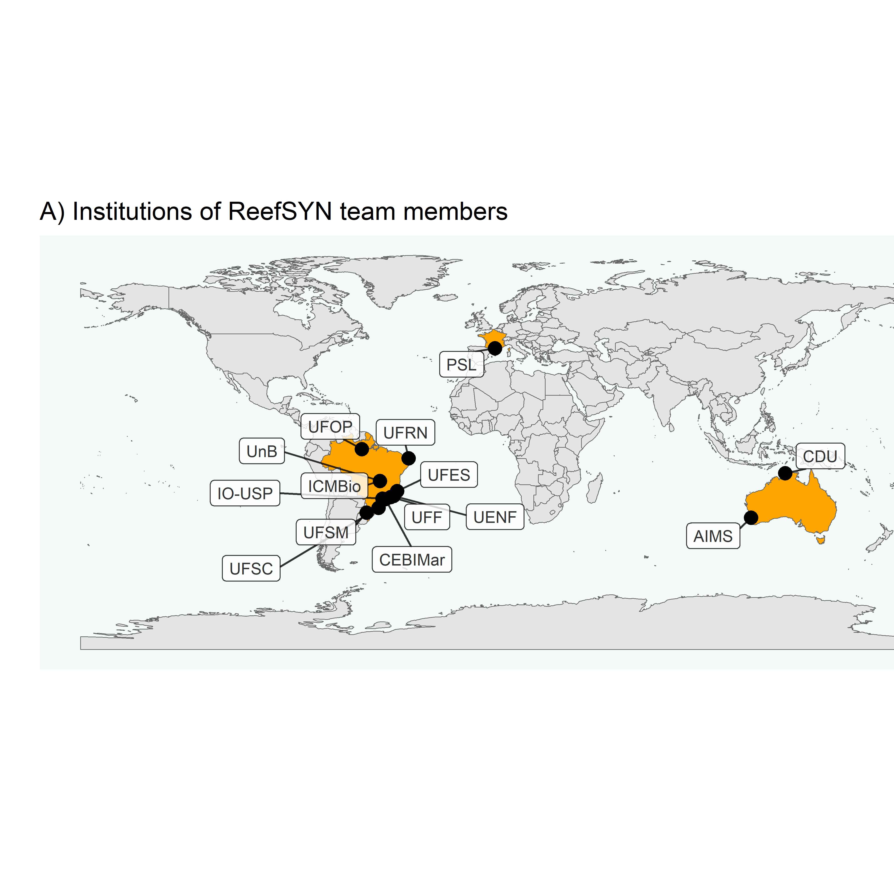
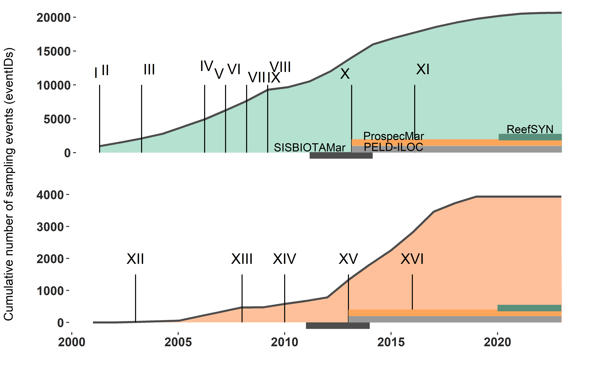

Standardized datasets of Brazilian reef diversity in space and time
================
Reef Synthesis Working Group
2023/08/14

<!-- README.md is generated from README.Rmd. Please edit that file -->
<!-- badges: start -->
<!-- badges: end -->

Target journal: Earth System Science Data

Here we present the raw figures of the datapaper. We adopted the Darwin
Core Standard to organize the 16 datasets. The root R script
“RUN_TO_ORGANIZE_DATA_INTO_DwC.R” can be used to generate these
organized datasets from raw datasets. By running this script you will
create the folder ‘DwC_output’ which will host the processed datasets
(most of them in a particular folder; exceptions are datasets II and XII
(fish and benthos from the ABrolhos Bank), and XI and XVI (fish and
benthos from Rio Grande do Norte state), which were produced by the same
researchers).

Folders in this project:

- **Data**: raw datasets. Each folder of dataset has its own R script to
  organize datasets into DwC standard;

- **DwC_output**: the processed data, after run the organization scripts
  for each dataset;

- **Policy**: policies of autorship and data sharing (only Portuguese);

- **R**: folder with R script to be applied to the processed data.
  Scratch of a Shiny App;

## Figures

Fig. 1: Institutions and research topics explored by ReefSYN team
members and collaborators. Abbreviations: AIMS: Australian Institute Of
Marine Science; CDU: Charles Darwin University; CEBIMar: Centro de
Biologia Marinha of the University of São Paulo; ICMBio: Chico Mendes
Institute for Biodiversity Conservation; IO-USP: Oceanographic Institute
of the University of São Paulo; PSL: Paris Sciences et Lettres
University; UENF: Universidade Federal do Norte Fluminense; UFES:
Universidade Federal do Espírito Santo; UFF: Universidade Federal
Fluminense; UFOP: Universidade Federal do Oeste do Pará; UFRN:
Universidade Federal do Rio Grande do Norte; UFSC: Universidade Federal
de Santa Catarina; UFSM: Universidade Federal de Santa Maria; UnB:
Universidade de Brasília.

Fig. 2: Spatial distribution of fish (left) and benthos (right) sampling
locations per dataset. Datasets: Fish communities from the Brazilian
province, Abrolhos Bank monitoring/time series, Arraial do Cabo (Rio de
Janeiro) monitoring/time series, Oceanic islands’ monitoring/time
series, Fish assemblages from Trindade and Martin Vaz, Santa Catarina
monitoring/time series, Fish assemblages from Guarapari, Espírito Santo,
Fish assemblages from Southern Espírito Santo, Trophic interactions
along the Western Atlantic, Alcatrazes monitoring/time series, Rio
Grande do Norte monitoring/time series, Benthic communities’ monitoring
in Abrolhos Bank, Benthic communities’ monitoring in Abrolhos Bank,
Extended benthic communities from the Brazilian province, Benthic
communities from the Brazilian province, Benthic communities’
monitoring/time series from oceanic islands, Benthic communities from
Rio Grande do Norte. Coordinates of datasets V and VII were gathered
from datasets XIV and IV based on the matching between site and locality
names. Dataset VIII has no geographic coordinates.

Table 1: Description of reef fish datasets/ Number of sampling events of
fish sampling in each dataset. Coordinates of datasets V and VII were
gathered from datasets XIV and IV based on the matching between site and
locality names. Dataset VIII has no geographic coordinates.

| Dataset |                          Name                           |         Sampling Protocol          | Samples (n) |     Scale     | Sampling area (m2) | Number of sites |    Latitude    |   Longitude    |   Years   |
|:-------:|:-------------------------------------------------------:|:----------------------------------:|:-----------:|:-------------:|:------------------:|:---------------:|:--------------:|:--------------:|:---------:|
|    I    |      Fish communities from the Brazilian province       | Underwater visual survey - 20 x 2m |    4570     | Transect/plot |         40         |       20        |  -27.85, 0.92  | -48.52, -28.86 | 2001-2015 |
|   II    |          Abrolhos Bank monitoring/time series           | Stationary visual survey - 4 x 2m  |    6422     | Transect/plot |         8          |        5        |  -18, -16.89   | -39.15, -38.65 | 2001-2014 |
|   III   | Arraial do Cabo (Rio de Janeiro) monitoring/time series | Underwater visual survey - 20 x 2m |    2159     | Transect/plot |         40         |        1        | -23.01, -22.96 | -42.04, -41.98 | 2003-2021 |
|   IV    |         Oceanic islands’ monitoring/time series         | Underwater Visual Survey - 20 x 2m |    3480     | Transect/plot |         40         |        4        |  -20.53, 0.97  | -33.82, -28.86 | 2006-2019 |
|    V    |      Fish assemblages from Trindade and Martin Vaz      | Underwater visual survey - 20 x 2m |     31      | Transect/plot |         40         |        2        | -20.53, -20.47 | -29.35, -28.86 | 2007-2009 |
|   VI    |          Santa Catarina monitoring/time series          | Underwater visual survey - 20 x 2m |    1897     | Transect/plot |         40         |        9        | -27.84, -27.12 | -48.53, -48.33 | 2007-2021 |
|   VII   |     Fish assemblages from Guarapari, Espírito Santo     | Underwater visual survey - 20 x 2m |     320     | Transect/plot |         40         |        1        |  -20.7, -20.7  | -40.41, -40.41 | 2008-2008 |
|  VIII   |      Fish assemblages from Southern Espírito Santo      | Underwater visual survey - 20 x 2m |     255     | Transect/plot |         40         |        1        |   Inf, -Inf    |   Inf, -Inf    | 2009-2009 |
|   IX    |     Trophic interactions along the Western Atlantic     |        Video plot - 2 x 1m         |     390     | Transect/plot |         2          |       12        |  -27.6, -0.87  | -48.39, -34.04 | 2009-2014 |
|    X    |            Alcatrazes monitoring/time series            | Underwater visual survey - 20 x 2m |     330     | Transect/plot |         40         |        1        | -24.11, -24.1  | -45.71, -45.69 | 2013-2022 |
|   XI    |       Rio Grande do Norte monitoring/time series        | Underwater visual survey - 20 x 2m |     859     | Transect/plot |         40         |        7        |  -6.38, -4.72  | -36.7, -34.93  | 2016-2023 |

Table 2. Description of benthic datasets/ Number of sampling events of
benthic sampling in each dataset. Sampling area provided for each
photoquadrat.

| Dataset |                               Name                               |       Sampling Protocol       | Samples (n) |   Scale    | Sampling area (m2) | Number of sites |    Latitude    |   Longitude    |   Years   |
|:-------:|:----------------------------------------------------------------:|:-----------------------------:|:-----------:|:----------:|:------------------:|:---------------:|:--------------:|:--------------:|:---------:|
|   XII   |         Benthic communities’ monitoring in Abrolhos Bank         |  Photoquadrats - 0.5 x 0.5 m  |     54      | Plot/point |        0.66        |        7        | -17.98, -16.89 | -39.15, -38.66 | 2003-2014 |
|   XII   |         Benthic communities’ monitoring in Abrolhos Bank         |   Photoquadrats - 1 X 0.7 m   |     595     | Plot/point |        0.66        |        7        | -17.98, -16.89 | -39.15, -38.66 | 2003-2014 |
|  XIII   |     Extended benthic communities from the Brazilian province     | Photoquadrats - 0.66 x 0.75 m |     24      | Plot/point |        0.50        |        7        |  -24.29, 0.92  | -46.18, -28.86 | 2008-2018 |
|   XIV   |         Benthic communities from the Brazilian province          | Photoquadrats - 0.25 x 0.25 m |     345     | Plot/point |        0.06        |       15        |  -27.6, -0.87  | -48.39, -29.31 | 2010-2014 |
|   XV    | Benthic communities’ monitoring/time series from oceanic islands |    Photoquadrats 50 X 50cm    |    2634     | Plot/point |        0.25        |        4        |  -20.52, 0.92  | -33.82, -29.32 | 2013-2019 |
|   XVI   |           Benthic communities from Rio Grande do Norte           | Photoquadrats - 0.25 x 0.25 m |     285     | Plot/point |        0.06        |        7        |  -6.38, -4.75  | -36.69, -34.93 | 2016-2017 |

<!-- badges: start -->
<!-- badges: end -->

Fig. 3: The number of sampling events accumulated over time for fish
(top) and benthos (bottom). One sampling event consists, for example, on
one transect deployed into a location. The vertical segments indicate
the year in which data included in each dataset started to be collected.
The horizontal bars depict the main funding sources as follows: dark
gray bar: Sisbiota, CNPq; light gray bar: PELD, CNPq; orange bar:
Prospec Mar, CNPq; green bar: ReefSYN, SinBiose CNPq. Datasets: Fish
communities from the Brazilian province, Abrolhos Bank monitoring/time
series, Arraial do Cabo (Rio de Janeiro) monitoring/time series, Oceanic
islands’ monitoring/time series, Fish assemblages from Trindade and
Martin Vaz, Santa Catarina monitoring/time series, Fish assemblages from
Guarapari, Espírito Santo, Fish assemblages from Southern Espírito
Santo, Trophic interactions along the Western Atlantic, Alcatrazes
monitoring/time series, Rio Grande do Norte monitoring/time series,
Benthic communities’ monitoring in Abrolhos Bank, Benthic communities’
monitoring in Abrolhos Bank, Extended benthic communities from the
Brazilian province, Benthic communities from the Brazilian province,
Benthic communities’ monitoring/time series from oceanic islands,
Benthic communities from Rio Grande do Norte

Fig. 4: Trends in the number of scientific names accumulated over time
for fish (top) and benthos (bottom). The vertical segments depict the
year in which data included in each Dataset started to be collected. The
horizontal bars depict the formal funding as follows: dark gray bar:
Sisbiota, CNPq; light gray bar: PELD, CNPq; orange bar: Prospec Mar,
CNPq; green bar: ReefSYN, SinBiose CNPq. Datasets: Fish communities from
the Brazilian province, Abrolhos Bank monitoring/time series, Arraial do
Cabo (Rio de Janeiro) monitoring/time series, Oceanic islands’
monitoring/time series, Fish assemblages from Trindade and Martin Vaz,
Santa Catarina monitoring/time series, Fish assemblages from Guarapari,
Espírito Santo, Fish assemblages from Southern Espírito Santo, Trophic
interactions along the Western Atlantic, Alcatrazes monitoring/time
series, Rio Grande do Norte monitoring/time series, Benthic communities’
monitoring in Abrolhos Bank, Benthic communities’ monitoring in Abrolhos
Bank, Extended benthic communities from the Brazilian province, Benthic
communities from the Brazilian province, Benthic communities’
monitoring/time series from oceanic islands, Benthic communities from
Rio Grande do Norte

Fig. 5: Structure of the datasets gathered by the ReefSYN working group,
showing the Darwin Core Standard terms included in most datasets.
Dataset codes are presented in Tables 1 and 2. These terms are part of a
standardized glossary maintained by the Darwin Core Task Group (2009).

Fig. 6: Taxa richness according to taxonomic classification in each
dataset. Column labels denote different reef fish and benthos datasets.
Datasets: Fish communities from the Brazilian province, Abrolhos Bank
monitoring/time series, Arraial do Cabo (Rio de Janeiro) monitoring/time
series, Oceanic islands’ monitoring/time series, Fish assemblages from
Trindade and Martin Vaz, Santa Catarina monitoring/time series, Fish
assemblages from Guarapari, Espírito Santo, Fish assemblages from
Southern Espírito Santo, Trophic interactions along the Western
Atlantic, Alcatrazes monitoring/time series, Rio Grande do Norte
monitoring/time series, Benthic communities’ monitoring in Abrolhos
Bank, Benthic communities’ monitoring in Abrolhos Bank, Extended benthic
communities from the Brazilian province, Benthic communities from the
Brazilian province, Benthic communities’ monitoring/time series from
oceanic islands, Benthic communities from Rio Grande do Norte

# Data availability

These data are published under CC BY-NC license. “Policy of data sharing
and use” can be found in the ReefSYN Organization in Github (available
at
[here::here](https://github.com/Sinbiose-Reefs/reefsyn_site/blob/master/DataPolicy_SINBIOSE.pdf)).
Data embargo goes up to January 2024, one year after the end of ReefSYN
funding by the SinBiose.

# Acknowledgements

Students and researchers that collected the data. ReefSYN was supported
by the Center for Synthesis in Biodiversity and Ecosystem Services
(SinBiose, CNPq). Thiago Silveira and Marina Sissini (PELD-ILOC team).

# Financial support

This project is funded by the Center for Synthesis in Biodiversity and
Ecosystem Services SinBiose
(<https://www.gov.br/cnpq/pt-br/acesso-a-informacao/acoes-e-programas/programas/sinbiose-1>)
(CNPq \#442417/2019-5, granted to MGB). The center is part of the
National Council for Scientific and Technological Development (Conselho
Nacional de Desenvolvimento Científico e Tecnológico, CNPq). Researchers
from the “Brazilian Marine Biodiversity Research Network – SISBIOTA-Mar”
(CNPq \#563276/2010-0 and FAPESC \#6308/2011-8 to SRF) and ‘‘Programa de
Monitoramento de Longa Duração das Comunidades Recifais de Ilhas
Oceânicas – PELD ILOC’’ (CNPq 441241/2016-6, to CELF), initiatives that
collected and shared their data sets used in this research. ALL received
post-doctoral fellowships from CNPq (#153024/2022-4, \#164240/2021-7,
\#151228/2021-3, \#152410/2020-1). J.P.Q. received post-doctoral
fellowship from FAPESP (2018/21380-0 and 2021/). TCM received
post-doctoral fellowships from FAPERJ (E-26/202.372/2021) and CNPq
(#102450/2022-6). GOL is grateful to a research productivity scholarship
provided by the Brazilian National Council for Scientific and
Technological Development (CNPq; 310517/2019-2) and Serrapilheira
Institute (Grant No. Serra-1708-15364) for continued research support.

## This paper was produced using the following software and associated packages:

    ## R version 4.3.0 (2023-04-21 ucrt)
    ## Platform: x86_64-w64-mingw32/x64 (64-bit)
    ## Running under: Windows 10 x64 (build 19045)
    ## 
    ## Matrix products: default
    ## 
    ## 
    ## locale:
    ## [1] LC_COLLATE=Portuguese_Brazil.utf8  LC_CTYPE=Portuguese_Brazil.utf8   
    ## [3] LC_MONETARY=Portuguese_Brazil.utf8 LC_NUMERIC=C                      
    ## [5] LC_TIME=Portuguese_Brazil.utf8    
    ## 
    ## time zone: America/Sao_Paulo
    ## tzcode source: internal
    ## 
    ## attached base packages:
    ## [1] parallel  stats     graphics  grDevices utils     datasets  methods  
    ## [8] base     
    ## 
    ## other attached packages:
    ##  [1] patchwork_1.1.2         magrittr_2.0.3          reshape2_1.4.4         
    ##  [4] mapdata_2.3.1           maps_3.4.1              plotly_4.10.1          
    ##  [7] xts_0.13.1              zoo_1.8-12              dygraphs_1.1.1.6       
    ## [10] vegan_2.6-4             lattice_0.21-8          permute_0.9-7          
    ## [13] leaflet_2.1.2           flexdashboard_0.6.1     rerddap_1.0.2          
    ## [16] png_0.1-8               knitr_1.42              wordcloud_2.6          
    ## [19] RColorBrewer_1.1-3      SnowballC_0.7.1         tm_0.7-11              
    ## [22] NLP_0.2-1               rgeos_0.6-2             sp_1.6-0               
    ## [25] sf_1.0-12               scatterpie_0.1.9        ggrepel_0.9.3          
    ## [28] gridExtra_2.3           rnaturalearthdata_0.1.0 rnaturalearth_0.3.2    
    ## [31] lubridate_1.9.2         forcats_1.0.0           stringr_1.5.0          
    ## [34] dplyr_1.1.2             purrr_1.0.1             readr_2.1.4            
    ## [37] tidyr_1.3.0             tibble_3.2.1            ggplot2_3.4.2          
    ## [40] tidyverse_2.0.0         openxlsx_4.2.5.2        here_1.0.1             
    ## 
    ## loaded via a namespace (and not attached):
    ##  [1] DBI_1.1.3          rlang_1.1.1        e1071_1.7-13       compiler_4.3.0    
    ##  [5] mgcv_1.8-42        vctrs_0.6.2        httpcode_0.3.0     pkgconfig_2.0.3   
    ##  [9] fastmap_1.1.1      labeling_0.4.2     utf8_1.2.3         rmarkdown_2.21    
    ## [13] tzdb_0.4.0         xfun_0.39          cachem_1.0.8       jsonlite_1.8.4    
    ## [17] highr_0.10         tweenr_2.0.2       cluster_2.1.4      R6_2.5.1          
    ## [21] bslib_0.4.2        stringi_1.7.12     hoardr_0.5.3       jquerylib_0.1.4   
    ## [25] Rcpp_1.0.10        Matrix_1.5-4       splines_4.3.0      timechange_0.2.0  
    ## [29] tidyselect_1.2.0   rstudioapi_0.14    yaml_2.3.7         curl_5.0.0        
    ## [33] plyr_1.8.8         withr_2.5.0        evaluate_0.21      units_0.8-2       
    ## [37] proxy_0.4-27       polyclip_1.10-4    zip_2.3.0          xml2_1.3.4        
    ## [41] pillar_1.9.0       KernSmooth_2.23-20 ggfun_0.0.9        ncdf4_1.21        
    ## [45] generics_0.1.3     rprojroot_2.0.3    hms_1.1.3          munsell_0.5.0     
    ## [49] scales_1.2.1       class_7.3-21       glue_1.6.2         slam_0.1-50       
    ## [53] lazyeval_0.2.2     tools_4.3.0        data.table_1.14.8  grid_4.3.0        
    ## [57] crosstalk_1.2.0    colorspace_2.1-0   nlme_3.1-162       ggforce_0.4.1     
    ## [61] cli_3.6.1          rappdirs_0.3.3     fansi_1.0.4        viridisLite_0.4.2 
    ## [65] gtable_0.3.3       sass_0.4.6         digest_0.6.31      classInt_0.4-9    
    ## [69] crul_1.3           htmlwidgets_1.6.2  farver_2.1.1       htmltools_0.5.5   
    ## [73] lifecycle_1.0.3    httr_1.4.6         MASS_7.3-58.4
