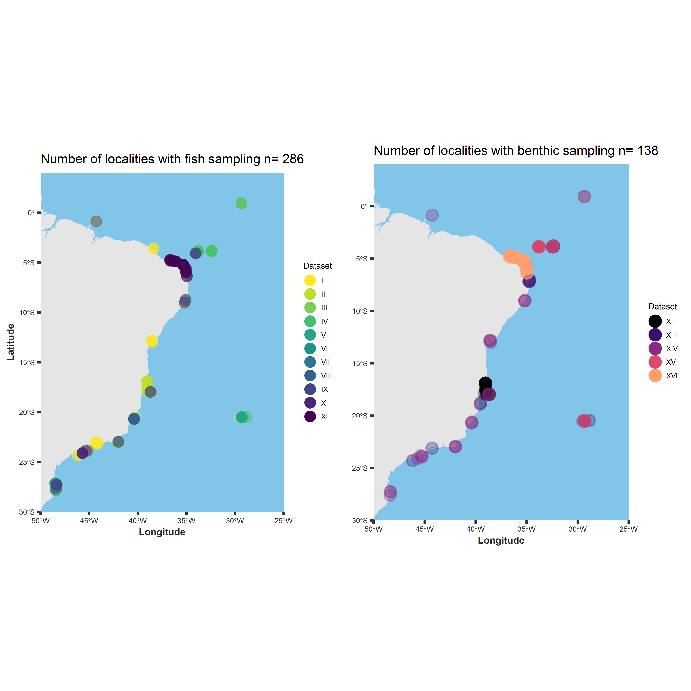

Project **Brazilian Reefs in the Anthropocene**, Reef Synthesis Working
Group (ReefSYN)
================
Dra. Mariana Bender (PI, UFSM), Dr. Sérgio Floeter (Co-PI, UFSC),
Dr. André Luís Luza (PostDoc, UFSM), Dr. Linda Eggertsen (PostDoc, UFSM)
2022/05/05

<!-- README.md is generated from README.Rmd. Please edit that file -->
<!-- badges: start -->
<!-- badges: end -->

## Who are we?

We are a team of researchers from several countries and institutions,
interested in several dimensions of marine biodiversity. We are
specially engaged in achieving a common objective: *To provide a
synthesis about patterns and drivers of reef diversity and supplying of
ecological services in Brazil*. We will synthesize information to be
useful to researchers and stakeholders. Our project is funded by the
Brazilian CNPq through the Brazilian Institute of Synthesis (Sinbiose,
see <http://www.sinbiose.cnpq.br/web/sinbiose/home>)

If you want to know our team and research we do please see
<https://reefsyn.weebly.com/home-us.html>. If you want to know about
data please assess &lt;&gt;

## Where are we? Which data are we using?

We are analyzing data from 221 unique localities distributed along the
Brazilian coast and oceanic islands. In these localities, we gathered
published and yet unpublished data of fish and benthic communities
–generated by geographically replicated, large-scale research programs
conducted over the last decades in Brazilian coast and oceanic islands
(SISBOTA-MAR, PELD-ILOC). We are also using data collected beyond the
Brazilian coast (e.g., Longo et al. 2019, GEB), and a species-level
trait dataset that includes Atlantic and Eastern Pacific fishes
(Quimbayo et al., unpublished data).

<!-- -->

# Brief description of each data set

## Spatial data

### Fish communities from the Brazilian province

This dataset, used by Morais et al. 2017 (Journal of Fish Biology),
includes fish counts in 4,570 transects distributed over 137 sites in 20
different localities from 0 to 27°S latitude degrees (including oceanic
islands). The dataset includes information about fish diet, feeding
mode, size, and biomass. Sampling descriptors include Observer ID, site
depth, and date. The geographical information is at the site (not
transect) level. Data and metadata are available
[here](https://drive.google.com/drive/u/0/folders/1Wn4n66sVPoj3YBT1kGFUE2FuMyPq4Iic).
These data were generated by the team of [SISBIOTA Mar
project](http://www.sisbiota.ufsc.br/). All documentation describing the
edits in this dataset (for use of the ReefSYN) can be found \[here\] ().

### Benthic communities from the Brazilian province

This dataset, used by Aued et al. 2018 (PlosOne), includes the cover of
benthic organisms into 3,855 photoquadrats deployed in 40 sites in 15
different localities from 0 to 27°S latitude degrees. Benthic organisms
were identified at several taxonomic levels (morphotype, species,
order). Sampling descriptors include photoquadrat ID, site depth, date
and, for some samples, observer ID. The geographical information is at
the site (not transect) level. Data and metadata are available
[here](https://drive.google.com/drive/u/0/folders/1sgILttlP6HQ1KOHV5yuyQouLe6Pscjlj).
These data were generated by the team of [SISBIOTA Mar
project](http://www.sisbiota.ufsc.br/).

### Benthic communities from the Brazilian province (Ronaldo Francini-Filho)

This dataset was compiled by Anaide Aued and Erika Santana, and includes
the cover of benthic organismos into the photoquadrats sampled by Aued
et al. (2018), as well as by the team of Francini-Filho. These data
include a subset of taxa included in Aued et al. (2018). Benthic
organisms were identified at several taxonomic levels (morphotype,
species, order). Sampling descriptors include site depth, month and
year. Also include site covariates, such as distance offshore,
clorophyll, nitrate, salinity. The geographical information is at the
site (not transect) level. Data and metadata are available
[here](https://drive.google.com/drive/u/0/folders/1o0S5-u1GAPSLwg8P5zzl11xzx4X5pxIU).

### Trophic interactions along the Western Atlantic

This dataset, used by Longo et al. 2019 (Global Ecology and
Biogeograhy), includes records of the interactions between fishes and
benthic organisms. These data were obtained with 1,133 unique videoplots
deployed in 70 sites in 17 different localities from 34°N to 27°S.
Sampling descriptors include recording time, date, depth, and observed
ID. No geographical information besides site ID is available. Data and
metadata are available
[here](https://drive.google.com/drive/u/0/folders/126xLZ6Z3xKO_pIT1IfGNj268Qy7E_Lo7).

### Fish and benthic communities from Rio Grande do Norte

Data collected by Guilherme Longo and Natália Roos in Rio Grande do
Norte. Data of fishes and benthos were collected in the same spatial
unit: within a transect of 20m2 used to register fishes, they deployed
10 photoquadrats to register benthic organisms. These data were used by
N Roos [Roos et al. 2019](https://www.int-res.com/prepress/m13005.html)
and are available
[here](https://drive.google.com/drive/u/0/folders/1WG68D_QAPKIZbZhYZmFOenOdUjejnjXn).

## Temporal data

### Benthic communities from oceanic islands

Two datasets of benthic communities registered in the Fernando de
Noronha Archipelago and Rocas Atoll from 2013 to 2018. These data were
shared by Sérgio Floeter are are available
[here](https://drive.google.com/drive/u/0/folders/1DXrcYH3yCbknkEuqpGG59m89LbDJpzVJ).
Data from Trindade Island and Martiz Vaz Archipelago, Abrolhos, and
Saint Peter and Saint Paul’s Archipelago will be available soon. These
data were generated by the team of [PELD ILOC
project](http://peldiloc.sites.ufsc.br/).

## Trait data

### Atlantic and Eastern Pacific fishes

Unpublished data collected by Juan Pablo Quimbayo and collaborators.
These data include functional traits of 2,153 fish species. Traits
describe activity, size, diet, distribution, and fishing price. Data and
metadata can be found
[here](https://drive.google.com/drive/u/0/folders/1aG6zlU5uoeLEPwwdnRKoTAqvldBmyJsp).

### Benthos from the Brazilian province

Unpublished data collected by Anaide Aued and collaborators. These data
include functional traits of more than 100 taxa of benthic organisms.
Traits describe mobility, size, growth form, trophic level, and
accretion capacity. Data and metadata can be found
[here](https://drive.google.com/drive/u/0/folders/1H54FZnBRwdF-ZdDkJ7hjB4ZnyBULspV8).

### Corals of the Brazilian province

Unpublished data collected J Bleuel and collaborators. These data
include functional traits of 24 coral species. Traits describe
reproduction mode and period, growth rate and form, and tolerance to
depth, light, and temperature. These data can be found
[here](https://drive.google.com/drive/u/0/folders/1vQp0xz_AMqepVbg1sbrFk1lvsjo_ecYL).

## Spatial polygons

We are using the most updated, yet unpublished spatial data of marine
protected and priority areas (year 2018), from Brazilian Institute for
Biodiversity Conservation (‘ICMBIO’). These data contain six shapefiles
with spatial data about conservation priority areas, artisanal fishing,
and implementation cost, urgency, and opportunity. These data were
produced by the team of AP Prates, were shared by Carlos Eduardo
Ferreira, and can be found
[here](https://drive.google.com/drive/u/0/folders/1Xra9owUYi0dK_T4l8WEn-aH7QnTk6ZtH).

## Brazilian Protected Areas

Finally, we have spatial data on Brazilian Protected Areas that can be
used in many steps of the project. These spatial data were shared by
Rafael Magris (ICMBio) and can be found \[here\] ().

## How can you access these data?

Published data can be found at their on-line repositories. Unpublished
data are only available to ReefSyn members, as defined by our “Policy of
data sharing and use” (available
[here](https://github.com/Sinbiose-Reefs/reefsyn_site/blob/master/DataPolicy_SINBIOSE.pdf)).
We will let these data available to external users at **January 2023**,
one year after the end of the ReefSyn project. If you are a member of
the ReefSyn team, please read our [co-authoring
rules](https://github.com/Sinbiose-Reefs/reefsyn_site/blob/master/Coauthor_SINBIOSE.pdf).

### Grant

This project is granted by the Brazilian Biodiversity Synthesis Center -
[SINBIOSE](http://www.sinbiose.cnpq.br/web/sinbiose). This center
belongs to the National Council for Scientific and Technological
Development (*Conselho Nacional de Desenvolvimento Científico e
Tecnológico*, CNPq).

**ReefSYN Working Group**
