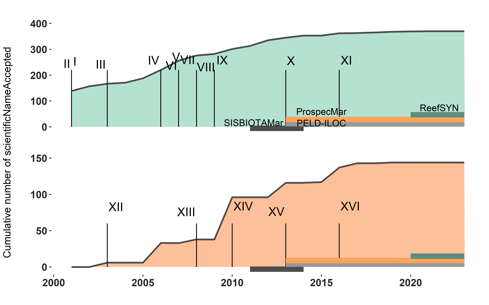

Datapaper Draft: Standardized datasets of Brazilian reef biodiversity in
space and time
================
Reef Synthesis Working Group; Luza, AL, Cordeiro, CAMM, …, Aued, AW,
Ferreira, CEL, Mendes, T., Roos, N, Longo, GO, Francini-Filho, RB,
Floeter, SR, Bender, MG
2022/08/16

<!-- README.md is generated from README.Rmd. Please edit that file -->
<!-- badges: start -->
<!-- badges: end -->

# 1 Introduction

The recent rise of ecological synthesis has two main reasons: ecology is
both entering in the age of big data (Michener & Jones 2012), and is
increasingly applying the principles of open science (UNESCO 2021,
Reichman et al. 2011). We are now experiencing a transition from
isolated research, with data stored locally, to a global research
network with data stored in public repositories available to be used for
fueling further research (Reichman et al. 2011). Brazil have just
started to track this trend. The ‘Sinbiose’, the Center for Synthesis in
Biodiversity and Ecosystem Services (see
<http://www.sinbiose.cnpq.br/web/sinbiose/home>), comprises a pioneer
initiative within Latin America in terms of ecological synthesis and
application of open-science principles (Luza et al., in prep.). There
are seven working groups funded by the SinBiose, from which the ReefSYN
–**ReefSYN Working Group**– is the unique group working with marine
ecosystems, particularly those biogenic and rocky reefs of the Brazilian
marine biogeographical province (Briggs 1974)).

The ReefSYN is composed of a team with 22 researchers (20 early-career
and senior researchers, assisted by two post-doctoral researchers) from
several countries and institutions (Fig. 1). Up to this date, most team
members performed research in isolation, each one covering a specific
dimension of reef biodiversity (Fig. 1). By getting funding and support
from the Sinbiose we have now the chance to gather existing data, make
data synthesis, and bring together different research expertise and
perspectives to engage into a common objective with large societal
implications: *Provide a synthesis about patterns and drivers of reef
diversity and ecological services provision in Brazil*. More information
about our group can be found at
<https://reefsyn.weebly.com/home-us.html>.

By standardizing these data to a common, globally accepted standard –the
Darwin Core Standard– it would be possible to integrate data and make
data synthesis to answer ambitious questions about the functioning of
Brazilian reef ecosystems, as well quantify, given the distribution of
data in space and time, the influence of humans on reef biodiversity and
ecosystem services.

Fig. 1: Institutions and research topics explored by the ReefSYN team
members.

# 2 Methodology

## 2.1 Geographical and temporal coverage

From 2001 up to 2020, data holders gathered data on fish and benthic
organisms (e.g., algae, corals) in more than 400 sites distributed
throughout the Brazilian coast and oceanic islands (Fig. 2, Tables 1 and
2). All these data came from geographically replicated, large-scale
research programs conducted over the last decades in Brazil
(SISBOTA-MAR, PELD-ILOC, Abrolhos Bank monitoring) and from novel
initiatives such as the monitoring of reef fish and benthos of Rio
Grande do Norte (e.g., Ross et al. 2019).

The Brazilian marine biogeographical province (Briggs, 1974; Floeter et
al., 2008; Pinheiro et al., 2018), located in Southwestern Atlantic,
host reefs with mostly turbid and nutrient-rich waters due to the
sediment discharge from several rivers that flow into the coast (Aued et
al., 2018; Loiola et al., 2019; Mies et al., 2020). The narrow
continental shelf hosts coral and rocky reefs reefs disposed along more
than 27 degrees of latitude (0.91N to 27.6S latitude degrees; Fig. 3).
The reefs are exposed to varied temperature, productivity and salinity
settings, producing a north/northeast and south/southeast
regionalization of the coast (Cord et al., 2022; Pinheiro et al., 2018).
Far from the coast there are four oceanic islands, which host
coralligenous and rocky reefs, with high endemism levels, and a varied
similarity in species composition to that of coastal reefs (Cord et al.,
2022; Pinheiro et al., 2018). Recent analysis of spatially extensive
benthic datasets revealed clear-water reef communities occurring in the
oceanic islands and in oligotrophic waters from the Northeast region,
whereas turbid-water reef communities occur throughout the coast
(Santana et al. 2023).

The sampling effort was not evenly distributed in time. Indeed, since
2001, the number of samples grew over time, as well the number of
sampled taxa (Fig. 2). There was a notable increase in sampling effort
after 2012-2013, which is associated with the consolidation of the
Sisbiota-Mar network, the increase in network members, and the total
amount of financial support derived from network cooperative efforts. As
an example, the inclusion of the ProspeqMar project, which has
bioprospection and holobiotic investigation objectives, had an important
contribution to the network from 2013 onwards.

Notably, the cumulative number of eventIDs (i.e. information associated
with an event of sampling (something that occurs at a place and time),
Darwin Core Task Group (2009)) across the datasets over time show that
i) there was an abrupt increase in the number of eventIDs after 2013,
mainly for benthos (probably leveraged by the Sisbiota-Mar project
(CNPq)), ii) large projects such as Sisbiota-Mar and PELD ILOC have
already made an effort to gather data from previous initiatives
(Krajewksi & Floeter 2011), iii) there was a nearly constant increase in
the number of fish scientific names over time. For benthos, in contrast,
there were years of constancy amid years of abrupt increase in the
number of identified taxa (Figs. 3 and 4).

Fig. 2: Spatial distribution of sampling sites of fish (left) and
benthos (right) per dataset.

## 2.2 Data description

The datasets described here represent different efforts to gather data
on reef fish and benthos along the Brazilian biogeographical province.
We hereby present 12 datasets of reef fish (n=7) and benthos (n=5).
Three out of seven fish datasets are time series, whereas two out of
five benthic datasetse are time series (Tables 1 and 2). The remaining
datasets are spatial snapshots (only one visit to a site) whose data
were collected over many years.

Table 1: number of sampling events of benthos sampling, per dataset.

| Dataset |   Sampling Protocol   | Samples (n) |   Scale    | Sampling area (m2) | Number of sites |    Latitude    |   Longitude    |   Years   |
|:-------:|:---------------------:|:-----------:|:----------:|:------------------:|:---------------:|:--------------:|:--------------:|:---------:|
|    I    |     Photoquadrats     |     345     | Plot/point |        0.06        |       15        |  -27.6, -0.87  | -48.39, -29.31 | 2010-2014 |
|   II    |     Photoquadrats     |     24      | Plot/point |        0.50        |        7        |  -24.29, 0.92  | -46.18, -28.86 | 2008-2018 |
|   III   |     Photoquadrats     |    2748     | Plot/point |        0.25        |        4        |  -20.52, 0.92  | -33.82, -29.32 | 2013-2019 |
|   IV    |     Photoquadrats     |     285     | Plot/point |       10.00        |        7        |  -6.38, -4.75  | -36.69, -34.93 | 2016-2017 |
|    V    |     Photoquadrats     |     595     | Plot/point |        1.47        |        7        | -17.98, -16.89 | -39.15, -38.66 | 2003-2014 |
|    V    | Point-intercept lines |     54      | Plot/point |        1.47        |        7        | -17.98, -16.89 | -39.15, -38.66 | 2003-2014 |

Table 2: Description of reef fish datasets.

| Dataset |    Sampling Protocol     | Samples (n) |     Scale     | Sampling area (m2) | Number of sites |    Latitude    |   Longitude    |   Years   |
|:-------:|:------------------------:|:-----------:|:-------------:|:------------------:|:---------------:|:--------------:|:--------------:|:---------:|
|    I    | Underwater visual survey |    4570     | Transect/plot |      40.00000      |       20        |  -27.85, 0.92  | -48.52, -28.86 | 2001-2015 |
|   II    |       Video plots        |     378     | Transect/plot |      2.00000       |       19        |  -27.6, 34.42  | -87.26, -34.04 | 2009-2014 |
|   III   | Underwater visual survey |    3480     | Transect/plot |      40.00000      |        4        |  -20.53, 0.97  | -33.82, -28.86 | 2006-2019 |
|   IV    | Underwater visual survey |     820     | Transect/plot |      40.00000      |        7        |  -6.38, -4.72  | -36.7, -34.93  | 2016-2022 |
|    V    | Underwater visual survey |    1897     | Transect/plot |      40.00000      |        9        | -27.84, -27.12 | -48.53, -48.33 | 2007-2021 |
|   VI    | Underwater visual survey |    2146     | Transect/plot |      40.00000      |        1        | -23.01, -22.96 | -42.04, -41.98 | 2003-2021 |
|   VII   | Stationary visual survey |    6422     | Transect/plot |      50.26548      |        5        |  -18, -16.89   | -39.15, -38.65 | 2001-2014 |

<!-- badges: start -->
<!-- badges: end -->

Fig. 3: The number of sampling events accumulated over time for benthos
(top) and fish (bottom). One sampling event consist, for example, on one
transect deployed into a locality. The vertical segments indicate the
year in which data included in each dataset started to be collected. The
horizontal bars depict the formal funding as follows: dark gray bar:
Sisbiota, CNPq; light gray bar: PELD, CNPq; green bar: ReefSYN, Sinbiose
CNPq.

Fig. 4: Trends in the number of scientific names accumulated over time
for benthos (top) and fish (bottom). The vertical segments depict the
year in which data included in each Dataset started to be collected. The
horizontal bars depict the formal funding as follows: dark gray bar:
Sisbiota, CNPq; light gray bar: PELD, CNPq; green bar: ReefSYN, Sinbiose
CNPq.

# 2.3 Data sources and sampling protocol

## 2.3.1 Reef fish datasets

### 2.3.1.1 Dataset I: Fish communities from the Brazilian province

This dataset, used by Morais et al. (2017), includes fish counts and
size estimates in 4,570 transects distributed over 137 localities in 20
different sites spanning from 0° to 27°S latitude degrees (including
oceanic islands). Sampling descriptors include *Observer ID*, *site
depth*, and *date*. The geographical information (coordinates) is
indicated here at the site level (i.e., represents a set of replicates
of transects in a given time and place). The method used to sample fish
was underwater visual census (UVC) with 20 × 2m in dimension, and
samples were obtained in the austral summer from 2007 to 2011. Strip
transects performed by free or scuba diving, during which the diver
unwound a tape while identifying, counting and estimating the total
length (LT, cm) of non-cryptic fishes \>10 cm. And, while retracting the
tape, following the same procedure for benthic-associated non-cryptic
fishes \<10 cm and cryptic species (see Morais et al. 2017 for more
details). The dataset also include data from Krajewski & Floeter (2011).

### 2.3.1.2 Dataset II: Trophic interactions along the Western Atlantic

This dataset, used by Longo et al. (2019), includes records of feeding
behavior of fish over the benthic community, as well interactions among
fish. These data were obtained with 1,133 unique videoplots deployed in
70 localities from 17 different sites spanning 61 degrees of latitude,
from 34°N to 27°S. Sampling descriptors include *recording time*,
*date*, *depth*, and *observed ID*. At each site, static videos were
replicated at 2 × 1 m areas positioned haphazardly on the reefs, with
5–10 m between replicates. Feeding pressure was estimated as the product
of the number of bites taken and the body mass (in kilograms) of the
fish, accounting for body size variation. Individual biomass was
obtained through length–weight relationships from the literature (Froese
& Pauly, 2016).

### 2.3.1.3 Dataset III: Oceanic islands’ monitoring/time series

Dataset of fish recorded in the four oceanic islands of Brazil: Fernando
de Noronha Archipelago, Rocas’ Atoll, Trindade Island and Martiz Vaz
Archipelago, and Saint Peter and Saint Paul’s Archipelago. Data were
collected from 2013 to 2019, organized by Juan Quimbayo, Thiago Silveira
and Cesar Cordeiro (PELD-ILOC team) and is curated by Dr. Cesar
Cordeiro. The method used to sample fish was the underwater visual
census (UVC). These data were generated by the team of [PELD ILOC
project](http://peldiloc.sites.ufsc.br/) applying the same UVS protocol
(20 x 2m strip transect) described above and used by Morais et
al. (2017). Transects were laid at different depths at 5m intervals
according to local maximum depths, ranging from 3 to 25m deep.

### 2.3.1.4 Dataset IV: Rio Grande do Norte monitoring/time series

Data collected by Guilherme Longo and Natália Roos in Rio Grande do
Norte. Data of fishes and benthos were collected in the same spatial
unit. within a transect of 20m2 used to record fishes, they also
deployed 10 photoquadrats to register benthic organisms. These data were
used in a publication by Natalia Roos [Roos et
al. 2019](https://www.int-res.com/prepress/m13005.html). Data have been
collected yearly since 2016, at depths ranging from 1 to 28 m according
to local depth.

### 2.3.1.5 Dataset V: Santa Catarina monitoring/time series

The data was collected yearly by the [LBMM team](https://lbmm.ufsc.br/),
from 2007 to 2021. Dataset includes fish species, size and abundance
recorded at 40m2 (20x2m) belt-transects in nine sites along the Santa
Catarina state coastal area. Transects were laid at different depths at,
approximately, 5m intervals according to local maximum depths, ranging
from 1 to 25m deep.

### 2.3.1.6 Dataset VI: Arraial do Cabo (Rio de Janeiro) monitoring/time series

The data was collected by the [LECAR team](https://www.lecar.uff.br/)
from 2003 to 2021, but were annually collected only from 2014 to 2021 at
four of the 21 sites monitored. All other sites were sampled
opportunistically. Dataset includes fish species, size and abundance
recorded at 40m2 (20x2m) belt-transects in rocky reefs in Arraial do
Cabo, Rio de Janeiro. Transects were laid at different depths at,
approximately, 5m intervals according to local maximum depths, ranging
from 1 to 25m deep. Samples include data from two distinct oceanographic
domains present locally, one under strong influence of seasonal
upwelling, and another with indirect influence of the upwelling.

### 2.3.1.6 Dataset VII: Abrolhos Bank monitoring/time series

Fish assemblage data from the Abrolhos Bank was collected by Ronaldo
Francini-Filho from 2001 to 2014. The dataset here include samples of
five sites and 28 localities nested within sites but not evenly
distributed (see table Xs for details). The variables in this dataset
are related to the description of fishes identification and abundance,
measured at stationary visual censuses (4 x 2 m, XX min). Depth of
sampling varied among sites and ranged between 2 and 15m. Benthic
communities assessments were completed at the same sites, localities and
depths of fish stationary censuses, using either point-intersect
technique (four 10m-transects in each depth and locality) or
photoquadrats (10 quadrats, 0.7m2).

## 2.3.2 Benthic datasets

### 2.3.2.1 Dataset I: Benthic communities from the Brazilian province

This dataset, used by Aued et al. (2018) – data also published at
[DRYAD](https://doi.org/10.5061/dryad.f5s90), includes site-level cover
information of \~100 benthic taxa from 3,855 photoquadrats deployed in
40 localities from 15 different sites, spanning 0° to 27°S latitude
degrees. The sampling sites indicated here are the same from Morais et
al. (2017). Benthic organisms were identified at the lowest possible
taxonomic level (i.e., morphotype, species, order) according to
constraints related to image identification. Sampling descriptors
include *photoquadrat ID*, *site depth*, *date* or *year* and, for some
samples, *observer ID*. The geographical information is indicated at the
site level. Six to twenty 2m2 horizontal surfaces of reef area on each
depth strata were haphazardly selected for taking photoquadrats (25 x 25
cm) and characterized the benthic community. Each 2m2 area was set, at
least, 2 meters apart from each other and considered as independent
sample units.

### 2.3.2.2 Dataset II: Benthic communities from the Brazilian province

This dataset was compiled by Erika Santana, Anaíde Aued, and Ronaldo
Francini-Filho, and consists of data on benthic organisms sampled in
photoquadrats deployed in several sites disposed along the coast and
oceanic islands. This dataset is complimentary to the dataset of Aued et
al. (2018). Benthic organisms were identified at different taxonomic
levels (morphotype, species, order). The dataset originally had
environmental descriptors such as *site depth*, *month* and *year*,
which were adequate here using DwC standards.

### 2.3.2.3 Dataset III: Benthic communities’ monitoring/time series from oceanic islands

Dataset of benthic communities recorded in the four oceanic islands of
Brazil: Fernando de Noronha Archipelago, Rocas’ Atoll, Trindade Island
and Martiz Vaz Archipelago, and Saint Peter and Saint Paul’s
Archipelago. Data were collected from 2013 to 2022, organized by Thiago
Silveira and Cesar Cordeiro (PELD-ILOC team) and is curated by Dr. Cesar
Cordeiro. These data were generated by the team of [PELD ILOC
project](http://peldiloc.sites.ufsc.br/), and is still being sampled
anually. As the images from 2020 to 2022 are still under analysis, these
data were not included here. The method for registering the benthic
community included three to six fixed transects (20 m) parallel to the
coastline placed at 2 m intervals. Ten to 11 (50 × 50 cm) photoquadrats
were taken at each transect in each year and locality from 2013 to 2019.
Following the imaging register, image processing was done using the
Coral Point Count with Excel extensions software (CPCe v. 4.1) (Kohler
and Gill, 2006). This stage consisted on the identification of major
taxonomic, morpho-anatomical benthic groups and the estimation of their
relative cover in samples. Software analysis were performed by
overlaying 50 random points on each image and identifying the organisms
immediately below each point details (details in Zamoner et al. 2021).

### 2.3.2.4 Dataset IV: Benthic communities from Rio Grande do Norte

See 2.3.1.4

### 2.3.2.5 Dataset V: Benthic communities’ monitoring in Abrolhos Bank

Detail…

# 2.4 Data management and standardization

We strive to standardize data and follow the FAIR principles of data
science – i.e. data should be “findable”, “accessible”, “interoperable”,
and “reusable” (Wilkinson et al., 2016). Data holders supplied their
datasets to the database manager in digital format (e.g., spreadsheets,
csv files).

# 2.5 Data structure

All datasets are available as a Darwin Core Archive (DwC-A), and all
fields were named compliant with Darwin Core (DwC) standards (TDWG,
2015), which includes an event core (event sampling data), occurrence
(taxonomic data), and extended measurement or fact (environmental
variables and taxa counts or cover) (Fig. 5).

Fig. 5: ReefSYN data structure following the Darwin Core Standard.
Dataset codes in Tables 1 and 2.

# 2.6 Quality assurance/quality control procedures

-   The name of all taxa were checked against the WoRMS database, using
    the R package “worrms” (World Register of Marine Species (WoRMS,
    2022)).

-   Samples were always collected by researchers or trained students.

-   Sampling methods are worldwide/widely used and accepted.

-   Data were checked by two data managers (A.L. Luza, C. Cordeiro) and
    questions were sent to data holders whenever necessary. The data
    holders are listed in Author contributions’ section. Overal, main
    inconsistencies found in the datasets were about 1) region names; 2)
    locality names; 3) site names; 4) different IDs of unique sampling
    events; 5) format of sampling data, month and year; 6) lack of
    geographical information; 7) incorrect writing of species names; 8)
    the identity of the most basic sampling unit (e.g., one video plot,
    photoquadrat) was not readily available.

-   Data holders shared Microsoft Excel spreadsheets (“.csv”, “.xlsx”),
    often containing data in a wide format. Most data were transformed
    into a long format, organized, standardized (using Darwin Core
    Standards) and processed using the R Programming Environment (R Core
    Team, 2022). Some modifications that could not be easily done in R,
    regarding the splitting of the sample IDs, were done in the software
    Microsoft Excel. It consisted in dealing with eventIDs separated by
    different separators (“\_“,”.”, …) and we used Excel to have more
    control on what information to get.

-   R routines (scripts) are available at GitHub, together with the raw
    data.

\_ This paper’s draft was written in RMarkdown to ensure consistency
between the data being presented, the data analysis, and the output
(tables, figures (except Fig. 5)).

-   Were softwares used to identify benthos always the same?

# 2.7 Taxonomic coverage

General taxonomic coverage description: The five benthic datasets
comprise the description of the occurrence of 185 taxa from 58 families,
15, and 4 kingdoms, being them Plantae, Animalia, Bacteria, Chromista.
The seven fish datasets comprise the description of the occurrence of
567 taxa from 68 families and 2 classes, being them Actinopteri,
Elasmobranchii.

# 2.8 Taxonomic coverage per dataset

## 2.8.1 Fish

Dataset I

*Taxonomic ranks*

Kingdom: Animalia, NA

Phylum: Chordata

Class: Actinopteri, NA, Elasmobranchii

Orders:

Families: Pomacentridae, Muraenidae, Serranidae, Balistidae, Carangidae,
Labridae, Pomacanthidae, Aulostomidae, Lutjanidae, Labrisomidae,
Holocentridae, Chaetodontidae, Kyphosidae, Blenniidae, Dactylopteridae,
Sphyraenidae, Monacanthidae, Chaenopsidae, Scorpaenidae, Diodontidae,
Apogonidae, Gobiidae, Scaridae, Acanthuridae, Haemulidae, NA,
Malacanthidae, Bothidae, Belonidae, Ginglymostomatidae, Synodontidae,
Mullidae, Dasyatidae, Albulidae, Carcharhinidae, Echeneidae,
Ostraciidae, Pempheridae, Priacanthidae, Cirrhitidae, Fistulariidae,
Tetraodontidae, Ophichthidae, Hemiramphidae, Opistognathidae,
Callionymidae, Sparidae, Clupeidae, Grammatidae, Batrachoididae,
Ogcocephalidae, Ephippidae, Microdesmidae, Scombridae, Sciaenidae,
Gerreidae, Rachycentridae, Syngnathidae, Antennariidae, Narcinidae,
Mugilidae, Pinguipedidae, Centropomidae, Rhinobatidae, Myliobatidae,
Engraulidae

*Taxa in the dataset (per identification level/at the identification
level)*

Family:

Genera: Acanthostracion, Apogon, Coryphopterus, Emblemariopsis,
Eucinostomus, Eugerres, Hypleurochilus, Kyphosus, Mugil, Muraena,
Mycteroperca, Parablennius, Rhinobatos, Scorpaena, Serranus, Sparisoma,
Sphyraena, Starksia

Species: Ablennes hians, Abudefduf saxatilis, Acanthistius brasilianus,
Acanthostracion polygonius, Acanthostracion quadricornis, Acanthurus
bahianus, Acanthurus chirurgus, Acanthurus coeruleus, Acanthurus
monroviae, Aetobatus narinari, Albula vulpes, Alectis ciliaris,
Alphestes afer, Aluterus monoceros, Aluterus scriptus, Amblycirrhitus
pinos, Amphichthys cryptocentrus, Anisotremus moricandi, Anisotremus
surinamensis, Anisotremus virginicus, Antennarius multiocellatus, Apogon
americanus, Apogon pseudomaculatus, Archosargus rhomboidalis, Aulostomus
maculatus, Aulostomus strigosus, Balistes vetula, Bathygobius soporator,
Belone belone, Bodianus insularis, Bodianus pulchellus, Bodianus rufus,
Bothus lunatus, Bothus ocellatus, Calamus calamus, Calamus penna,
Callionymus bairdi, Cantherhines pullus, Canthidermis maculata,
Canthidermis sufflamen, Canthigaster figueiredoi, Carangoides
bartholomaei, Caranx crysos, Caranx hippos, Caranx latus, Caranx
lugubris, Caranx ruber, Carcharhinus perezii, Centropomus undecimalis,
Centropyge aurantonotus, Cephalopholis fulva, Chaetodipterus faber,
Chaetodon ocellatus, Chaetodon sedentarius, Chaetodon striatus,
Chilomycterus reticulatus, Chilomycterus spinosus, Chloroscombrus
chrysurus, Choranthias salmopunctatus, Chromis flavicauda, Chromis
jubauna, Chromis limbata, Chromis multilineata, Chromis scotti,
Clepticus brasiliensis, Coryphopterus dicrus, Coryphopterus
glaucofraenum, Coryphopterus thrix, Cosmocampus albirostris, Cryptotomus
roseus, Ctenogobius saepepallens, Dactylopterus volitans, Decapterus
macarellus, Dermatolepis inermis, Diapterus auratus, Diodon holocanthus,
Diodon hystrix, Diplectrum formosum, Diplectrum radiale, Diplodus
argenteus, Doratonotus megalepis, Dules auriga, Echeneis naucrates,
Echidna catenata, Elacatinus figaro, Elacatinus phthirophagus,
Elacatinus pridisi, Emblemariopsis signifer, Enchelycore anatina,
Enchelycore nigricans, Engraulis anchoita, Epinephelus adscensionis,
Epinephelus itajara, Epinephelus marginatus, Epinephelus morio, Equetus
lanceolatus, Eucinostomus argenteus, Eucinostomus melanopterus,
Euthynnus alletteratus, Fistularia petimba, Fistularia tabacaria, Gerres
cinereus, Ginglymostoma cirratum, Gnatholepis thompsoni, Gobioclinus
kalisherae, Gramma brasiliensis, Gymnothorax funebris, Gymnothorax
miliaris, Gymnothorax moringa, Gymnothorax vicinus, Haemulon
aurolineatum, Haemulon chrysargyreum, Haemulon melanurum, Haemulon
parra, Haemulon plumierii, Haemulon squamipinna, Haemulon steindachneri,
Halichoeres bivittatus, Halichoeres brasiliensis, Halichoeres
dimidiatus, Halichoeres penrosei, Halichoeres poeyi, Halichoeres
radiatus, Halichoeres rubrovirens, Halichoeres sazimai, Harengula
clupeola, Harengula jaguana, Hemiramphus brasiliensis, Heteropriacanthus
cruentatus, Hippocampus reidi, Holacanthus ciliaris, Holacanthus
tricolor, Holocentrus adscensionis, Hypanus americanus, Hypleurochilus
fissicornis, Hypleurochilus pseudoaequipinnis, Hyporthodus niveatus,
Hypsoblennius invemar, Kyphosus cinerascens, Kyphosus sectatrix,
Kyphosus vaigiensis, Labrisomus cricota, Labrisomus nuchipinnis,
Lactophrys trigonus, Lutjanus alexandrei, Lutjanus analis, Lutjanus
cyanopterus, Lutjanus griseus, Lutjanus jocu, Lutjanus synagris,
Malacanthus plumieri, Malacoctenus brunoi, Malacoctenus delalandii,
Malacoctenus lianae, Melichthys niger, Microgobius carri, Microspathodon
chrysurus, Mugil curema, Mulloidichthys martinicus, Muraena melanotis,
Muraena pavonina, Mycteroperca acutirostris, Mycteroperca bonaci,
Mycteroperca interstitialis, Mycteroperca microlepis, Mycteroperca
venenosa, Myrichthys breviceps, Myrichthys ocellatus, Myripristis
jacobus, Narcine brasiliensis, Negaprion brevirostris, Nicholsina
collettei, Ocyurus chrysurus, Odontoscion dentex, Ogcocephalus
vespertilio, Ophioblennius trinitatis, Opistognathus aurifrons,
Orthopristis ruber, Pagrus pagrus, Parablennius marmoreus, Parablennius
pilicornis, Paraclinus spectator, Paranthias furcifer, Pareques
acuminatus, Pempheris schomburgkii, Pinguipes brasilianus, Pomacanthus
arcuatus, Pomacanthus paru, Porichthys porosissimus, Priacanthus
arenatus, Prognathodes brasiliensis, Prognathodes guyanensis,
Prognathodes marcellae, Prognathodes obliquus, Pseudocaranx dentex,
Pseudupeneus maculatus, Ptereleotris randalli, Rachycentron canadum,
Rhomboplites aurorubens, Rypticus bistrispinus, Rypticus saponaceus,
Sardinella brasiliensis, Sargocentron bullisi, Scartella cristata,
Scarus trispinosus, Scarus zelindae, Scomberomorus maculatus, Scorpaena
brachyptera, Scorpaena isthmensis, Scorpaena plumieri, Scorpaenodes
caribbaeus, Selene vomer, Seriola dumerili, Seriola lalandi, Seriola
rivoliana, Serranus atricauda, Serranus baldwini, Serranus flaviventris,
Serranus phoebe, Sparisoma amplum, Sparisoma axillare, Sparisoma
frondosum, Sparisoma radians, Sparisoma rocha, Sparisoma tuiupiranga,
Sparisoma viride, Sphoeroides greeleyi, Sphoeroides spengleri,
Sphoeroides testudineus, Sphyraena barracuda, Sphyraena borealis,
Sphyraena guachancho, Sphyraena picudilla, Starksia brasiliensis,
Stegastes fuscus, Stegastes pictus, Stegastes rocasensis, Stegastes
sanctipauli, Stegastes variabilis, Stephanolepis hispidus, Strongylura
timucu, Synodus intermedius, Synodus synodus, Thalassoma noronhanum,
Trachinotus falcatus, Trachinotus goodei

Subspecies: Platybelone argalus argalus

Dataset II

*Taxonomic ranks*

Kingdom: Animalia, NA

Phylum: Chordata

Class: Actinopteri, NA, Elasmobranchii

Orders:

Families: Scaridae, Haemulidae, Labridae, Chaetodontidae, Acanthuridae,
Mullidae, Lutjanidae, NA, Blenniidae, Pomacanthidae, Kyphosidae,
Pomacentridae, Carangidae, Sphyraenidae, Holocentridae, Gerreidae,
Serranidae, Cirrhitidae, Balistidae, Ostraciidae, Sciaenidae,
Monacanthidae, Ephippidae, Scorpaenidae, Aulostomidae, Scombridae,
Gobiesocidae, Gobiidae, Apogonidae, Malacanthidae, Carcharhinidae,
Bothidae, Ginglymostomatidae, Diodontidae, Labrisomidae, Tetraodontidae,
Synodontidae, Dasyatidae, Sparidae, Myliobatidae, Priacanthidae,
Fistulariidae, Dactylopteridae, Mugilidae, Ophichthidae, Clupeidae,
Engraulidae, Grammatidae, Pempheridae

*Taxa in the dataset (per identification level/at the identification
level)*

Family:

Genera: Acanthurus, Bothus, Caranx, Dasyatis, Haemulon, Halichoeres,
Kyphosus, Labrisomus, Lutjanus, Malacoctenus, Mycteroperca,
Parablennius, Scarus, Scomberomorus, Scorpaena, Sparisoma, Sphoeroides,
Synodus

Species: Abudefduf saxatilis, Acanthostracion polygonius,
Acanthostracion quadricornis, Acanthurus bahianus, Acanthurus chirurgus,
Acanthurus coeruleus, Acanthurus tractus, Aetobatus narinari, Aluterus
monoceros, Aluterus scriptus, Amblycirrhitus pinos, Anchoviella
lepidentostole, Anisotremus moricandi, Anisotremus surinamensis,
Anisotremus virginicus, Apogon americanus, Archosargus probatocephalus,
Arcos rhodospilus, Aulostomus maculatus, Aulostomus strigosus, Balistes
capriscus, Balistes vetula, Bodianus pulchellus, Bodianus rufus, Bothus
ocellatus, Calamus bajonado, Calamus calamus, Calamus penna,
Cantherhines pullus, Canthidermis maculata, Canthidermis sufflamen,
Canthigaster figueiredoi, Canthigaster rostrata, Carangoides
bartholomaei, Caranx crysos, Caranx latus, Caranx ruber, Carcharhinus
plumbeus, Centropristis ocyurus, Centropristis striata, Centropyge argi,
Cephalopholis cruentata, Cephalopholis fulva, Chaetodipterus faber,
Chaetodon capistratus, Chaetodon ocellatus, Chaetodon sedentarius,
Chaetodon striatus, Chilomycterus reticulatus, Chilomycterus schoepfii,
Chloroscombrus chrysurus, Chromis cyanea, Chromis flavicauda, Chromis
insolata, Chromis jubauna, Chromis multilineata, Chromis scotti,
Clepticus brasiliensis, Clepticus parrae, Coryphopterus glaucofraenum,
Cryptotomus roseus, Dactylopterus volitans, Decapterus macarellus,
Diodon hystrix, Diplectrum radiale, Diplodus argenteus, Diplodus
holbrookii, Elacatinus figaro, Epinephelus adscensionis, Epinephelus
cruentatus, Epinephelus guttatus, Epinephelus itajara, Epinephelus
marginatus, Epinephelus morio, Epinephelus niveatus, Epinephelus
striatus, Eucinostomus lefroyi, Eucinostomus melanopterus, Fistularia
tabacaria, Ginglymostoma cirratum, Gramma loreto, Haemulon aurolineatum,
Haemulon carbonarium, Haemulon chrysargyreum, Haemulon flaviguttatum,
Haemulon maculicauda, Haemulon parra, Haemulon plumierii, Haemulon
sciurus, Haemulon squamipinna, Haemulon steindachneri, Halichoeres
bivittatus, Halichoeres brasiliensis, Halichoeres caudalis, Halichoeres
dimidiatus, Halichoeres garnoti, Halichoeres maculipinna, Halichoeres
penrosei, Halichoeres poeyi, Halichoeres radiatus, Heteropriacanthus
cruentatus, Holacanthus bermudensis, Holacanthus ciliaris, Holacanthus
tricolor, Holocentrus adscensionis, Holocentrus rufus, Hypanus
americanus, Hypanus marianae, Hypoplectrus chlorurus, Hypoplectrus
indigo, Hypoplectrus puella, Hypoplectrus unicolor, Kyphosus sectatrix,
Kyphosus vaigiensis, Labrisomus nuchipinnis, Lachnolaimus maximus,
Lactophrys bicaudalis, Lactophrys trigonus, Lagodon rhomboides, Lutjanus
alexandrei, Lutjanus analis, Lutjanus apodus, Lutjanus cyanopterus,
Lutjanus griseus, Lutjanus jocu, Lutjanus mahogoni, Lutjanus synagris,
Malacanthus plumieri, Malacoctenus delalandii, Malacoctenus
triangulatus, Melichthys niger, Microspathodon chrysurus, Monacanthus
tuckeri, Mugil curema, Mulloidichthys martinicus, Mycteroperca
acutirostris, Mycteroperca bonaci, Mycteroperca interstitialis,
Mycteroperca microlepis, Mycteroperca phenax, Mycteroperca tigris,
Myrichthys breviceps, Myrichthys ocellatus, Myripristis jacobus,
Negaprion brevirostris, Neoniphon marianus, Ocyurus chrysurus,
Odontoscion dentex, Ophioblennius macclurei, Ophioblennius trinitatis,
Orthopristis ruber, Parablennius marmoreus, Parablennius pilicornis,
Paranthias furcifer, Pareques acuminatus, Pareques umbrosus, Pempheris
schomburgkii, Pomacanthus arcuatus, Pomacanthus paru, Priacanthus
arenatus, Pseudocaranx dentex, Pseudupeneus maculatus, Rhomboplites
aurorubens, Rypticus maculatus, Rypticus saponaceus, Sardinella
brasiliensis, Scarus coelestinus, Scarus guacamaia, Scarus iseri, Scarus
taeniopterus, Scarus trispinosus, Scarus vetula, Scarus zelindae,
Scomberomorus regalis, Scorpaena brasiliensis, Seriola rivoliana,
Serranus atricauda, Serranus baldwini, Serranus subligarius, Serranus
tigrinus, Sparisoma amplum, Sparisoma atomarium, Sparisoma aurofrenatum,
Sparisoma axillare, Sparisoma chrysopterum, Sparisoma frondosum,
Sparisoma radians, Sparisoma rubripinne, Sparisoma tuiupiranga,
Sparisoma viride, Sphoeroides greeleyi, Sphoeroides spengleri,
Sphoeroides testudineus, Sphyraena barracuda, Sphyraena borealis,
Sphyraena guachancho, Sphyraena picudilla, Stegastes adustus, Stegastes
fuscus, Stegastes leucorus, Stegastes partitus, Stegastes pictus,
Stegastes planifrons, Stegastes rocasensis, Stegastes variabilis,
Stenotomus chrysops, Stephanolepis hispidus, Synodus foetens, Synodus
intermedius, Synodus synodus, Thalassoma bifasciatum, Thalassoma
noronhanum

Subspecies: Chilomycterus spinosus spinosus

Dataset III

*Taxonomic ranks*

Kingdom:

Phylum: Chordata

Class:

Orders:

Families:

*Taxa in the dataset (per identification level/at the identification
level)*

Family:

Genera: coryphopterus, entomacrodus, kyphosus, ophioblennius, rypticus,
sparisoma

Species: abudefduf saxatilis, acanthostracion polygonius,
acanthostracion quadricornis, acanthurus bahianus, acanthurus chirurgus,
acanthurus coeruleus, albula vulpes, aluterus monoceros, aluterus
scriptus, amblycirrhitus earnshawi, amblycirrhitus pinos, anisotremus
surinamensis, anisotremus virginicus, anthias salmopunctatus, apogon
americanus, apogon axillaris, aulostomus strigosus, balistes vetula,
belone belone, bodianus insularis, bodianus pulchellus, bodianus rufus,
bothus lunatus, bothus ocellatus, callionymus bairdi, cantherhines
macrocerus, cantherhines pullus, canthidermis sufflamen, canthigaster
figueiredoi, canthigaster sanctaehelenae, carangoides bartholomaei,
caranx crysos, caranx latus, caranx lugubris, caranx ruber, centropyge
aurantonotus, cephalopholis fulva, chaetodon ocellatus, chaetodon
sanctaehelenae, chaetodon striatus, channomuraena vittata, chilomycterus
reticulatus, chromis jubauna, chromis multilineata, clepticus
brasiliensis, coryphopterus glaucofraenum, coryphopterus thrix,
dactylopterus volitans, dermatolepis inermis, diodon holocanthus, diodon
hystrix, diplodus argenteus, doratonotus megalepis, echeneis naucrates,
echidna catenata, elacatinus figaro, elacatinus phthirophagus,
elacatinus pridisi, elagatis bipinnulata, emblemariopsis signifer,
enchelycore anatina, enchelycore carychroa, enchelycore nigricans,
enneanectes altivelis, enneanectes smithi, epinephelus adscensionis,
fistularia petimba, fistularia tabacaria, gnatholepis thompsoni,
gobioclinus kalisherae, gymnothorax funebris, gymnothorax miliaris,
gymnothorax moringa, gymnothorax vicinus, haemulon chrysargyreum,
haemulon parra, halichoeres brasiliensis, halichoeres dimidiatus,
halichoeres penrosei, halichoeres poeyi, halichoeres radiatus,
halichoeres rubrovirens, helcogramma ascensionis, hemiramphus
brasiliensis, heteropriacanthus cruentatus, holacanthus ciliaris,
holacanthus tricolor, holocentrus adscensionis, hypanus americanus,
hypleurochilus brasil, kyphosus bigibbus, kyphosus cinerascens, kyphosus
sectatrix, kyphosus vaigiensis, labrisomus nuchipinnis, lactophrys
trigonus, lutjanus jocu, malacanthus plumieri, malacoctenus brunoi,
malacoctenus lianae, melichthys niger, menaphorus punticulatus,
microspathodon chrysurus, mulloidichthys martinicus, muraena melanotis,
muraena pavonina, mycteroperca bonaci, mycteroperca interstitialis,
mycteroperca venenosa, myrichthys breviceps, myripristis jacobus,
nicholsina usta, ocyurus chrysurus, ophichthus ophis, ophioblennius
atlanticus, ophioblennius trinitatis, opistognathus aurifrons,
orthopristis ruber, parablennius marmoreus, paranthias furcifer,
pempheris schomburgkii, phaeoptyx pigmentaria, pomacanthus paru,
priacanthus arenatus, priolepis ascensionis, prognathodes brasiliensis,
prognathodes obliquus, pseudupeneus maculatus, rypticus saponaceus,
sargocentron bullisi, scarus trispinosus, scorpaena brasiliensis,
scorpaena plumieri, selar crumenophthalmus, seriola rivoliana, sparisoma
amplum, sparisoma axillare, sparisoma frondosum, sparisoma radians,
sparisoma rocha, sphoeroides spengleri, sphyraena barracuda, sphyraena
borealis, sphyraena picudilla, stegastes fuscus, stegastes lubbocki,
stegastes pictus, stegastes rocasensis, stegastes sanctipauli,
strongylura timucu, synodus synodus, thalassoma ascensionis, thalassoma
noronhanum, thalassoma sanctaehelenae, trachinotus falcatus, xyrichtys
blanchardi, xyrichtys novacula

Subspecies: chilomycterus spinosus mauretanicus, platybelone argalus
argalus

Dataset IV

*Taxonomic ranks*

Kingdom: Animalia, NA

Phylum: Chordata

Class: Actinopteri, Elasmobranchii, NA

Orders:

Families: Scaridae, Acanthuridae, Lutjanidae, Labridae, Serranidae,
Haemulidae, Pomacanthidae, Holocentridae, Pomacentridae, Ostraciidae,
Diodontidae, Ephippidae, Sciaenidae, Mullidae, Muraenidae, Sphyraenidae,
Tetraodontidae, Monacanthidae, Kyphosidae, Aulostomidae,
Ginglymostomatidae, Balistidae, Cirrhitidae, Scombridae, Chaetodontidae,
Carangidae, Gobiidae, Dasyatidae, Synodontidae, Hemiramphidae,
Blenniidae, Labrisomidae, Gerreidae, NA, Clupeidae, Bothidae, Sparidae

*Taxa in the dataset (per identification level/at the identification
level)*

Family:

Genera: Caranx, Eucinostomus, Hemiramphus, Kyphosus, Sparisoma

Species: Abudefduf saxatilis, Acanthostracion polygonia, Acanthostracion
quadricornis, Acanthurus bahianus, Acanthurus chirurgus, Acanthurus
coeruleus, Alphestes afer, Amblycirrhitus pinos, Anisotremus moricandi,
Anisotremus surinamensis, Anisotremus virginicus, Archosargus
rhomboidalis, Aulostomus strigosus, Bodianus rufus, Bothus ocellatus,
Cantherhines macrocerus, Cantherhines pullus, Canthigaster figueiredoi,
Carangoides bartholomaei, Cephalopholis fulva, Chaetodipterus faber,
Chaetodon ocellatus, Chaetodon striatus, Chilomycterus spinosus, Chromis
multilineata, Chromis scotti, Clepticus brasiliensis, Coryphopterus
glaucofraenum, Dasyatis marianae, Elacatinus figaro, Epinephelus
adscensionis, Epinephelus itajara, Eugerres brasilianus, Ginglymostoma
cirratum, Gymnothorax funebris, Gymnothorax miliaris, Gymnothorax
vicinus, Haemulon aurolineatum, Haemulon chrysargyreum, Haemulon parra,
Haemulon plumierii, Haemulon squamipinna, Haemulon steindachneri,
Halichoeres brasiliensis, Halichoeres dimidiatus, Halichoeres
maculipinna, Halichoeres poeyi, Harengula clupeola, Hemiramphus
brasiliensis, Holacanthus ciliaris, Holacanthus tricolor, Holocentrus
adscensionis, Hypanus americanus, Kyphosus cinerascens, Kyphosus
sectatrix, Kyphosus vaigensis, Labrisomus nuchipinnis, Lutjanus
alexandrei, Lutjanus analis, Lutjanus jocu, Lutjanus synagris,
Melichthys niger, Microspathodon chrysurus, Mulloidichthys martinicus,
Muraena pavonina, Mycteroperca bonaci, Myripristis jacobus, Ocyurus
chrysurus, Odontoscion dentex, Ophioblennius trinitatis, Orthopristis
ruber, Paranthias furcifer, Pareques acuminatus, Pomacanthus paru,
Pseudupeneus maculatus, Scarus trispinosus, Scarus zelindae,
Scomberomorus brasiliensis, Serranus baldwini, Sparisoma amplum,
Sparisoma axillare, Sparisoma frondosum, Sparisoma radians, Sphoeroides
spengleri, Sphyraena barracuda, Stegastes fuscus, Stegastes pictus,
Stegastes variabilis, Synodus synodus, Thalassoma noronhanum,
Trachinotus ovatus

Subspecies:

Dataset V

*Taxonomic ranks*

Kingdom: Animalia

Phylum: Chordata

Class: Actinopteri, Elasmobranchii

Orders:

Families: Haemulidae, Gobiidae, Serranidae, Pomacanthidae, Scaridae,
Pomacentridae, Tetraodontidae, Chaetodontidae, Blenniidae, Sparidae,
Labrisomidae, Sciaenidae, Labridae, Holocentridae, Kyphosidae,
Lutjanidae, Carangidae, Ephippidae, Synodontidae, Malacanthidae,
Mullidae, Monacanthidae, Chaenopsidae, Sphyraenidae, Acanthuridae,
Batrachoididae, Bothidae, Ophichthidae, Ogcocephalidae, Clupeidae,
Muraenidae, Mugilidae, Centropomidae, Fistulariidae, Scorpaenidae,
Diodontidae, Ostraciidae, Apogonidae, Gerreidae, Dactylopteridae,
Pempheridae, Microdesmidae, Dasyatidae, Engraulidae, Gymnuridae,
Syngnathidae, Priacanthidae, Narcinidae, Pomatomidae, Scombridae,
Belonidae, Balistidae, Rhinobatidae

*Taxa in the dataset (per identification level/at the identification
level)*

Family:

Genera: Acanthostracion, Decapterus, Diplectrum, Kyphosus,
Ophioblennius, Parablennius, Scomberomorus, Scorpaena, Sparisoma,
Sphyraena

Species: Abudefduf saxatilis, Acanthostracion polygonius,
Acanthostracion quadricornis, Acanthurus bahianus, Acanthurus chirurgus,
Acanthurus coeruleus, Aluterus monoceros, Aluterus scriptus, Anisotremus
surinamensis, Anisotremus virginicus, Apogon pseudomaculatus,
Archosargus rhomboidalis, Balistes capriscus, Balistes vetula,
Bathygobius soporator, Bodianus pulchellus, Bodianus rufus, Bothus
ocellatus, Calamus penna, Canthigaster figueiredoi, Carangoides
bartholomaei, Caranx crysos, Caranx latus, Centropomus parallelus,
Centropomus undecimalis, Chaetodipterus faber, Chaetodon striatus,
Chilomycterus spinosus, Chromis flavicauda, Chromis jubauna, Chromis
limbata, Chromis multilineata, Clepticus brasiliensis, Coryphopterus
glaucofraenum, Cryptotomus roseus, Ctenogobius saepepallens,
Dactylopterus volitans, Dasyatis americana, Decapterus macarellus,
Decapterus punctatus, Diapterus auratus, Diodon hystrix, Diplectrum
formosum, Diplectrum radiale, Diplodus argenteus, Dules auriga,
Emblemariopsis signifer, Engraulis anchoita, Epinephelus itajara,
Epinephelus marginatus, Epinephelus morio, Fistularia tabacaria,
Gnatholepis thompsoni, Gobiosoma hemigymnum, Gymnothorax funebris,
Gymnothorax miliaris, Gymnothorax moringa, Gymnothorax vicinus, Gymnura
altavela, Haemulon atlanticus, Haemulon aurolineatum, Haemulon parra,
Haemulon steindachneri, Halichoeres brasiliensis, Halichoeres poeyi,
Halichoeres sazimai, Harengula clupeola, Heteropriacanthus cruentatus,
Hippocampus reidi, Holacanthus ciliaris, Holacanthus tricolor,
Holocentrus adscensionis, Hypleurochilus fissicornis, Hypleurochilus
pseudoaequipinnis, Hyporthodus niveatus, Hypsoblennius invemar, Kyphosus
sectatrix, Kyphosus vaigiensis, Labrisomus cricota, Labrisomus
nuchipinnis, Lutjanus analis, Lutjanus jocu, Malacanthus plumieri,
Malacoctenus delalandii, Micrognathus crinitus, Mugil curema,
Mycteroperca acutirostris, Mycteroperca bonaci, Mycteroperca
interstitialis, Mycteroperca microlepis, Myrichthys breviceps,
Myrichthys ocellatus, Myripristis jacobus, Narcine brasiliensis,
Nicholsina usta, Ocyurus chrysurus, Odontoscion dentex, Ogcocephalus
vespertilio, Orthopristis ruber, Pagrus pagrus, Parablennius marmoreus,
Parablennius pilicornis, Paraclinus spectator, Paranthias furcifer,
Pareques acuminatus, Pempheris schomburgkii, Pomacanthus arcuatus,
Pomacanthus paru, Pomatomus saltatrix, Porichthys porosissimus,
Priacanthus arenatus, Pseudobatos horkelii, Pseudocaranx dentex,
Pseudupeneus maculatus, Ptereleotris randalli, Rhomboplites aurorubens,
Sardinella brasiliensis, Scartella cristata, Scarus trispinosus, Scarus
zelindae, Scorpaena brasiliensis, Scorpaena plumieri, Selene setapinnis,
Seriola dumerili, Seriola lalandi, Seriola rivoliana, Serranus
atrobranchus, Serranus baldwini, Serranus flaviventris, Sparisoma
amplum, Sparisoma axillare, Sparisoma frondosum, Sparisoma radians,
Sparisoma tuiupiranga, Sphoeroides greeleyi, Sphoeroides spengleri,
Sphoeroides testudineus, Sphyraena barracuda, Sphyraena guachancho,
Sphyraena picudilla, Sphyraena tome, Starksia brasiliensis, Stegastes
fuscus, Stegastes partitus, Stegastes pictus, Stegastes variabilis,
Stephanolepis hispidus, Strongylura marina, Synodus intermedius, Synodus
synodus, Thalassoma noronhanum, Trachinotus falcatus, Trachinotus goodei

Subspecies:

Dataset VI

*Taxonomic ranks*

Kingdom: NA

Phylum: Chordata

Class: NA

Orders:

Families: NA

*Taxa in the dataset (per identification level/at the identification
level)*

Family:

Genera: Acanthostracion, Coryphopterus, Enchelycore, Eucinostomus,
Eugerres, Haemulon, Kyphosus, Labrisomus, Malacoctenus, Mugil,
Parablennius, Scorpaena, Sparisoma

Species: Abudefduf saxatilis, Acanthistius brasilianus, Acanthostracion
polygonius, Acanthostracion quadricornis, Acanthurus bahianus,
Acanthurus chirurgus, Acanthurus coeruleus, Ahlia egmontis, Alphestes
afer, Aluterus monoceros, Aluterus scriptus, Amblycirrhitus pinos,
Anisotremus surinamensis, Anisotremus virginicus, Antennarius
multiocellatus, Apogon americanus, Apogon pseudomaculatus, Archosargus
rhomboidalis, Astrapogon puncticulatus, Aulostomus strigosus, Balistes
capriscus, Balistes vetula, Bodianus pulchellus, Bodianus rufus, Bothus
lunatus, Bothus ocellatus, Calamus calamus, Calamus penna, Callionymus
bairdi, Cantherhines macrocerus, Cantherhines pullus, Canthigaster
figueiredoi, Caranx crysos, Caranx latus, Caranx lugubris, Caranx ruber,
Centropyge aurantonotus, Chaetodon sedentarius, Chaetodon striatus,
Chilomycterus reticulatus, Chromis flavicauda, Chromis jubauna, Chromis
limbata, Chromis multilineata, Clepticus brasiliensis, Coryphopterus
dicrus, Coryphopterus glaucofraenum, Cosmocampus albirostris,
Cryptotomus roseus, Dactylopterus volitans, Decapterus macarellus,
Decapterus punctatus, Diodon holacanthus, Diodon hystrix, Diplectrum
formosum, Diplectrum radiale, Doratonotus megalepis, Dules auriga,
Elacatinus figaro, Emblemariopsis signifer, Epinephelus marginatus,
Equetus lanceolatus, Eucinostomus argenteus, Fistularia petimba,
Fistularia tabacaria, Gnatholepis thompsoni, Gymnothorax funebris,
Gymnothorax miliaris, Gymnothorax moringa, Gymnothorax vicinus, Haemulon
aurolineatum, Haemulon parra, Haemulon plumierii, Haemulon
steindachneri, Halichoeres brasiliensis, Halichoeres dimidiatus,
Halichoeres poeyi, Halichoeres sazimai, Heteropriacanthus cruentatus,
Hippocampus reidi, Holacanthus ciliaris, Holacanthus tricolor,
Holocentrus adscensionis, Hypleurochilus fissicornis, Hypleurochilus
pseudoaequipinnis, Hyporthodus niveatus, Hypsoblennius invemar, Kyphosus
sectatrix, Kyphosus vaigiensis, Labrisomus cricota, Labrisomus
nuchipinnis, Lutjanus analis, Lutjanus jocu, Lutjanus synagris,
Malacanthus plumieri, Malacoctenus delalandii, Malacoctenus zaluari,
Mugil curema, Mulloidichthys martinicus, Mullus argentinae, Muraena
retifera, Mycteroperca acutirostris, Mycteroperca bonaci, Mycteroperca
interstitialis, Myrichthys breviceps, Myrichthys ocellatus, Myripristis
jacobus, Narcine brasiliensis, Ocyurus chrysurus, Odontoscion dentex,
Ogcocephalus vespertilio, Ophichthus ophis, Orthopristis ruber, Pagrus
pagrus, Parablennius marmoreus, Parablennius pilicornis, Paranthias
furcifer, Pareques acuminatus, Pempheris schomburgkii, Pinguipes
brasilianus, Plectrypops retrospinis, Pomacanthus arcuatus, Pomacanthus
paru, Porichthys porosissimus, Priacanthus arenatus, Prognathodes
brasiliensis, Prognathodes guyanensis, Pronotogrammus martinicensis,
Pseudocaranx dentex, Pseudupeneus maculatus, Rypticus bistrispinus,
Rypticus saponaceus, Sardinella brasiliensis, Sargocentron bullisi,
Scartella cristata, Scarus trispinosus, Scarus zelindae, Scorpaena
brasiliensis, Scorpaena dispar, Scorpaena isthmensis, Scorpaena
plumieri, Scorpaenodes caribbaeus, Seriola dumerili, Serranus aliceae,
Serranus baldwini, Serranus flaviventris, Serranus phoebe, Sparisoma
amplum, Sparisoma axillare, Sparisoma frondosum, Sparisoma radians,
Sparisoma tuiupiranga, Sphoeroides greeleyi, Sphoeroides spengleri,
Sphyraena guachancho, Sphyraena picudilla, Stegastes fuscus, Stegastes
pictus, Stegastes variabilis, Stephanolepis hispidus, Strongylura
timucu, Synodus foetens, Synodus intermedius, Synodus synodus,
Thalassoma noronhanum, Uraspis secunda, Zapteryx brevirostris

Subspecies: Chilomycterus spinosus spinosus, Diplodus argenteus
argenteus, Nicholsina usta usta

Dataset VII

*Taxonomic ranks*

Kingdom: Animalia

Phylum: Chordata

Class: Actinopteri, Elasmobranchii

Orders:

Families: Pomacentridae, Acanthuridae, Ostraciidae, Monacanthidae,
Cirrhitidae, Haemulidae, Sparidae, Balistidae, Labridae, Tetraodontidae,
Carangidae, Carcharhinidae, Serranidae, Ephippidae, Chaetodontidae,
Gobiidae, Scaridae, Dasyatidae, Diodontidae, Chaenopsidae, Grammatidae,
Muraenidae, Holocentridae, Pomacanthidae, Kyphosidae, Labrisomidae,
Lutjanidae, Malacanthidae, Mullidae, Ophichthidae, Sciaenidae,
Ogcocephalidae, Blenniidae, Opistognathidae, Pempheridae, Microdesmidae,
Scombridae, Scorpaenidae, Sphyraenidae, Synodontidae

*Taxa in the dataset (per identification level/at the identification
level)*

Family: Haemulidae, Scaridae

Genera: Coryphopterus, Kyphosus, Malacoctenus, Opistognathus,
Parablennius, Pomacanthus, Scarus, Scomberomorus, Scorpaena, Sparisoma,
Stegastes, Synodus, Trachinotus

Species: Abudefduf saxatilis, Acanthostracion polygonius, Acanthurus
bahianus, Acanthurus chirurgus, Acanthurus coeruleus, Aluterus scriptus,
Amblycirrhitus pinos, Anisotremus moricandi, Anisotremus surinamensis,
Anisotremus virginicus, Archosargus probatocephalus, Balistes vetula,
Bodianus pulchellus, Bodianus rufus, Calamus penna, Cantherhines pullus,
Canthidermis maculata, Canthigaster figueiredoi, Carangoides
bartholomaei, Caranx crysos, Caranx hippos, Caranx latus, Caranx ruber,
Carcharhinus perezi, Cephalopholis fulva, Chaetodipterus faber,
Chaetodon sedentarius, Chaetodon striatus, Chromis flavicauda, Chromis
jubauna, Chromis multilineata, Clepticus brasiliensis, Coryphopterus
glaucofraenum, Cryptotomus roseus, Ctenogobius saepepallens, Dasyatis
americana, Diodon hystrix, Doratonotus megalepis, Elacatinus figaro,
Emblemariopsis signifera, Epinephelus adscensionis, Epinephelus itajara,
Epinephelus morio, Gramma brasiliensis, Gymnothorax funebris,
Gymnothorax moringa, Gymnothorax vicinus, Haemulon aurolineatum,
Haemulon parra, Haemulon plumieri, Haemulon squamipinna, Haemulon
steindachneri, Halichoeres brasiliensis, Halichoeres dimidiatus,
Halichoeres maculipinna, Halichoeres poeyi, Holacanthus ciliaris,
Holacanthus tricolor, Holocentrus adscensionis, Labrisomus kalisherae,
Labrisomus nuchipinnis, Lactophrys trigonus, Lutjanus alexandrei,
Lutjanus analis, Lutjanus jocu, Lutjanus synagris, Malacanthus plumieri,
Microgobius carri, Microspathodon chrysurus, Mulloidichthys martinicus,
Mycteroperca bonaci, Myrichthys ocellatus, Myripristis jacobus, Ocyurus
chrysurus, Odontoscion dentex, Ogcocephalus vespertilio, Ophioblennius
trinitatis, Parablennius marmoreus, Parablennius pilicornis, Pareques
acuminatus, Pempheris schomburgkii, Pomacanthus arcuatus, Pomacanthus
paru, Pseudocaranx dentex, Pseudupeneus maculatus, Ptereleotris
randalli, Rypticus saponaceus, Scartella cristata, Scarus trispinosus,
Scarus zelindae, Serranus baldwini, Serranus flaviventris, Sparisoma
amplum, Sparisoma axillare, Sparisoma frondosum, Sparisoma radians,
Sphoeroides spengleri, Sphyraena barracuda, Sphyraena guachancho,
Stegastes fuscus, Stegastes pictus, Stegastes variabilis, Synodus
intermedius, Thalassoma noronhanum, Upeneus parvus

Subspecies:

## 2.8.2 Benthos

Dataset I

*Taxonomic ranks*

Kingdom: Plantae, Animalia, NA, Bacteria, Chromista

Phylum:

Class: Florideophyceae, Hydrozoa, Ascidiacea, Thecostraca, NA,
Phaeophyceae, Anthozoa, Ulvophyceae, Echinoidea, Polychaeta, Asteroidea,
Gymnolaemata, Crinoidea, Ophiuroidea

Orders:

Families: NA, Milleporidae, Ascidiidae, Corallinaceae, Dictyotaceae,
Faviidae, Sphenopidae, Poritidae, Sargassaceae, Rhizangiidae,
Agariciidae, Halimedaceae, Bryopsidaceae, Parazoanthidae, Champiaceae,
Plexauridae, Caulerpaceae, Montastraeidae, Udoteaceae, Valoniaceae,
Peyssonneliaceae, Styelidae, Clavulariidae, Codiaceae, Galaxauraceae,
Gelidiaceae, Aglaopheniidae, Pocilloporidae, Schizoporellidae,
Didemnidae, Sertulariidae, Gorgoniidae, Scytosiphonaceae, Zoanthidae,
Meandrinidae, Plexaurellidae, Gelidiellaceae, Ophiotrichidae,
Lomentariaceae, Cystocloniaceae, Rhodomelaceae, Wrangeliaceae,
Cladophoraceae

*Taxa in the dataset (per identification level/at the identification
level)*

Phylum (Division): Chlorophyta

Phylum: Cyanobacteria, Echinodermata, Porifera

Subphylum:

Class: Anthozoa, Ascidiacea, Asteroidea, Crinoidea, Echinoidea,
Hydrozoa, Polychaeta, Ulvophyceae

Subclass: Cirripedia, Octocorallia

Order: Actiniaria, Corallinales

Subfamily: Amphiroideae

Genera: Agaricia, Caulerpa, Chaetomorpha, Codium, Dictyopteris,
Dictyota, Didemnum, Galaxaura, Gelidiopsis, Halimeda, Heterogorgia,
Laurencia, Leptogorgia, Millepora, Mussismilia, Padina, Parazoanthus,
Peyssonnelia, Porites, Protopalythoa, Sargassum, Schizoporella,
Siderastrea, Stypopodium, Trididemnum, Udotea, Wrangelia

Species: Agaricia fragilis, Agaricia humilis, Botrylloides nigrum,
Bryopsis pennata, Carijoa riisei, Caulerpa racemosa, Caulerpa
verticillata, Champia parvula, Codium intertextum, Colpomenia sinuosa,
Dictyopteris plagiogramma, Didemnum perlucidum, Favia gravida,
Gelidiella acerosa, Gelidium floridanum, Hypnea musciformis, Idiellana
pristis, Lobophora variegata, Macrorhynchia philippina, Madracis
decactis, Meandrina brasiliensis, Millepora alcicornis, Millepora
nitida, Montastraea cavernosa, Muricea flamma, Muriceopsis sulphurea,
Mussismilia braziliensis, Mussismilia harttii, Mussismilia hispida,
Mussismilia leptophylla, Ophiothela mirabilis, Palythoa caribaeorum,
Palythoa variabilis, Phallusia nigra, Phyllogorgia dilatata, Plexaurella
grandiflora, Plexaurella regia, Porites astreoides, Porites branneri,
Tricleocarpa cylindrica, Valonia ventricosa, Zoanthus sociatus

Dataset II

*Taxonomic ranks*

Kingdom: Animalia, NA, Plantae, Bacteria

Phylum:

Class: Anthozoa, NA, Hydrozoa, Florideophyceae, Ascidiacea

Orders:

Families: Faviidae, Agariciidae, Rhizangiidae, Montastraeidae,
Pocilloporidae, Meandrinidae, Poritidae, NA, Astrocoeniidae,
Astrangiidae, Milleporidae, Sphenopidae

*Taxa in the dataset (per identification level/at the identification
level)*

Phylum (Division):

Phylum: Bryozoa, Cyanobacteria, Porifera

Subphylum:

Class: Ascidiacea

Subclass: Octocorallia

Order: Corallinales, Zoantharia

Subfamily:

Genera: Millepora, Palythoa, Siderastrea

Species: Agaricia fragilis, Agaricia humilis, Astrangia solitaria, Favia
gravida, Madracis decactis, Meandrina brasiliensis, Montastraea
cavernosa, Mussismilia braziliensis, Mussismilia harttii, Mussismilia
hispida, Mussismilia leptophylla, Porites astreoides, Porites branneri,
Stephanocoenia intersepta

Dataset III

*Taxonomic ranks*

Kingdom:

Phylum:

Class:

Orders:

Families:

*Taxa in the dataset (per identification level/at the identification
level)*

Phylum (Division):

Phylum: bryozoa, cyanobacteria, porifera

Subphylum: tunicata

Class: asteroidea, bivalvia, polychaeta

Subclass:

Order: scleractinia, zoantharia

Subfamily: amphiroideae, lithophylloideae

Genera: amphiroideae, bryopsis, caulerpa, chaetomorpha, cladophora,
clathria, dictyopteris, dictyota, galaxaura, millepora sp, mussismilia
spp, padina sp, palythoa sp , peyssonnelia, sargassum, siderastrea spp,
tubastraea

Species: aiolochroia crassa, caulerpa cupressoides, caulerpa mexicana,
caulerpa racemosa, caulerpa verticillata, chondrilla nucula, diadema
antillarum, dictyosphaeria versluysii, digenea simplex, echinometra
lucunter, favia gravida, halimeda discoidea, hypnea musciformis, ircinia
strobilina, mesophyllum erubescens, monanchora brasiliensis, montastraea
cavernosa, neomeris annulata, porites astreoides, valonia ventricosa,
verongula gigantea, verongula rigida, xestospongia muta

Dataset IV

*Taxonomic ranks*

Kingdom: Animalia, Plantae, NA, Bacteria, Chromista

Phylum:

Class: Anthozoa, Florideophyceae, NA, Demospongiae, Phaeophyceae,
Ulvophyceae, Hydrozoa, Echinoidea, Polychaeta, Homoscleromorpha

Orders:

Families: Rhizangiidae, Rhodomelaceae, NA, Sphenopidae, Faviidae,
Montastraeidae, Crambeidae, Irciniidae, Dictyotaceae, Callyspongiidae,
Caulerpaceae, Gelidiaceae, Clionaidae, Lithophyllaceae, Corallinaceae,
Niphatidae, Aplysinidae, Zoanthidae, Agariciidae, Milleporidae,
Poritidae, Ulvaceae, Halimedaceae, Valoniaceae, Sargassaceae,
Astrangiidae, Clavulariidae, Halymeniaceae, Suberitidae, Pocilloporidae,
Plakinidae, Agelasidae

*Taxa in the dataset (per identification level/at the identification
level)*

Phylum (Division):

Phylum: Bryozoa, Cyanobacteria, Porifera

Subphylum:

Class: Echinoidea, Hydrozoa, Polychaeta

Subclass:

Order: Corallinales

Subfamily: Amphiroideae

Genera: Amphimedon, Amphiroa, Dictyopteris, Dictyota, Halymenia, Jania,
Pseudosuberites, Sargassum, Siderastrea, Ulva

Species: Agaricia agaricites, Agaricia fragilis, Agelas dispar,
Aiolochroia crassa, Aplysina fulva, Aplysina lactuca, Aplysina lacunosa,
Astrangia rathbuni, Callyspongia vaginalis, Canistrocarpus cervicornis,
Carijoa riisei, Caulerpa racemosa, Caulerpa verticillata, Cliona
delitrix, Dictyopteris jolyana, Dictyopteris justii, Dictyopteris
plagiogramma, Dictyota menstrualis, Dictyota mertensii, Digenea simplex,
Favia gravida, Gelidium floridanum, Gelidium pusillum, Halimeda
discoidea, Halimeda opuntia, Ircinia felix, Ircinia strobilina,
Lobophora variegata, Madracis decactis, Millepora alcicornis, Millepora
braziliensis, Monanchora arbuscula, Montastrea cavernosa, Mussismilia
hispida, Palythoa caribaeorum, Palythoa grandiflora, Palythoa
variabilis, Plakinastrella microspiculifera, Porites astreoides, Valonia
ventricosa, Zoanthus sociatus

Dataset V

*Taxonomic ranks*

Kingdom: NA, Animalia, Bacteria, Plantae

Phylum:

Class: NA, Anthozoa, Hydrozoa, Echinoidea, Ulvophyceae, Ascidiacea,
Polychaeta

Orders:

Families: NA, Milleporidae, Halimedaceae, Agariciidae, Faviidae,
Pocilloporidae, Meandrinidae, Montastraeidae, Poritidae, Rhizangiidae,
Sphenopidae, Zoanthidae, Clavulariidae, Plexauridae, Nephtheidae,
Gorgoniidae, Plexaurellidae, Serpulidae

*Taxa in the dataset (per identification level/at the identification
level)*

Phylum (Division):

Phylum: Bryozoa, Cyanobacteria, Porifera

Subphylum:

Class: Ascidiacea, Echinoidea

Subclass: Octocorallia

Order: Scleractinia, Zoantharia

Subfamily: Spirorbinae

Genera: Halimeda, Millepora, Palythoa, Siderastrea, Zoanthus

Species: Agaricia agaricites, Agaricia fragilis, Carijoa riisei, Favia
gravida, Favia leptophylla, Madracis decactis, Meandrina braziliensis,
Millepora alcicornis, Montastrea cavernosa, Muricea flamma, Mussismilia
braziliensis, Mussismilia harttii, Mussismilia hispida, Neospongodes
atlantica, Phyllogorgia dilatata, Plexaurella grandiflora, Plexaurella
regia, Porites astreoides, Porites branneri

# 3 Data availability

These data are published under CC BY-NC licence. “Policy of data sharing
and use” can be found in the ReefSYN Organization in Github (available
[here::here](https://github.com/Sinbiose-Reefs/reefsyn_site/blob/master/DataPolicy_SINBIOSE.pdf)).
Data embargo goes up to **January 2024**, one year after the end of
ReefSYN funding.

# 4 Potential use and conclusions

# Author contributions

ALL and CAAMC organized the data. Data holders: CAMM Cordeiro, AW Aued,
CEL Ferreira, T Mendes, N Roos, GO Longo, RB Francini-Filho, SR Floeter.

# Competing interests

The authors have no competing interest to declare.

# Disclaimer

Embargo for fish dataset V (Arraial do Cabo, RJ)

# Acknowledgements

Students and researchers that collected the data. ReefSYN was supported
by the Center for Synthesis in Biodiversity and Ecosystem Services
\[SinBiose\] (CNPq). Thiago Silveira (PELD-ILOC team)

# Financial support

This project is funded by the Center for Synthesis in Biodiversity and
Ecosystem Services [SinBiose](http://www.sinbiose.cnpq.br/web/sinbiose)
(CNPq \#442417/2019-5, granted to MGB). The center is part of the
National Council for Scientific and Technological Development (*Conselho
Nacional de Desenvolvimento Científico e Tecnológico*, CNPq).Researchers
from the “Brazilian Marine Biodiversity Research Network – SISBIOTA-Mar”
(CNPq \#563276/2010-0 and FAPESC \#6308/2011-8 to SRF) and ‘‘Programa de
Monitoramento de Longa Duração das Comunidades Recifais de Ilhas
Oceânicas – PELD ILOC’’ (CNPq 441241/2016-6, to CELF), initiatives that
collected and shared their data sets used in this research. ALL
acknowledge the funding of CNPq (#164240/2021-7, \#151228/2021-3,
\#152410/2020-1). GOL is grateful to a research productivity scholarship
provided by the Brazilian National Council for Scientific and
Technological Development (CNPq; 310517/2019-2) and Serrapilheira
Institute (Grant No. Serra-1708-15364) for continued research support.

# References

Briggs, J.C. (1974). Marine zoogeography. McGraw-Hill, New York.

Darwin Core Task Group. 2009. Darwin Core. Biodiversity Information
Standards (TDWG) <http://www.tdwg.org/standards/450>

Michener WK, Jones MB. Ecoinformatics: supporting ecology as a
data-intensive science. Trends Ecol Evol. 2012 Feb;27(2):85-93. doi:
10.1016/j.tree.2011.11.016. Epub 2012 Jan 10. PMID: 22240191.

Reichman OJ, Jones MB, Schildhauer MP. Challenges and opportunities of
open data in ecology. Science. 2011 Feb 11;331(6018):703-5. doi:
10.1126/science.1197962. PMID: 21311007.

UNESCO, 2021. UNESCO Recommendation on Open Science. Available at:
<https://unesdoc.unesco.org/ark:/48223/pf0000379949>. 34 pages
\<\<\<\<\<\<\< HEAD

Krajewski, J.P., Floeter, S.R. Reef fish community structure of the
Fernando de Noronha Archipelago (Equatorial Western Atlantic): the
influence of exposure and benthic composition. Environ Biol Fish 92, 25
(2011). <https://doi.org/10.1007/s10641-011-9813-3>

Zamoner JB, Aued AW, Macedo-Soares LCP, Picolotto VAP, Garcia CAE and
Segal B (2021) Integrating Oceanographic Data and Benthic Community
Structure Temporal Series to Assess the Dynamics of a Marginal Reef.
Front. Mar. Sci. 8: 762453 <https://doi.org/10.3389/fmars.2021.762453>
